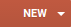
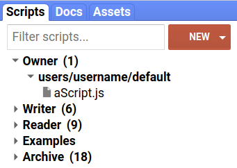
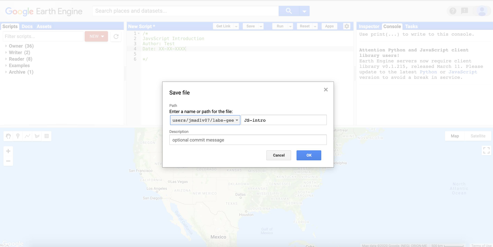

```{r setup, include=FALSE}
knitr::opts_chunk$set(echo = TRUE)
```

<br>

## Introduction

You will be using Google Earth Engine to perform geospatial data analysis. Google Earth Engine programs comprise a series of statements written in a programming language (JavaScript or python) that outline steps taken to perform specific tasks using geospatial data. You write these statements to create programs that perform one or more useful tasks such as data processing, creating interactive maps, or training statistical models.

This lab is an introductory section on programming using JavaScript. This section introduces key programming concepts that are important to understand when using Google Earth Engine. However, also view this section as a *reference resource* to refer back to as you work through the labs and become more proficient in using Google Earth Engine and creating your own programs. A good exercise to consolidate your understanding of these concepts is to try and identify where, and explain how, the concepts that are introduced are used to perform various geospatial data analysis tasks in later labs. 

<br>

## Setup

Load the Google Earth Engine code editor in your browser via the URL: [https://code.earthengine.google.com/](https://code.earthengine.google.com/).

### Code Editor 

You will create your Google Earth Engine programs using the code editor which can be loaded in your web browser. The code editor is a web-based interactive development environment (IDE) which provides access to the Google Earth Engine JavaScript API. The Google Earth Engine [Developers Guide](https://developers.google.com/earth-engine/playground) provides an overview of the code editor tools. 

The code editor provides a range of tools that geospatial data analysis and visualisation easy, especially when working with big datasets. These tools will be introduced in the subsequent labs. Some key code editor features include:

* **code editor**: where you write JavaScript statements.
* **Scripts tab**: save the JavaScript code for your Google Earth Engine programs.
* **Map**: web map visualise spatial data.
* **Docs**: JavaScript API reference - lists all the in-built functions and operations.
* **Console**: print results from analysis and metadata.
* **Inspector tab**: interactive query of spatial objects on the map.
* **Geometry tools**: digitise vector features to use in your Google Earth Engine programs.
* **Run**: Run your script.

<center>

```{r code-editor, fig.align = 'center', out.width = "80%", fig.cap = "Google Earth Engine code editor (source: Google Earth Engine [Developers Guide](https://developers.google.com/earth-engine/images/Playground_scripts.png)", echo = FALSE}
knitr::include_graphics("img/Code_editor_diagram.png")

```

### Create a Repository

Create a repository called *labs-gee* where you will store the scripts containing the code for programs you write throughout these labs. Go to the *Scripts* tab and click the {width=7%} button to create a new *labs-gee* repository. 

<center>

```{r playground-scripts, fig.align = 'center', out.width = "50%", fig.cap = "Scripts tab and button to create new repositories (source: Google Earth Engine [Developers Guide](https://developers.google.com/earth-engine/images/Playground_scripts.png)", echo = FALSE}


```
</center>

Enter the following code into the *Code Editor* and save the script to your *labs-gee* repository. Name the script *JS-intro*. This code is just some comments that define what the script does and who wrote it and when. Replace the author name and date as appropriate. **Under path in the save widget make sure you select the correct repository (i.e. not default)**.

```{js, echo=TRUE, eval=FALSE}
/*
JavsScript Introduction
Author: Test
Date: XX-XX-XXXX

*/

```

<br>
<center>

```{r save-js-intro, fig.align = 'center', out.width = "80%", fig.cap = "Save script to labs-gee repository", echo = FALSE}


```

</center>

<br>
<center>

<iframe src="https://player.vimeo.com/video/441911311" width="640" height="321" frameborder="0" allow="autoplay; fullscreen" allowfullscreen></iframe>
<p><a href="https://vimeo.com/441911311">Create repository and save script.</a></p>

</center>

<br>

## Programming

Programming (coding) is the creation of source code for programs that run on computers. You will be writing programs using [JavaScript](https://developers.google.com/earth-engine/tutorial_js_01). (To avoid confusion, JavaScript is different to the programming language Java). 

### Data Types

Programs need data to work with, perform operations on, and to return outputs from computation and analysis. Real world geographic and non-geographic phenomena and entities are represented in computer programs as data of specific types. In JavaScript there are seven primitive data types:

* undefined
* String
* Number
* Boolean
* BigInt
* Symbol 
* null

undefined types are variables that have not been assigned a value. Variables of null data type intentionally have no value. 

All other data types in JavaScript are of type object.

**Strings**

Variables of string data type contain characters and text which are surrounded by single ' or double " quotes. There are several cases where string variables are used when working with geospatial data; for example, in the metadata of satellite images the name of the sensor used to collect an image could be stored as a string. 

<br>
<details>
  <summary><b>*What other information related to geospatial data could be stored as a string data type?*</b></summary>
  <p>Anything that needs to be represented as text data such as place names, road names, names of weather stations.</p>
</details>
<br>

Enter the following command into the code editor to create a string variable.

```{js, echo=TRUE, eval=FALSE}
var stringVar= 'Hello World!';

```

You have created a string variable called `stringVar` which contains the text information 'Hello World!'. This is data that you can use in your program. 

You can use the `print()` operation to print the data in `stringVar` onto the *Console* for inspection. 

```{js, echo=TRUE, eval=FALSE}
print(stringVar);

```

You should see 'Hello World!' displayed in the *Console*. You have just created a simple program that creates a string object storing text data in a variable named `stringVar` and prints this text data to a display. In reality, programs that perform geospatial data analysis will be more complex, contain many variables of different data types, and perform more operations than printing values to a display (instead of printing results to the *Console* a GIS program might write a *.tif* file containing the raster output of some analysis). 

<br>
<center>

<iframe src="https://player.vimeo.com/video/441912597" width="640" height="321" frameborder="0" allow="autoplay; fullscreen" allowfullscreen></iframe>
<p><a href="https://vimeo.com/441912597">Hello World!</a></p>

</center>
<br>

**Numbers**

The number data type in JavaScript is in double precision 64 bit floating point format. Add the following code to your script to make two number variables.

```{js, echo=TRUE, eval=FALSE}
var x = 1;
var y = 2;
print(x);
print(y);

```

Storing numbers in variables enables programs to perform mathematical and statistical operations and represent geographic phenomena and entities using quantitative values. For example, spectral reflectance values in remote sensing images are numeric which can be combined mathematically to compute vegetation indices (e.g. NDVI). 

Execute the following code to perform some basic maths with the variables `x` and `y`.

```{js, echo=TRUE, eval=FALSE}
var z = x + y;

```

<br>
<details>
  <summary><b>*What numeric value do you think variable *`z` *will contain? How could you check if the variable *`z` *contains the correct value?*</b></summary>
  <p>3 `print(z);`.</p>
</details>
<br>

**Boolean**

The Boolean data type is used to store true or false values. This is useful for storing the results of comparison (equal to, greater than, less than) and logical (and, or, not) operations.  

```{js, echo=TRUE, eval=FALSE}
var demoBool = z == 4;
print(demoBool);

var bool1 = x == 1 && y == 2;

var bool2 = y < x;

```

You can read up on JavaScript logical and comparison operators [here](https://www.w3schools.com/js/js_comparisons.asp) or look at the table below. 

<br>
<details>
  <summary><b>*What do you think the value of *`bool1` *and* `bool2` *will be?*</b></summary>
  <p>true, false.</p>
</details>
<br>

<center>
<table style="width:75%; border-collapse: collapse; border-bottom: 1px solid #ddd; padding: 15px;">
  <caption>JavaScript comparison and logical operators</caption>
  <tr>
    <th>Operator</th>
    <th>Description</th>
    <th>Example</th>
  </tr>
  <tr>
    <td>`==`</td>
    <td>equal to</td>
    <td>`x == 5`</td>
  </tr>
  <tr>
    <td>`!=`</td>
    <td>not equal</td>
    <td>`x != 5`</td>
  </tr>
   <tr>
    <td>`>`</td>
    <td>greater than</td>
    <td>`x > 5`</td>
  </tr>
  <tr>
    <td>`<`</td>
    <td>less than</td>
    <td>`x < 5`</td>
  </tr>
  <tr>
    <td>`>=`</td>
    <td>greater than or equal to</td>
    <td>`x >= 5`</td>
  </tr>
  <tr>
    <td>`<=`</td>
    <td>less than or equal to</td>
    <td>`x <= 5`</td>
  </tr>
  <tr>
    <td>`&&`</td>
    <td>and</td>
    <td>`x == 5 && y == 4`</td>
  </tr>
  <tr>
    <td>`||`</td>
    <td>or</td>
    <td>`x == 5 || y == 5`</td>
  </tr>
  <tr>
    <td>`!`</td>
    <td>not</td>
    <td>`!(x <= 5)`</td>
  </tr>
</table>
</center>

<br>

**Objects**

An object in JavaScript is a collection properties where each property is a name:value pair and the value can be any primitive data type (e.g. String, Number, Boolean, null) or a type of object. You can create custom data types using objects as required by your program; for example, you could create an object to represent a point with two name:value pairs: `longitude: 25.55` and `latitude: 23.42` where the values are number type coordinates. You can access properties in an object using the dot operator: `.` with the format `<object name>.<property name>`.

```{js, echo=TRUE, eval=FALSE}
var lon = 25.55;
var lat = 23.42;

// create an object named point
var point = {
  longitude: lon,
  latitude: lat
};
print(point);

// access value in object
print(point.longitude);

```

**Arrays**

Arrays are a special list-like object that store an ordered collection of elements. Arrays are declared by placing values in square brackets `[1, 2, 3]` and you access values inside an array using the value's array index. The first value in an array has an index of 0, the second value has an index of 1, and the final value has an index of $n-1$ where $n$ is the number of elements in the array. This is the distinction between arrays and objects where elements are represented by name:value pairs. The elements in arrays are ordered and accessed by their index position; the elements in objects are unordered and accessed by their property name. 

Below is an example of how to create an array of numbers that represent years.

```{js, echo=TRUE, eval=FALSE}
var years = [2000, 2001, 2002, 2003, 2004, 2005, 2006];

```

You can see the data inside arrays using the `print()` command or extract information from arrays using square brackets `[]` and the index of the element. 

```{js, echo=TRUE, eval=FALSE}
print(years);
var year0 = years[0];
print(year0);
var year1 = years[1];
print(year1);

```

You can also put strings inside arrays.

```{js, echo=TRUE, eval=FALSE}
var stringList = ['I', 'am', 'in', 'a', 'list'];
print(stringList);

```

Remember, each item in an array is separated by a comma. You can create n-Dimensional arrays. 

```{js, echo=TRUE, eval=FALSE}
var squareArray = [
  [2, 3], 
  [3, 4]
];
print(squareArray);

```


<br>
<details>
  <summary><b>*What kind of geospatial data is well suited to being represented using arrays?*</b></summary>
  <p>raster data (grids of pixels with each pixel assigned a value representing a phenomenon or entity that varies across space).</p>
</details>
<br>

### Variables

Variables refer to a named location in the computer's memory where the data associated with that variable is stored. 

To create a variable you need to declare it using the **`var`** keyword. Once a variable is declared you can put data inside it and use that variable, and therefore the data inside it, in your program. You assign data to a variable using the assignment operator `=`.

The code block below declares a variable `temp` and then assigns the value `25` to this variable. As demonstrated by the variable `temp1` you can declare a variable and assign values to it in one statement. 

```{js, echo=TRUE, eval=FALSE}
var temp;
temp = 25;

var temp1 = 26;

```

Using variables makes code easier to organise and write. For example, if you want to perform multiple operations on temperature data you can refer to the data using the variable name as opposed to either writing out the temperature values or reading them from a file separately for each operation. You can use variables in operations and functions too: 

<br>
<details>
  <summary><b>*What value do you think the variable *</b>`tempDiff` <b>*would store after executing this statement:*</b> `var tempDiff = temp1 - temp;`<b>*?*</b></summary>
  <p>1 `print(tempDiff);`.</p>
</details>
<br>


You only need to declare a variable once. **`var`** is a reserved keyword; this means a variable cannot be named **`var`**. Other reserved keywords in JavaScript include **`class`**, **`function`**, **`let`**, and **`return`** with a full list [here](https://developer.mozilla.org/en-US/docs/Web/JavaScript/Reference/Lexical_grammar#Keywords). 

### Object-Orientated Programming

Except for the seven primitive data types, everything in JavaScript is an object. An object is a programming concept where each object can have properties which describe attributes of the object and methods which are operations or tasks the object can perform. Real world phenomenon or entities can be represented as objects in computer systems. For example, you can define an object called `field` to represent data about fields. The `field` object can have a numeric array property storing the vertices for the field's outline, a crop type string property stating what crops are grown in the field, and a numeric type property stating crop yield. The `field` object could have a `computeArea()` method which would calculate and return the area of the field (in this instance using the data in the property storing vertices demarcating the fields outline). The `field` object is a spatial geometric object so it could also have methods such as `intersects()` which would return spatial objects whose extent intersects with the field. An object definition, which outlines the properties and methods associated with an object, is called a class; you can create multiple objects of the same class in your program. For example, your program could perform operations on multiple field objects all of class `field`. 

### Functions

There are many methods and operations already defined in JavaScript that you can use in your program. However, there maybe cases where you need to create your own operation to perform a task as part of your program; user-defined functions fill this role. A function is a set of statements that perform a specific task. First, you declare or define your function which consists of:

* The `function` keyword.
* The name of the function (e.g. `function subtraction`).
* The list of parameters the function takes in separated by commas and enclosed in parentheses (e.g. `function subtraction(number1, number2)`).
* A list of statements that perform the function tasks enclosed in curly brackets. 
* A `return` statement that specifies what data is returned by a call to the function.

```{js, echo=TRUE, eval=FALSE}
// substraction function

//function declaration
function subtraction(number1, number2) {
  var diff = number1 - number2;
  return diff;
}

```

Once a function has been declared you can call it from within your program. For example, you can call the function `subtraction` declared above and pass the two numberic variables `temp` and `temp1` into it as arguments. This will return the difference between the numeric values stored in `temp` and `temp1`. 

```{js, echo=TRUE, eval=FALSE}
// use subtraction function

var tempFuncDiff = subtraction(temp, temp1);
print(tempFuncDiff);

```

You should see the result -1 printed in the *Console*. 

This is a very simple example of how to declare and use a function. However, creating your own functions is one of the key advantages of programming. You can flexibly combine functions together to create more complex functions and workflows specific to the task your computer program is being developed for. It is this flexibility in being able to define the tasks your computer program performs that makes programming a complementary skill to using GUI GIS (e.g. QGIS, ArcGIS) for geospatial data analysis. A strength of GUI based GIS is the ease of performing tasks using in-built functions and quickly visualising data whereas a strength of programming GIS is extending and combining in-built functions within GIS to perform specific tasks, that are challenging to implement in GUI GIS, at the cost of added complexity and cognitive load. Most GIS workflows require iterating between working in a GUI GIS and creating custom programs; this is why GUI GIS now provide options for executing user-defined code and consoles for entering commands (e.g. the Python console in QGIS).

<br>
<details>
  <summary><b>*Can you declare and call a function *</b>`convertTempToK` <b>*that takes in a temperature value in degrees centigrade as a parameter and returns the temperature in Kelvin? Call the function with * `temp` *as an argument and print the result to the console*</b></summary>
  <p>
  ```{js, echo=TRUE, eval=FALSE}
  // temperature conversion function
  function convertTempToK(tempIn) {
    var tempK = tempIn - (-273.15);
    return tempK;
  }
  var tempInK = convertTempToK(temp);
  print(tempInK);
  ```
  </p>
</details>
<br> 


### Syntax and Code Style

There are various syntax rules that need to be followed when writing JavaScript statements. If these rules are not followed your code will not execute and you'll get a syntax error. 

As you see and write JavaScript programs, syntax and style will become apparent. This is not something you need to get right first time but is part of the process of learning to write your own programs. 

Some important syntax rules:

* Strings are enclosed within " or ' quotes.
* Hyphen `-` cannot be used except as the subtraction operator (i.e. `perth-airport` is **not** valid).
* JavaScript identifiers are used to identify variables or functions (i.e. a variable of function name - `x = 23` is identified by variable name `x`). Identifiers are case sensitive and can only start with a letter, underscore (`_`), or dollar sign (`$`).
* Identifiers cannot start with a number.
* Variables need to be declared with the **`var`** keyword before they are used.
* Keywords (e.g. **`var`**) are reserved and cannot be used as variable or function names.

<b>Code Style</b>

Alongside syntax rules, there are stylistic recommendations for writing JavaScript. These are best adhered to as they'll make your code easier for you, future you, or somebody else to read. This is important if you require help debugging a script. 

Some common style tips:

* Use camel case for variables - first word is lower case and all other words start with an upper case letter with no spaces between words (e.g. `camelCase`, `perthAirport`).
* Finish each statement with a semi-colon `var x = 23;`.
* At most, one statement per line (a statement can span multiple lines if required or improves readability). 
* Consistency in code style throughout your script. 
* Indent each block of code with two spaces.
* Sensible and logical variable names - variable names should be nouns and describe the variable.
* Sensible and logical function names - function names should be verbs that describe what the function does. 
* Keep variable and function names short to avoid typos.
* One variable declaration per line.

The Google [JavaScript style guide](https://google.github.io/styleguide/jsguide.html) is a useful guide for writing clear JavaScript programs. 

<b>Comments</b>

You can write text in your script that is not executed by the computer. These are comments and are useful to describe what parts of your script are doing. In general, you should aspire to write your code so that it is legible and easy to follow. However, comments augment good code, can help explain how a program works, and are useful to someone else using your script or to future you if you return to working on it. 

Some useful things to comment:

* Start the script with brief description of what it does.
* Author and date of script.
* Outline any data or other programs the script depends on. 
* Outline what data or results are returned by the script.
* Avoid commenting things which are outlined in documentation elsewhere (e.g. Google Earth Engine documentation).
* Outline what arguments (and type) a function takes and returns. 

Lines of code can be commented using `//` or `/* .... */`. 

```{js, echo=TRUE, eval=FALSE}
/*
Script declares variables to store latitude and longitude values.
Author: XXXXX
Date: 01/02/0304
*/

// longitude
var lon = 25.55;

// latitude
var lat = 23.42;

```

<br>

## Recap

This introduction to JavaScript illustrates what a computer program is: a set of statements outlining instructions for operations that the computer should perform on data to carry out a required task. How you write these statements will depend on the task you want your program to perform. Each program will relate to different geographic and non-geographic entities and phenomena which can be represented in your program by using or combining JavaScript data types. Each program will perform one or more tasks using the data representing geographic and non-geographic entities and phenomena; you can specify which tasks should be performed using built-in operators and functions or by creating your own functions.  

<hr>
<div class="tocify-extend-page" data-unique="tocify-extend-page" style="height: 0;"></div>
<footer>
<p>Advanced GIS and Remote Sensing</p>
</footer>