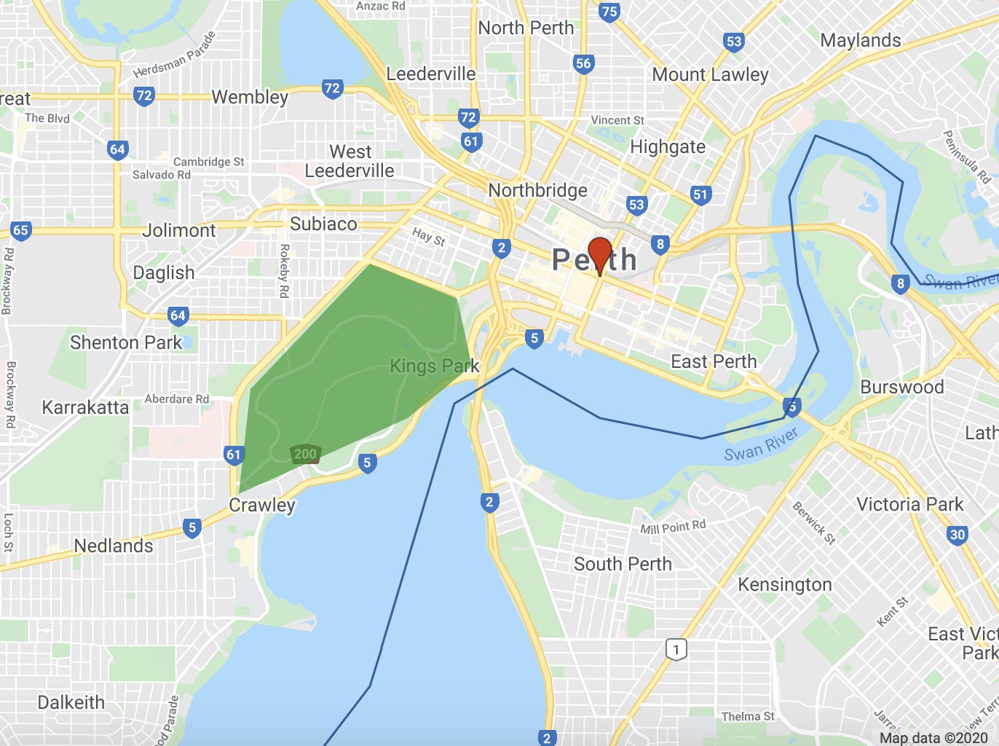
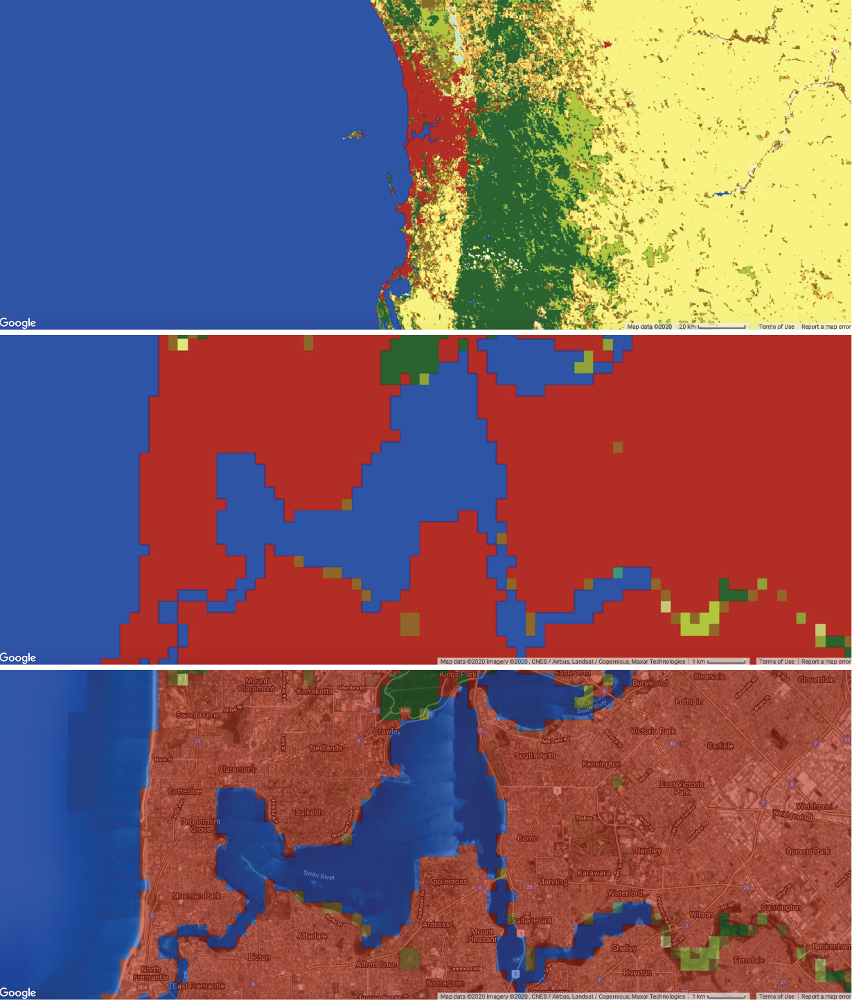
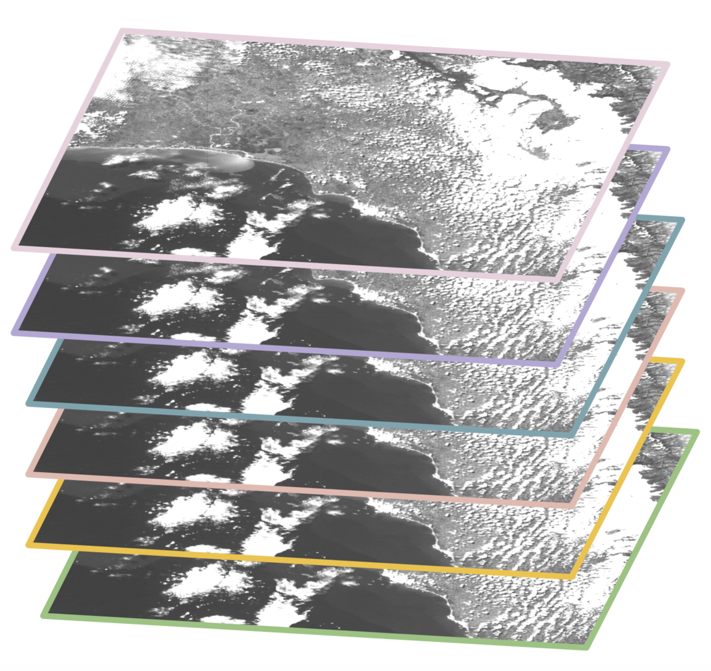
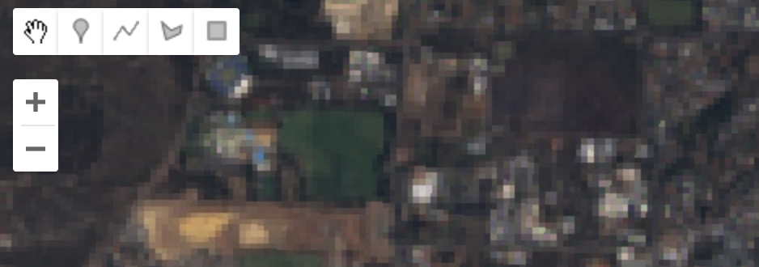
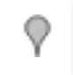
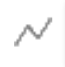
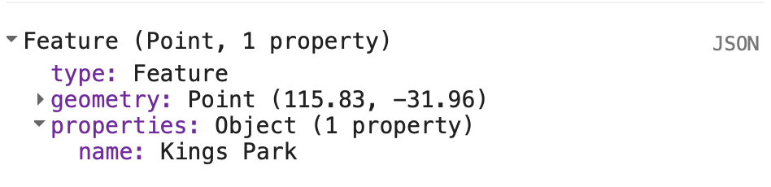
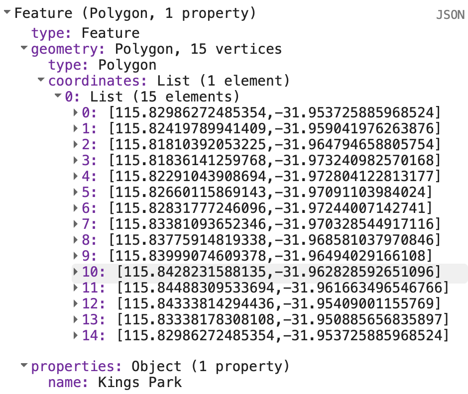
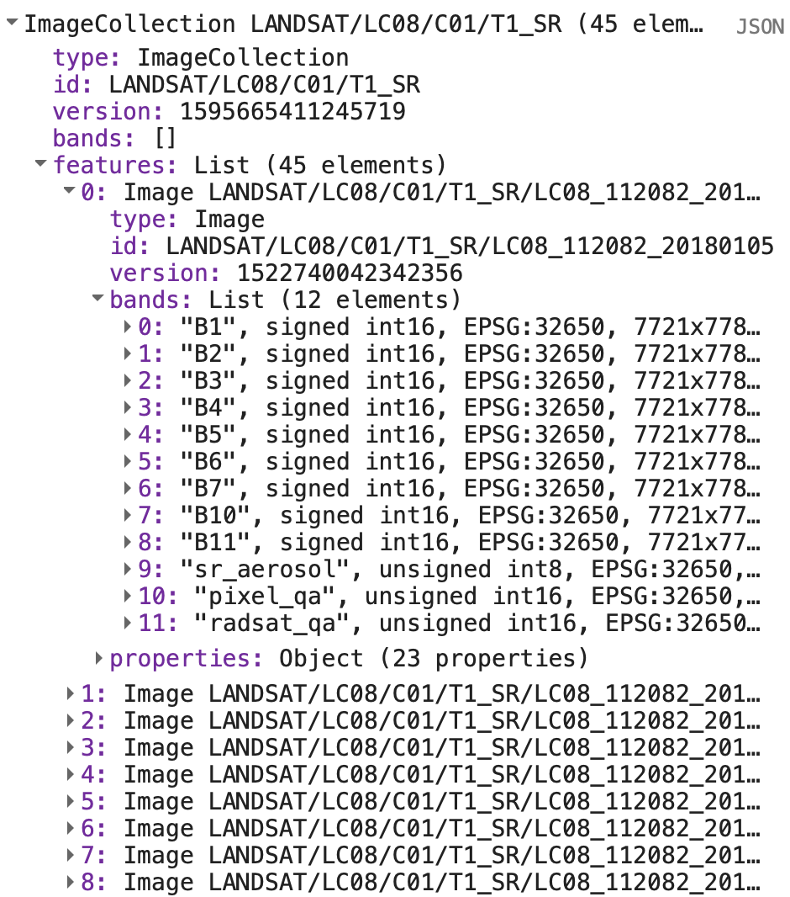

```{r setup, include=FALSE}
knitr::opts_chunk$set(echo = TRUE)
```

<br>

## Introduction

This lab introduces spatial data models for representing geographic entities and phenomena and the data structures which implement these spatial data models in Google Earth Engine. 

### Setup

Create a new script in your *labs-gee* repository called *lab4a*. Enter the following comment header to the script. 

```{js, echo=TRUE, eval=FALSE}
/*
Lab 4a
Author: Test
Date: XX-XX-XXXX

*/

```

<br>

## Client and Server

Up to now you have been writing JavaScript programs that are executed by your browser and run on the hardware in your local machine (i.e. any data in variables you declare reside in your computer's memory and the operations or functions you invoke run on your computer's CPU). 

However, your machine has limited storage, memory, and processing power. Google Earth Engine allows you to access servers comprising more powerful computers and access to larger datasets (than could be stored on your local machine). You still write a Google Earth Engine program in JavaScript using the code editor in your browser; however, the servers storing and processing the geospatial data in your program are remotely located in the cloud. 
The execution of a Google Earth Engine program is as follows:

1. You write a series of JavaScript statements that identify geospatial data, and operations to perform on this data, that run on remote servers and the results to be returned from this processing.
2. Your browser encodes these statements and sends them in a message to the Google Earth Engine servers via the internet.
3. The Google Earth Engine servers process your message, access data you requested, and perform the operations outlined in your script.
4. Results your program requests back from the Google Earth Engine servers are returned to your browser (again via the internet) and displayed (e.g. a map is drawn in your browser, results are printed to the console, a file is made available to download).

This differs from a desktop GIS (e.g. QGIS) where all the data and processing occurs locally on your machine's hardware. Google Earth Engine is a distributed system which means the program runs by calling functions running on different computers connected via a network (e.g. your Google Earth Engine programs will call functions running locally in your browser and also functions running on Google servers with data shared between these functions over the internet). Google Earth Engine has a clear client-server architecture where your browser is the client requesting services from Google Earth Engine, the server, which offers a range of services and processes and responds to client requests. 

There are several advantages to this mode of computing. It is more efficient to just download the result of processing geospatial data than to download all the raw data and process and store it locally. For example, if you wanted to compute the area of forest in Australia using a land cover map you can perform this analysis in the cloud and download one number (the area of forest). Contrast this with having to download a land cover map for all of Australia, process the data, and then run the analysis to calculate the area of forest on your local machine. Also, more geospatial datasets are coming online and they getting larger; it is often not feasible to process all this "big data" locally.  

## The `ee` object

It is important to distinguish between variables that are stored, and operations that are run, locally on your machine and data and operations that run on Google servers in the cloud. The `ee` prefix indicates that the data being referred to in your script is a server side object. For example, `var localString = 'on my computer'` is a string type variable stored locally on your machine where as `var cloudString = ee.String('in the cloud')` is a proxy object for a variable containing string data located on servers in the cloud. 

In general, any variable that is declared as `ee.<Thing>()` is server side and any method or operation of the form `ee.<Thing>().method()` is a server side operation. One way of understanding `ee.<Thing>()` is as a container that you put instructions inside to send to the Google servers; for example, in `var cloudString = ee.String('in the cloud')` you are putting a client side string `'in the cloud'` in a container and that data is sent to servers in the cloud. Similarly, you could put the ID of geospatial data that is stored in databases located on Google Earth Engines servers and assign it to server side variables that are used in your program; executing `var landsatImage = ee.Image('LANDSAT/LC8_L1T_TOA/LC81130822014033LGN00')` will assign the Landsat image with the specified ID to the variable `landsatImage` in your script. 

If the geospatial data and operations used in your program are server side how do you access or visualise the results? There are a range of functions in Google Earth Engine that let you request data from the server to be displayed in your browser. For example, the `print()` function can request server side objects and print them to the *Console* and the `Map.addLayer()` function requests spatial data which is displayed in the map. 

<br>

## Spatial Data Models

A spatial data model refers to a conceptual model for describing geographic phenomena or entities. A spatial data model typically contains two pieces of information: 

* positional information describing location (e.g. an `(x, y)` coordinate pair representing the location of a weather station)
* attribute information describing characteristics of the phenomena or entity (e.g. a name:value pair recording the name of the weather station `name:'Perth Airport'`) 

A spatial data model is a *representation* of geographic phenomena or entities; therefore, some detail is abstracted away. 

### Vector Data Model

The vector data model represents geographic phenomena or entities as geometric features: 

* points (i.e. a coordinate pair of values)
* lines (i.e. two or more points connected by a line) 
* polygons (i.e. three or more points connected by a non-intersecting line which "closes" the polygon) 

Along with coordinates that represent the position of the geometry, vector data also stores non-spatial attribute information which describe characteristics of the geographic phenomena or entity represented by the geometry feature.

The figure below demonstrates how geographic entities in Perth can be represented using the vector data model. The blue line feature broadly captures the shape of the river; however, it is a simplification as it does not provide information about how the river's width varies across space. The red point feature is used to represent the location of Perth; this might be an appropriate way to represent Perth's location on a zoomed out map but it does not capture Perth's actual extent across the landscape. 


<br>
<details>
  <summary><b>*What detail is abstracted away by representing Kings Park using the green polygon feature?*</b></summary>
  <p><ul>
  <li>Shape of Kings Park is simplified using only 6 vertices.</li>
  <li>Variation in land cover types and land uses within the park is not captured.</li>
</ul></p>
</details>
<br>

<center>

```{r vector-data-model, fig.align = 'center', out.width = "70%", fig.cap = "Representing geographic entities using the vector data model", echo = FALSE}


```
</center>
<br>

### Raster Data Model

The raster data model represents geographic phenomena or entities as a grid of cells (pixels). Attribute information about geographic phenomena or entities is described by assigning a value to each pixel. The dimensions of a pixel relative to distance on the Earth's land surface determines the complexity and detail of spatial features that can be resolved in raster data. A pixel that represents a 1 km x 1 km footprint on the Earth's surface will not be able to resolve an individual tree or a single building. Pixel values can be continuous (e.g. values represent precipitation) or categorical (e.g. values represent a land cover type).

The figure below shows the 2018 European Space Agency (ESA) [Climate Change Initiative (CCI) land cover map](https://www.esa-landcover-cci.org) for 2018. This is a raster data model representation of land cover; each pixel represents a 300 m x 300 m area on the Earth's land surface and a pixel can only represent a single land cover type. If you look at the bottom two zoomed in maps you can some limitations of modelling land cover using 300 m x 300 m spatial resolution raster data. The shape of features of different land cover types is poorly represented by the "block-like" arrangement of pixels and there is variation in land cover within a single pixel. 

<br>
<center>

```{r raster-data-model, fig.align = 'center', out.width = "70%", fig.cap = "Representing land cover using the raster data model", echo = FALSE}


```
</center>


<br>
<details>
  <summary><b>*How could you represent spatial variation in elevation using vector and raster data models?*</b></summary>
  <p><ul>
  <li>Vector data model: contour lines.</li>
  <li>Raster data model: digital elevation model (DEM) - each pixel value represents the elevation at that location.</li>
</ul></p>
</details>
<br>


## Data Structures

Data structures are how spatial data models are implemented in a computer system. GEE has a range of non-spatial data structures used for organising data related to geographic and non-geographic information. 
<center>
<table style="width:75%; border-collapse: collapse; border-bottom: 1px solid #ddd; padding: 15px;">
  <caption>Google Earth Engine Data Structures</caption>
  <tr>
    <th>Name</th>
    <th>Constructor</th>
    <th>Summary</th>
  </tr>
  <tr>
    <td>String</td>
    <td>`ee.String()`</td>
    <td>Create a string object on the GEE server. Useful for storing text data (e.g. name of a weather station) and metadata.</td>
  </tr>
  <tr>
    <td>Dictionary</td>
    <td>`ee.Dictionary()`</td>
    <td>Create a dictionary object on the GEE server. Dictionary object comprise key and value pairs which describe properties of an object (e.g. a dictionary object could contain key attributes about a point feature representing a city - `{city: 'Perth', population: '1000000'}` - or metadata about a remote sensing image capture - `{CLOUD_COVER: 0.059, DATE_ACQUIRED: 2014-03-18, DATUM: WGS84}`).</td>
  </tr>
   <tr>
    <td>Number</td>
    <td>`ee.Number()`</td>
    <td>Create a number object on the GEE server. Useful for storing quantitative data (e.g. the result of a mathematical operation or a numeric measurement such as temperature).</td>
  </tr>
  <tr>
    <td>List</td>
    <td>`ee.List()`</td>
    <td>Create a list object on the GEE server. Useful for organising different objects (e.g. a list can store images, features, an array, and a string in one object - `var list = ee.List([1, 'text']);`).</td>
  </tr>
  <tr>
    <td>Array</td>
    <td>`ee.Array()`</td>
    <td>Create an array object on the GEE server. 1-D vector, 2-D matrics, 3-D cubes, or n-D hypercubes. Arrays are created from lists of numbers and lists of lists (e.g. `var arr = ee.Array({[1, 2], [1, 2]});` - a 2x2 array). This demonstrates how complex data structures and objects are constructed from simpler data structures.</td>
  </tr>
  <tr>
    <td>Date</td>
    <td>`ee.Date()`</td>
    <td>Create a date object on the GEE server. Useful for storing temporal attributes about geographic data (e.g. date of satellite image capture).</td>
  </tr>
</table>
</center>

<br>

## Spatial Data Structures

### Images

Raster data in GEE are represented as `Image` objects. 

To create an image object that stores raster data on the GEE server use the `ee.Image()` constructor. You pass arguments into the parentheses of the `ee.Image()` constructor to specify what raster data should be represented by the image object. If you pass a number into `ee.Image()` you will get a constant image where each pixel value is the number passed in. 

Add the following code to your GEE script. This will create an image object where each pixel has the value 5 which can be referred to using the variable `img5`. Click on the *Inspector* tab and then click at locations on the map. You should see the value 5 printed in the *Inspector* tab.

```{js, echo=TRUE, eval=FALSE}
// Raster where pixel values equal 5
var img5 = ee.Image(5);
print(img5);
Map.addLayer(img5, {palette:['FF0000']}, 'Raster with pixel value = 5');

```

Alternatively, you can pass a string id into the `ee.Image()` constructor to specify a Google Earth Engine asset (e.g. a Landsat image). Google Earth Engine assets are geospatial data that is stored in databases on Google servers in the cloud, are available for use in your programs, and are frequently updated - see the available data at the [Google Earth Engine data catalog](https://developers.google.com/earth-engine/datasets).

The variable `img` in the code block below refers to an image object on the Google servers storing Landsat 8 data. This variable can be used in your program to access, query, and analyse the Landsat data. Pass the variable `img` into the `print()` function to view the Landsat 8 image's metadata. The image metadata should be printed in the *Console* tab. Exploring the image metadata in the *Console* is demonstrated in the video below. 

```{js, echo=TRUE, eval=FALSE}
// Pass Landsat 8 image id into Image constructor*
var img = ee.Image('LANDSAT/LC8_L1T_TOA/LC81130822014033LGN00');
print(img);

```

An image can have one or more bands, each band is a georeferenced raster which can have its own set of properties such as data type (e.g. Integer), scale (spatial resolution), band name, and projection. The image object itself can contain metadata relevant to all bands in a dictionary object.

<br>
<center>

```{r image, fig.align = 'center', out.width = "70%", fig.cap = "Schematic of an `Image` data structure in Google Earth Engine where an image can contain multiple georeferenced bands (source: [What is Google Earth Engine?](https://docs.google.com/presentation/d/1hT9q6kWigM1MM3p7IEcvNQlpPvkedW-lgCCrIqbNeis/edit#slide=id.g4e98c855a5_0_3795)).", echo = FALSE}


```
</center>
<br>

Go to the *Console* tab and you should see the Landsat 8 image has 12 bands. Click on a band and you should see some band specific properties such as its projection (`crs: EPSG:32650`). Click on the image `properties` to explore metadata that applies to the image such as cloud cover at the time of image capture (`CLOUD_COVER: 11.039999961853027`) or the satellite carrying the sensor (`SPACECRAFT_ID: LANDSAT_8`).

You can visualise the Landsat 8 image on the map display in your browser. To this you use the `Map.addLayer()` function to request the image stored in the variable `img` on the Google servers to be displayed in your browser. If you execute the following code block you will visualise the an RGB composite map of the Landsat 8 data stored in `img` in your browswer's display. 

```{js, echo=TRUE, eval=FALSE}
/* Define the visualization parameters. The bands option allows us to specify which bands to map. Here, we choose B4 (Red), B3 (Green), B2 (Blue) to make a RGB composite image.*/ 
var vizParams = {
  bands: ['B4', 'B3', 'B2'],
  min: 0,
  max: 0.5,
};

// Centre the display and then map the image
Map.centerObject(img, 10);
Map.addLayer(img, vizParams, 'RGB composite');

```


<br>
<center>

```{r map-image, fig.align = 'center', out.width = "80%", fig.cap = "Visualising Landsat 8 data as a RGB composite image.", echo = FALSE}
knitr::include_graphics("img/map-img.png")

```
</center>
<br>

<center>

<iframe src="https://player.vimeo.com/video/442255846" width="640" height="301" frameborder="0" allow="autoplay; fullscreen" allowfullscreen></iframe>
<p><a href="https://vimeo.com/442255846"> Images in Google Earth Engine</a></p>
</center>
<br>

### Geometry Objects

The spatial location or extent of vector data is stored as `Geometry` objects. Google Earth Engine implements the `Geometry` objects outlined in the [GeoJSON spec](https://tools.ietf.org/html/rfc7946):

* Point
* MultiPoint
* LineString
* MultiLineString
* Polygon
* MultiPolygon

To create a `Geometry` object programmatically use the `ee.Geometry.<geometry type>()` constructor (e.g. for a LineString object use `ee.Geometry.LineString()`) and pass the coordinates for object as an argument to the constructor function. Look at the code block below to observe that coordinates for a location in Kings Park are passed as arguments to the `ee.Geometry.Point()` constructor to create a point `Geometry` object (`locationKP`). 

```{js, echo=TRUE, eval=FALSE}
//location of Kings Park
var locationKP = ee.Geometry.Point(115.831751, -31.962064); 
print(locationKP);

// Display the point on the map.
Map.centerObject(locationKP, 11); // 11 = zoom level
Map.addLayer(locationKP, {color: 'FF0000'}, 'Kings Park');

```

If you explore the metadata for `locationKP` in the *Console* tab you will see the object has a `type` field which indicates the object is of `Point` type and a `coordinates` field which contains the the coordinates for the point as an array. The value of the coordinates field is an ordered x y pair.

You can create LineString objects in a similar way. Here, you can pass the coordinates as an array into the `ee.Geometry.LineString()` constructor. As noted in the [GeoJSON spec](https://tools.ietf.org/html/rfc7946), coordinates for LineString objects are an array of ordered x y pairs. 

```{js, echo=TRUE, eval=FALSE}
// May Drive as a LineString object
var mayDr = ee.Geometry.LineString(
        [[115.84063447625735, -31.959551722179764],
         [115.8375445714722, -31.957002964307144],
         [115.83303846032717, -31.956201911510334],
         [115.82994855554202, -31.957403488085628],
         [115.827244888855, -31.9606440253292],
         [115.82625783593753, -31.961445039381488],
         [115.82368291528323, -31.96217322791136],
         [115.82127965600588, -31.963811630990566],
         [115.82055009515383, -31.96563204456937],
         [115.82278169305422, -31.96690631259952],
         [115.82325376184085, -31.968471817682193],
         [115.82218087823489, -31.969818858827356],
         [115.82222379357913, -31.970401356984638]]);
print(mayDr);
Map.addLayer(mayDr, {color: '00FF00'}, 'May Drive');
```

`Geometry` objects in Google Earth Engine are by default geodesic (i.e. edges are the shortest path on spherical surface) as opposed to planar (edges follow the shortest path on a 2D surface). You can read more about the difference between geodesic and planar geometries [here](https://developers.google.com/earth-engine/geometries_planar_geodesic).

<br>
<center>

```{r geodesic-planar, fig.align = 'center', out.width = "80%", fig.cap = "Illustration of difference between geodesic and planar geometries (source: [Google Earth Engine: Geodesic vs. Planar Geometries](https://developers.google.com/earth-engine/images/Geometry_geodesic_vs_planar_annotated.png)).", echo = FALSE}
knitr::include_graphics("img/Geometry_geodesic_vs_planar_annotated.png")

```
</center>
<br>

You can also import `Geometry` objects into your scripts by manually drawing them on the map display using the *Geometry Tools*. The *Geometry Tools* are located in the upper left corner of the map display.

<br>
<center>

```{r geometry-tools, fig.align = 'center', out.width = "80%", fig.cap = "Geometry Tools.", echo = FALSE}


```
</center>
<br>

The following video illustrates how to use the *Geometry Tools* to create a Polygon object representing Kings Park and how to use variable storing the geometry object in your script. 

Some things to note:

* Use the placemark icon  to create Point or MultiPoint objects.
* Use the line icon  to create Line or MultiLine objects.
* Use the polygon icon  to create Polygon or MultiPolygon objects.
* Use the spanner icon to configure how geometry objects that you create using *Geometry Tools* are imported into your script and styling options for display on the map.
* Use <b>+ new layer</b> to create new `Geometry` objects. <b>If you want to create separate `Geometry` objects for different geographic features remember to click this button before digitising a new feature</b>.

<br>
<center>

<iframe src="https://player.vimeo.com/video/442270755" width="640" height="301" frameborder="0" allow="autoplay; fullscreen" allowfullscreen></iframe>
<p><a href="https://vimeo.com/442270755">Geometry Tools.</a></p>

</center>
</br>

### Features

Geometry objects describe the positional information of vector data; however, there is also a need to represent attribute information about geographic phenomenon or entities represented by `Geometry` objects. Vector data in Google Earth Engine which contains geometry data (representing location and shape of geographic phenomenon or entities) and attribute data are [GeoJSON `Feature` objects](https://tools.ietf.org/html/rfc7946#page-11). 

A `Feature` object is of type `Feature` with a `geometry` property which contains a `Geometry` object or `null` and a `properties` property which stores a dictionary object of name:value pairs of attribute information associated with the geographic feature represented by the `Geometry` object. 

Execute the code block below convert the `Geometry` object representing Kings Park to a `Feature` object with a `properties` property which with a name attribute. Inspect the `Feature` object in the *Console*.

```{js, echo=TRUE, eval=FALSE}
// Create a Feature from the Geometry.
var kpFeature = ee.Feature(locationKP, {name: 'Kings Park'});
print(kpFeature);

```

<br>
<center>

```{r feature, fig.align = 'center', out.width = "70%", fig.cap = "Kings Park `Feature` object.", echo = FALSE}


```
</center>
<br>

<details>
  <summary><b>*How would a `Feature` object differ if the Kings Park `geometry` property was of Polygon type rather than point? Can you convert `kpPoly` to a `Feature` object?*</b></summary>
  <p>The `geometry` property of the `Feature` object would contain an array object of coordinates for the outline of the Polygon. 
  ```{js, echo=TRUE, eval=FALSE}
  // Create polygon Feature
var kpPolyFeature = ee.Feature(kpPoly, {name: 'Kings Park'});
print(kpPolyFeature);
  ```
  ```{r poly-feature, fig.align = 'center', out.width = "70%", fig.cap = "Kings Park Polygon `Feature` object.", echo = FALSE}


  ```
  </p>
</details>
<br>

You can read more about `Feature` objects in Google Earth Engine <a href="https://developers.google.com/earth-engine/features" target="_blank">here</a>.

### Collections

Collections in Google Earth Engine comprise groups of related objects. `ImageCollections` contain stacks of related `Image` objects and `FeatureCollections` contain sets of related `Feature` objects. Storing objects together in a collection means that operations can be easily applied to all the objects in the collection such as sorting, filtering, summarsing, or other mathematical operations. For example, all the Landsat 8 surface reflectance `Images` are stored in the `ImageCollection` with the ID `'LANDSAT/LC08/C01/T1_SR'`. You can pass this string `ImageCollection` ID into the `ee.ImageCollection()` constructor to import all Landsat 8 surface reflectance `Images` into your program. 

If you were creating a program to monitor land surface changes over Kings Park in 2018, you might want to import an `ImageCollection` of all Landsat 8 `Images` into your program and then filter the `ImageCollection` for Landsat 8 scenes that intersect with the extent of Kings Park and were recording in 2018. The following code block demonstrates this. You can then apply subsequent analysis or summary operations to the `ImageCollection` `l8ImCollKP`.

```{js, echo=TRUE, eval=FALSE}
// Landsat 8 Image Collection
var l8ImColl = ee.ImageCollection("LANDSAT/LC08/C01/T1_SR");

// Filter Image Collection for 2018 and Images that intersect Kings Park
var l8ImCollKP = l8ImColl
  .filterBounds(kpPoly)
  .filterDate("2018-01-01", "2018-12-31");
print(l8ImCollKP);

```

<br>

You should find 45 Landsat 8 surface reflectance `Images` intersected with Kings Park in 2018. You can inspect all the `Images` in this `ImageCollection` `l8ImCollKP` in the *Console*. The ability to store spatial data in collections makes creating programs that need to access and analyse analyse big geospatial data easier. 

You have already created your own `ImageCollection` that contains only the Landsat 8 `Images` for the spatial and temporal extent of interest to you. Now you can easily apply a range of functions and operations to all the `Images` in the `ImageCollection`. For example, you could apply a function that identifies maximum greenness observed at each pixel in 2018 to analyse spatial variability in vegetation cover. You will learn how to apply functions to `Images` in `ImageCollections` in subsequent labs.

<br>
<center>

```{r im-coll-kp, fig.align = 'center', out.width = "70%", fig.cap = "`ImageCollection` of all Landsat 8 scenes that intersect with Kings Park in 2018.", echo = FALSE}


```
</center>
<br>

You can find more information on `ImageCollections` <a href="https://developers.google.com/earth-engine/ic_creating" target="_blank">here</a> and `FeatureCollections` <a href="https://developers.google.com/earth-engine/feature_collections" target="_blank">here</a>.

<details>
  <summary><b>*How would you represent multiple weather stations and observations recorded at these stations as a `FeatureCollection`?*</b></summary>
  <p> Each weather station would be a `Feature` object in the `FeatureCollection`. Each weather station `Feature` would have a `geometry` property containing a Point `Geometry` object representing the location of the station and a `properties` property containing objects of name:value pairs of weather observations for a given day. 
  
  ```{js, echo=TRUE, eval=FALSE}
  // Example structure of weather stations Feature Collection
  {
  "type": "FeatureCollection",
  "features": [
    {
      "type": "Feature",
      "properties": {
        "station-id": XXXX,
        "date": "01-01-2018",
        "temperature": 29
      },
      "geometry": {
        "type": "Point",
        "coordinates": [
          119.17968749999999,
          -26.74561038219901
        ]
      }
    },
    {
      "type": "Feature",
      "properties": {
        "station-id": XXXX,
        "date": "02-01-2018",
        "temperature": 27
        },
      "geometry": {
        "type": "Point",
        "coordinates": [
          124.1015625,
          -29.535229562948455
        ]
      }
    }
  ]
}

  ```


  </p>
</details>
<br>

<hr>
<div class="tocify-extend-page" data-unique="tocify-extend-page" style="height: 0;"></div>
<footer>
<p>Advanced GIS and Remote Sensing</p>
<p>Point , Line , and Polygon  marker symbols obtained from <a href="https://developers.google.com/earth-engine/playground#geometry-tools">Google Earth Engine Developers Guide</a></p>
</footer>