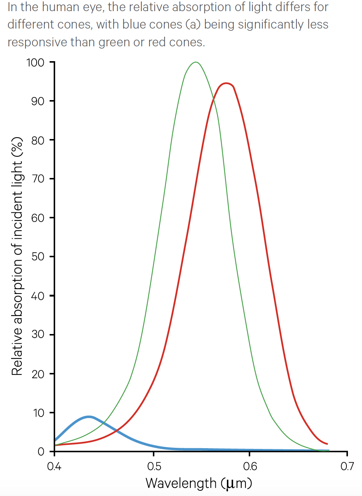
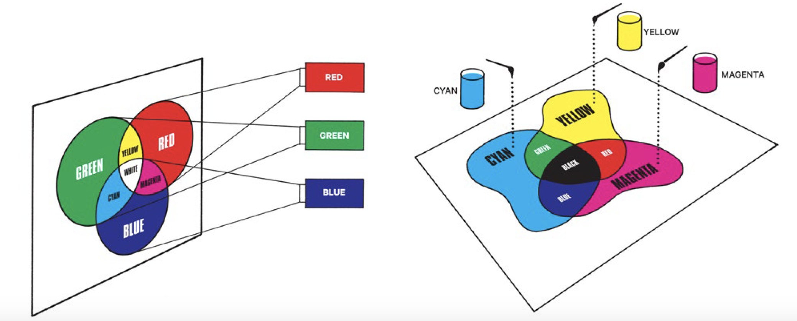
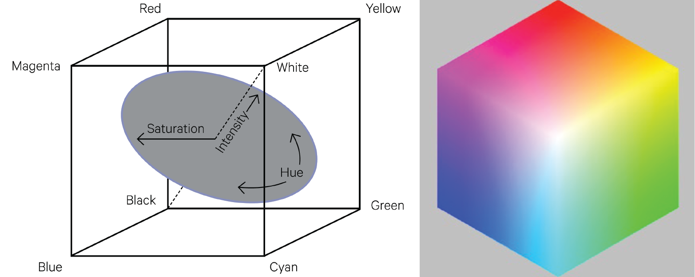
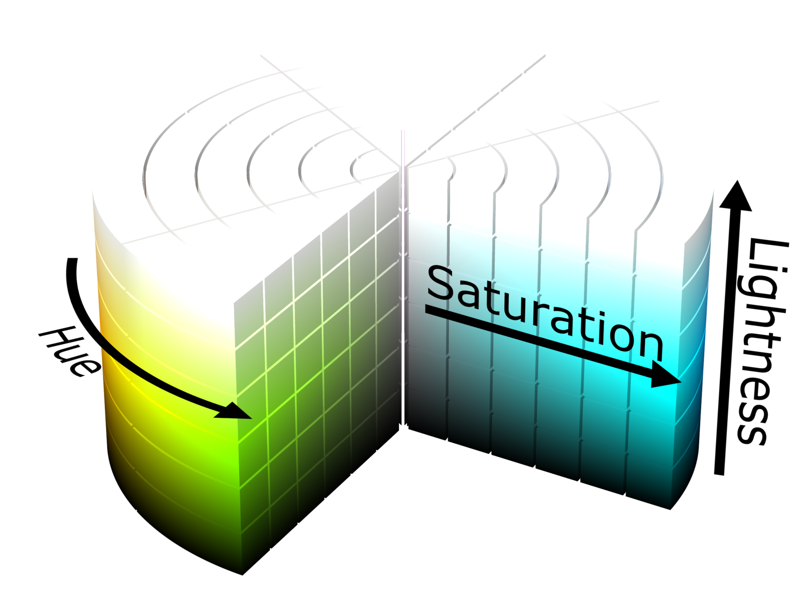
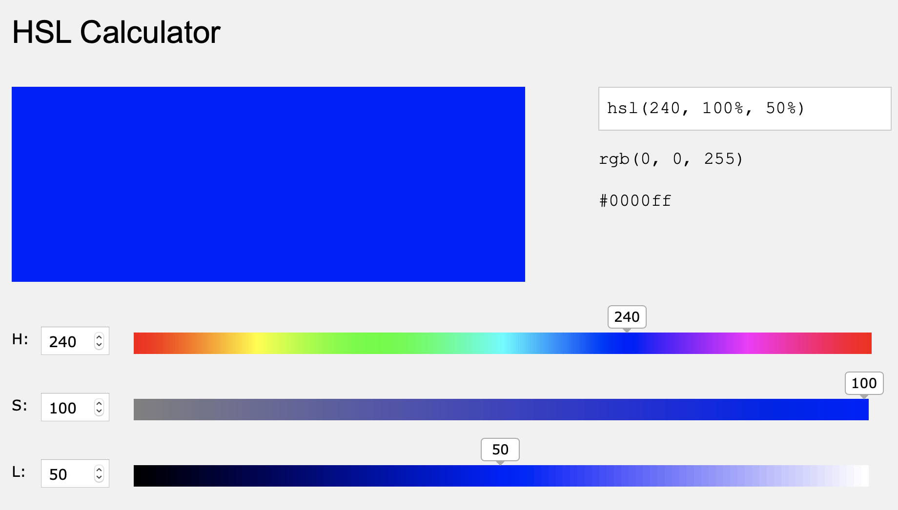
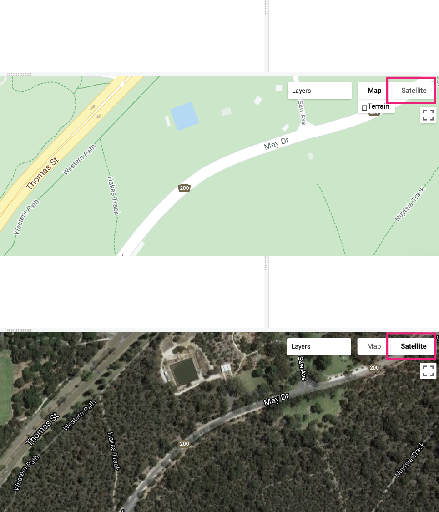
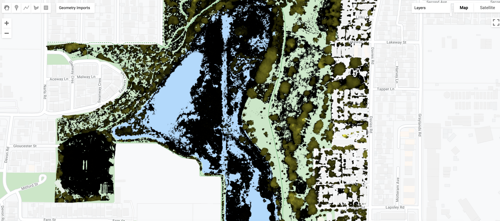
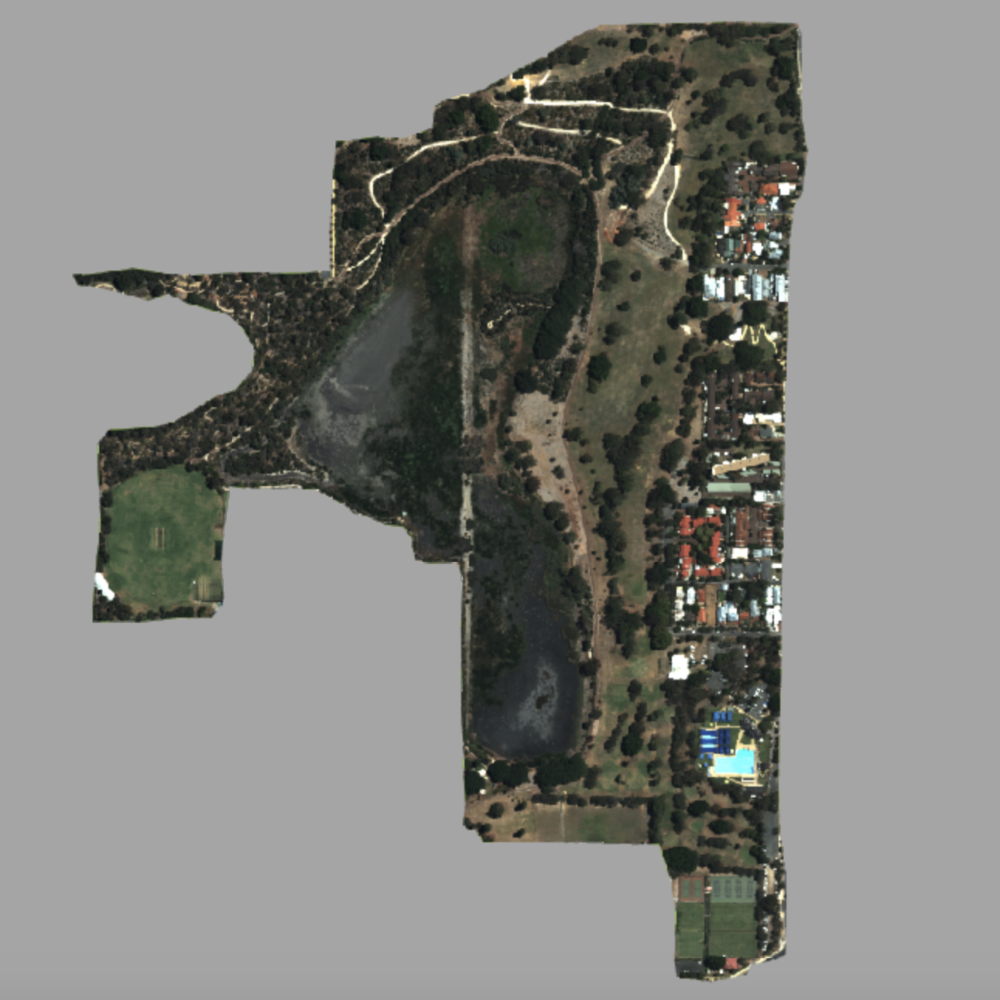
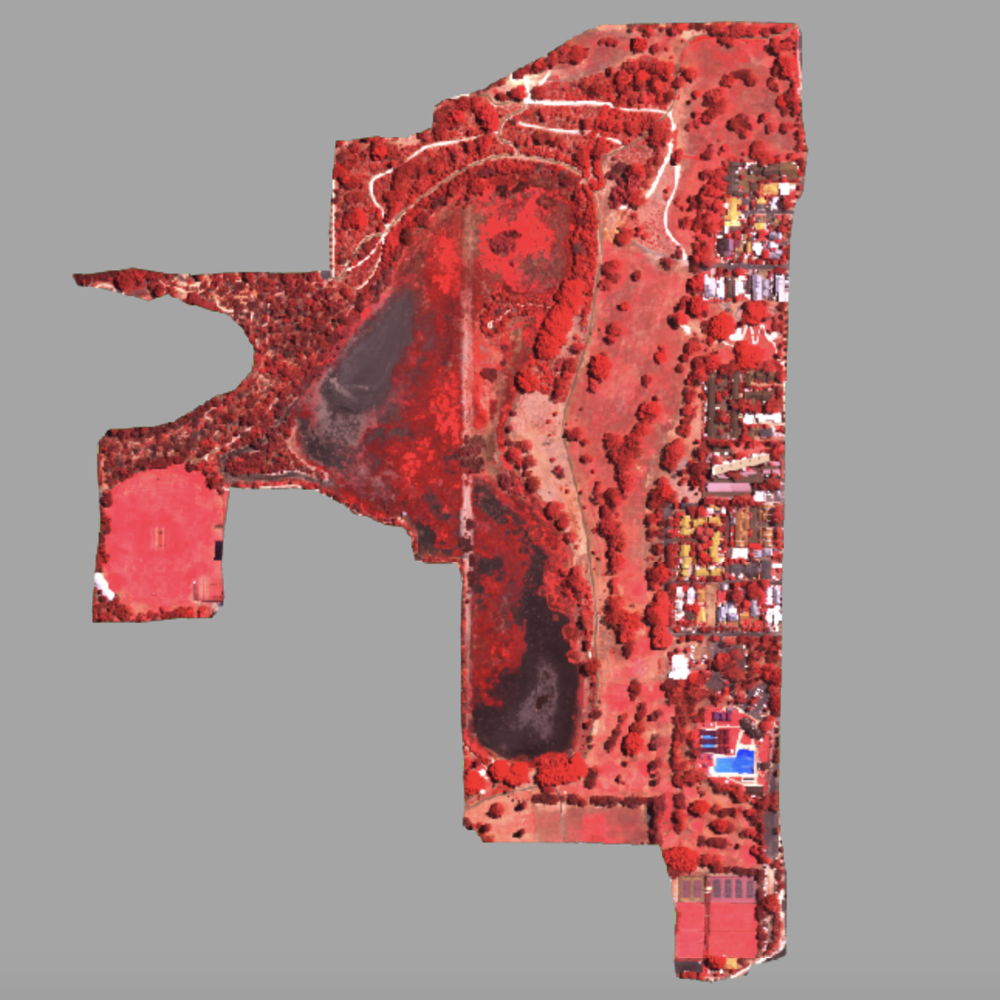

```{r setup, include=FALSE}
knitr::opts_chunk$set(echo = TRUE)
```

<br>

## Introduction

This lab will introduce tools for spatial data visualisation in Google Earth Engine. Data visualisation is the activity of relating observations and variation in your data to visual objects and properties on a display. How you relate your data values to display objects will determine what insights you can derive from your data, what patterns and relationships it will reveal, and what messages you can convey from your data. 

Visual objects and properties that you can associate with data values include  geometric objects (points, lines, polygons, pixels for a map; histogram bar polygons, line chart lines, scatter plot points for charts), line width, line style, point marker type, displacement, and colour. This lab will focus on the use of colour to represent features or patterns in geospatial data but you should also be aware of other visual properties of your map display that can be adjusted; for example, you don't want to use a line width so thick that it obscures variation in polygons represented by colour fill values. 

### Setup

Create a new script in your *labs-gee* repository called *lab4b*. Enter the following comment header to the script. 

<br>

```{js, echo=TRUE, eval=FALSE}
/*
Lab 4b
Author: Test
Date: XX-XX-XXXX

*/

```

<br>
<hr>
<br>

## Colour Theory

One of the key aspects of spatial data visualisation is using colour to represent variation in data values. This process involves mapping data values to colours and then assigning colours to objects (e.g. points, lines, polygons, or pixels) on your display. As stated by <a href="https://serialmentor.com/dataviz/color-basics.html" target="_blank">Wilke (2019)</a> there are three main uses of colour in data visualisation:

1. distinguish groups in your data
2. represent data values
3. to highlight features in your data

### Colour

Color is defined by the characteristics of a mix wavelengths of light in the visible spectrum <a href="https://ggplot2-book.org/index.html" target="_blank">Wickham (2020)</a>. A particular colour is defined by levels of intensity of light in different parts of the visible spectrum (e.g. yellow is a mixture of light in red and green wavelengths). The human eye has three types of sensors / receptors (cones) with each type of sensor most sensitive to light with wavelenghts of 0.44 $\mu$m (blue), 0.53 $\mu$m (green), and 0.57 $\mu$m (yellow - but absorbs red light). The human eye can distinguish millions of colours <a href="https://www.crcsi.com.au/assets/Consultancy-Reports-and-Case-Studies/Earth-Observation-reports-updated-Feb-2019/Vol2A-low-res-20MB.pdf" target="_blank">CRCSI (2017)</a>; thus, colour is useful for representing variation, patterns, or interesting features in your data. 

<br>
<center>

```{r colour, fig.align = 'center', out.width = "60%", fig.cap = "Relative light absorption of cones in the human eye (source: [CRCSI (2016)](https://www.crcsi.com.au/history-2/earth-observation-series-2/)).", echo = FALSE}


```

</center>
<br>

An individual colour can be described in terms of hue, value, or chroma <a href="https://www.crcsi.com.au/history-2/earth-observation-series-2/" target="_blank">(CRCSI, 2016)</a>:

* **Hue:** the attribute commonly associated with colour which is determined by the mix wavelengths. Hues have an order which follows the colours of the spectrum and spectral hues can be created by mixing adjacent wavelengths. Purple, for example, is a non-spectral hue as it is a mixture of blue and red whose wavelengths are not adjacent. 
* **Brightness (Value / Intensity):** is the perceived brightness of a colour and is related to the amount of energy in all wavelengths of light reflected by an object. This is the intensity or value of light. 
* **Chroma (Saturation):** is related to the purity of a colour. It can be thought of as the distribution of intensity in wavelengths around the wavelength of average (peak) intensity of light reflected by an object. Adding white, grey, or black to light reduces the chroma and produces pastel colours. 

### Colour Models / Colour Spaces

**Additive Primaries (RGB Cube)**

Colour is represented by combinations (addition) of red, green, and blue light. Red, green, and blue are primary colours and combine to form white. An absence of red, green, and blue is black. Secondary colours, which are brighter than any of the primary colours, can be formed by the addition of primary colours of varying intensities (e.g. yellow is the addition of red and green, magenta is the addition of red and blue, and cyan is the addition of green and blue). A related colour model uses subtractive primary colours (yellow, magenta, or cyan) which are subtracted from a white background to produce different colours.

<br>
<center>

```{r colour-models, fig.align = 'center', out.width = "70%", fig.cap = "Additive and subtractive colour models (source: [CRCSI (2017)](https://www.crcsi.com.au/assets/Consultancy-Reports-and-Case-Studies/Earth-Observation-reports-updated-Feb-2019/Vol2A-low-res-20MB.pdf)).", echo = FALSE}


```

</center>
<br>

Colour can be represented by coordinates in 3D space using the RGB colour cube where each dimension is represented by a primary colour. The intensity of a colour is represented by its position along a dimension. Grey colours, equal intensities of each of the primary colours, is represented by the diagonal axis from black (absence of primary colours) to white (complete presence of the spectrum of colours). 

<br>
<center>

```{r rgb-colour-models, fig.align = 'center', out.width = "70%", fig.cap = "RGB Colour Cube (source: [CRCSI (2017)](https://www.crcsi.com.au/assets/Consultancy-Reports-and-Case-Studies/Earth-Observation-reports-updated-Feb-2019/Vol2A-low-res-20MB.pdf)).", echo = FALSE}


```

</center>
<br>

**Hue, Saturation, Intensity (HSI) Colour Space** 

Colour coordinates in the RGB cube colour model can be transformed to coordinates in Hue, Saturation, and Intensity (HSI) space. Hue represents saturated pure colours as angular values surrounding a central axis of achromatic colour with black at the bottom and white at the top (red hue = 0 or 360; green = 120; blue = 240). This central axis represents the lightness of the colour (black = 0 % and white = 100 %). The saturation of a colour represents the amount of grey in the colour (grey = 0 % and pure colour = 100 %). 

<br>
<center>

```{r hsl-colour-models, fig.align = 'center', out.width = "70%", fig.cap = "HSL colour model (source: [Wikimedia Commons](https://commons.wikimedia.org/wiki/File:HSL_color_solid_cylinder.png)).", echo = FALSE}


```

</center>
<br>

**Colour on Computer Displays**

Computer displays consist of red, green, and blue sub-pixels, which when activated with different intensities, are perceived as different colours. The range of colours that can be displayed on a computer display is called the *gamut*. Colour in computer programs is represented as a three byte hexadecimal number with byte 1 corresponding to red, byte 2 corresponding to green, and byte 3 corresponding to blue. Each byte can take the range of 00 to FF in the hexadecimal system (or 0 to 255 in decimal). 00 indicates the absence of that colour and FF indicates saturation of that colour. `FF0000` is red, `00FF00` is green, and `0000FF` is blue. 

Use this <a href="https://www.w3schools.com/colors/colors_rgb.asp" target="_blank">RGB colour picker</a> to see how changing red, green, and blue intensities creates hexadecimal number representations of the colour. 

Similarly, you can use this <a href="https://www.w3schools.com/colors/colors_hsl.asp" target="_blank">HSL colour picker</a> to see how changing hue, saturation, and lightness results in different hexadecimal number representations of colour.

<br>
<details>
  <summary><b>*How would you represent pure yellow as a 3 byte hexadecimal number?*</b></summary>
  <p>
  <br>
  `FFFF00`
  </p>
</details>
<br>

<details>
  <summary><b>*You want to represent a flooded location as a blue polygon. You want this object to stand out and appear bright. What would be suitable hue, saturation, and lightness values for this object? What hexadecimal number would represent these HSL values?*</b></summary>
  <p>
  <br>
  Choose a colour with a distinctive blue hue (around 240), pure colour (saturation close to 1 or 100 %), and a lightness with minimal white or black tints and shades (around 0.5 or 50 %). Depending on the basemap and colour of other objects on the map you could adjust these values to maximise visual discrimination of the flooded object.
  <br>
  `0000FF`
  <br>
  
  ```{r hsl-blue, fig.align = 'center', out.width = "70%", fig.cap = "Distinctive blue for displaying a flood object (source: [W3Schools](https://www.w3schools.com/colors/colors_hsl.asp)).", echo = FALSE}


```
  </p>
</details>
<br>

### Choosing Colours

Choose colours and colour palettes that account for colour blindness. There are online tools that you can use to simulate colour blindness (e.g. <a href="https://colororacle.org" target="_blank">color oracle</a>). 

Choose colours / colour palettes that have a logical interpretation (e.g. greens for vegetation; blue for wetter areas; red for hot).

If your data values don't have a natural order (e.g. land cover data) don't use a colour scale that implies order (e.g. dark to light colours, low to high saturation, warm to cool hues). Section 4 in <a href="https://serialmentor.com/dataviz/color-basics.html" target="_blank">Wilke (2019)</a> outlines key points to consider when choosing a colour scale to represent variation in your data and <a href="https://serialmentor.com/dataviz/color-pitfalls.html" target="_blank">common pitfalls</a> to avoid when using colour for data visualisations. 

If there is order in your data, *sequential* colour palettes which indicate large and small values and distance between values should be used. Sequential colour palettes can be single-hue or multi-hue The top group of colour palettes in the below figure depict sequential colour palettes from <a href="https://colorbrewer2.org/#type=sequential&scheme=BuGn&n=3" target="_blank">Color Brewer</a>. 

In some cases, your data might have a logical midpoint value (e.g. median) and you want your colour palette to represent variation away from this value. In this instance a *diverging* colour palette should be used (see the bottom group of colour palettes in the below figure). 

*Qualitative* colour palettes (middle group in the figure below) assign colours to data values or categories where each colour appears equivalent and distinct. They should be used for categorical and unordered data. 

The <a href="https://colorbrewer2.org/#type=sequential&scheme=BuGn&n=3" target="_blank">Color Brewer</a> website is a good resource for generating colour palettes for spatial data which also account for colour blindness. 

<br>

```{r brewer-scales, fig.align = 'center', out.width = "60%", fig.asp = 1.5, echo = FALSE, fig.cap = "ColourBrewer scales (source [R 4 Data Science](https://r4ds.had.co.nz/graphics-for-communication.html))"}
par(mar = c(0, 3, 0, 0))
RColorBrewer::display.brewer.all()
```
<br>

Be aware of context and how the relationship between objects on a map display can affect how they are perceived by human eyes. For example, thin geometric features are not easily detected when represented in blue hues, the perceived hue of an object changes with background colour (blue features are hard to detect on black backgrounds, yellow is hard to detect on white backgrounds), and the perceived chroma of an object is related to feature size. <a href="https://www.crcsi.com.au/assets/Consultancy-Reports-and-Case-Studies/Earth-Observation-reports-updated-Feb-2019/Vol2A-high-res-84MB.pdf" target="_blank">Excursus 5.2 (CRCSI, 2017; p. 75)</a> highlights how color composition can obscure or misrepresent variation in spatial data. 

<br>
<details>
  <summary><b>*Go to the <a href="https://colorbrewer2.org/#type=sequential&scheme=BuGn&n=3" target="_blank">Color Brewer</a> website and choose a colour palette to represent spatial variation in precipitation? Justify why this is a suitable colour palette. Look out for how to copy the hexadecimal values representing the colours in your palette as a JavaScript array.*</b></summary>
  <p>
  <br>
  Diverging colour palette emphasises variation between wet and dry areas with red representing dry areas and blue wet areas. Pure red and blue will highlight extreme values. People who are colour blind will be able to distinguish variation in precipitation.
  <br>
  <center>
  <iframe src="https://player.vimeo.com/video/444908480" width="640" height="399" frameborder="0" allow="autoplay; fullscreen" allowfullscreen></iframe>
  <p>Selecting a colour palette to represent precipitation using Color Brewer.</p>
  </center>
  </p>
</details>
<br>

<hr>
<br>

## Colour to Highlight Features

You can use colour to highlight certain features or patterns in your data, or, as is often the case in spatial data visualisation, make certain features stand out from a base map. Look at the colours used in Google Maps and also the typical styling for <a href="https://www.openstreetmap.org/#map=12/-31.9353/115.8210" target="_blank">open street maps</a>; they use subdued and relatively impure pastel colours. You can use strong and pure colours to visualise features that stand out against these backgrounds. 

In the map display zoom and scroll to an area of parkland in Perth. Use the *Geometry Tools* to digitise a Polygon object to represent green space or a park. Change the name of the variable storing the Polygon `Geometry` object to `park`. Add the Polygon object in `park` to the map display with the <font color="#99e6b3">green colour</font>: `#99e6b3`. To do this you need to use the following functions:

* `Map.addLayer()` - adds a Google Earth Engine object (i.e. spatial data stored in a variable on the Google servers) to the map display in your browser. You pass the variable you wish to display (i.e. `park`), a dictionary of visualisation parameters that specify how the spatial data is visualised (i.e. `{color:"#99e6b3"}`), and a string name of the layer (i.e. `"Park"`) into the `Map.addLayer()` function as arguments.
* `Map.centerObject()` - centers the map display on the location of an object passed as a variable to function (i.e. `park`) with the second argument being a number specifying the zoom level (i.e. `15`).

<br>

```{js, echo=TRUE, eval=FALSE}
// Add Polygon geometry object representing a park to the map
Map.centerObject(park, 15);
Map.addLayer(park, {color:"#99e6b3"}, "Park");

```

<br>

<center>
<iframe src="https://player.vimeo.com/video/445129978" width="640" height="302" frameborder="0" allow="autoplay; fullscreen" allowfullscreen></iframe>
<p>Use Geometry Tools to create a Polygon object representing a park and display in green.</p>
</center>

<details>
  <summary><b>*Assess the use of the <font color="#99e6b3">green colour</font>: `#99e6b3` to represent the park on Google Maps? Can you pick a different colour to visualise the park and justify your choice?*</b></summary>
  <p>
    The <font color="#99e6b3">green colour</font>: `#99e6b3` has a logical relationship with greenspace or parks - the real world geographic entity it is representing. However, the green colour could be edited to make it stand out from the basemap. For example, `#99e6b3` has a hue of 140, a saturation of 60 %, and a lightness of 75 %. This indicates the hue of `#99e6b3` is a spectral mix of blue and green, a saturation of 60 % indicates that the colour is not pure and includes some some grey, and a lightness greater than 50 % indicates that white tints are introduced to the colour. You could reduce the white tints by reducing the lightness value to 50 %, increase the saturation, and change the hue value to be closer to primary green (hue = 120). Use the <a href="https://www.w3schools.com/colors/colors_hsl.asp" target="_blank">HSL Calculator</a> to adjust hue, saturation, and lightness values and find a suitable colour to highlight your `park` against the Google Maps basemap. Edit your script to visualise your `park` object in a more distinctive green colour. You should include a different hexadecimal number as a string representing colour in the value referenced by the `color` key in the visualisation parameters. The code snippet below is an example using the hexadecimal number representation of primary green `00FF00`.

<br>
    
```{js, echo=TRUE, eval=FALSE}
// Use colour to highlight the park against the basemap
Map.addLayer(park, {color:"#00FF00"}, "Park - Primary Green");

```    
  </p>
</details>
<br>

<hr>
<br>

## Colour to Represent Groups

You can use colour to represent categorical groups in your data. You do not want to choose a colour palette that implies order in your data. Use a qualitative colour palette that ensures groups in your data can be distinguished from each other and the colours are perceived as equivalent <a href="https://serialmentor.com/dataviz/color-basics.html" target="_blank">(Wilke, 2019)</a>. Also, if it makes sense with your data choose colours that have a logical relationship with the group or category in your data (e.g. vegetated land cover classes as green in a land cover map). 

Execute the below code. This loads the tree raster layer from the 2016 Urban Monitor data <a href="https://urbanmonitor-beta.landgate.wa.gov.au/content/app/urban-monitor-metadata-final-report.pdf" target="_blank">(Caccetta, 2012)</a> and displays tree pixels in black. The Urban Monitor data is derived from 20 cm spatial resolution multispectral aerial images collected and processed by CSIRO (resampled to 40 cm spatial resolution here). Tree land cover is a categorical group in your data (the only group in this raster data); is black the most suitable colour to represent trees? 

<br>

```{js, echo=TRUE, eval=FALSE}
// UM Tree
var umTree = ee.Image("users/jmad1v07/gee-labs/um-lake-claremont-tree-2016");
Map.centerObject(umTree, 15);
Map.addLayer(umTree, {min: 0, max: 1, palette:["000000"]}, "UM Tree - black colour");

```

<br>
<details>
  <summary><b>*Display the Urban Monitor tree `Image` on your map choosing a more suitable colour than black for display.*</b></summary>
  <p>
  <br>
```{js, echo=TRUE, eval=FALSE}
// UM Tree - green
Map.addLayer(umTree, {min: 0, max: 1, palette:["#009900"]}, "UM Tree - better colour???");

``` 
  </p>
</details>
<br>

Change the base map to satellite. You can do this by clicking the satellite button in the top right corner of the map display. 

<br>
<center>

```{r satellite-basemap, fig.align = 'center', out.width = "60%", fig.cap = "Change to satellite basemap.", echo = FALSE}


```

</center>
<br>
<details>
  <summary><b>*Change the base map to satellite. Choose a suitable colour to represent trees so that they stand out against the satellite base map? Justify your choice of colour.*</b></summary>
  <p>
  <br>
  You could use <a href="https://colorbrewer2.org/#type=sequential&scheme=BuGn&n=3" target="_blank">Color Brewer</a> to help pick out a colour that is distinct from the green and brown colours that dominate the base map but are safe for colour blind viewers. One option could be to use a blue colour; this will be distinct from green but the trade off is that blue is not logically associated with trees. 
  
```{js, echo=TRUE, eval=FALSE}
// UM Tree - blue
Map.addLayer(umTree, {min: 0, max: 1, palette:["#009E73"]}, "UM Tree - satellite basemap");

``` 
  </p>
</details>
<br>

<b>Tip:</b> You can use the Layers widget in the top right corner of the map display to turn layers on and off, change a layer's opacity, and also control other visualisation and display paramters.

<br>
<center>

<iframe src="https://player.vimeo.com/video/449161980" width="640" height="300" frameborder="0" allow="autoplay; fullscreen" allowfullscreen></iframe>
<p>Change layers on map display.</p>
</center>
<br>

You can also specify colours to visualise multiple categories in spatial data. If you execute the below code you will assign one of the colours specified in the array assigned to the `palette` key in the `igbpVis` object to one of land cover classes in the 500 m spatial resolution <a href="https://developers.google.com/earth-engine/datasets/catalog/MODIS_006_MCD12Q1" target="_blank">MODIS MCD12Q1</a> land cover data for 2019. Each pixel has a value from 1 to 17 which relates to the land cover classes (categories) of the Annual International Geosphere-Biosphere Programme (IGBP) classification.

<br>

```{js, echo=TRUE, eval=FALSE}

// Visualise MODIS MCD12Q1 Land Cover data for 2019 
var lcModis = ee.Image("users/jmad1v07/gee-labs/lc-mcd12q1-2019-lc-type-1");

// Define a palette for the distinct land cover classes.
var igbpVis = {
  min: 1.0,
  max: 17.0,
  palette: [
    '05450a', '086a10', '54a708', '78d203', '009900', 'c6b044', 'dcd159',
    'dade48', 'fbff13', 'b6ff05', '27ff87', 'c24f44', 'a5a5a5', 'ff6d4c',
    '69fff8', 'f9ffa4', '1c0dff'
  ],
};
Map.centerObject(lcModis, 9);
Map.addLayer(lcModis, igbpVis, "Land Cover MODIS MC12Q1 2019");

```

<br>
<hr>
<br>

## Colour to Represent Data Values

Up until now you have been associating discrete values or categories to colours that are rendered on your display. However, if your data is continuous you will need to relate your data values to a range of colours in a palette. How you relate data values to a range of colours, and the choice of colours in your colour palette, will determine how variation in your data is visualised. 

The 2016 Urban Monitor data introduced above also includes a vegetation height raster layer <a href="https://urbanmonitor-beta.landgate.wa.gov.au/content/app/urban-monitor-metadata-final-report.pdf" target="_blank">(Caccetta, 2012)</a>. Again, this data is resampled to a 40 cm spatial resolution and each pixel value represents the height of vegetation in metres if a pixel was vegetated. Height is a continuous variable with a clear order from low to high.  

<br>
<details>
  <summary><b>*Would a sequential or diverging colour palette be suited to visualising the height of vegetation?*</b></summary>
  <p>
  <br>
  Sequential. There is not an obvious mid-point from which height diverges. Height increases from 0 m.  
  </p>
</details>
<br>

Execute the below code to visualise the Urban Monitor vegetation height data with a colour palette to represent low vegetation height in black (`"000000"`) through to red colours for high vegetation (`"0000FF"`). 

<br>

```{js, echo=TRUE, eval=FALSE}
// UM Vegetation Height
var umVht = ee.Image("users/jmad1v07/gee-labs/um-lake-claremont-vht-2016");
Map.centerObject(umVht, 15);
Map.addLayer(umVht, {min: 0, max: 100, palette:["000000", "FFFF00", "FF0000"]}, "UM Vegetation Height");

```

<br>

You should see something like the below image in your map display. It was just mentioned that the colour palette relates high vegetation to the colour red but tree canopy is appearing in black-yellow colours. Why is this? 

If you look at the dictionary of visualisation parameters you passed as an argument to the `Map.addLayer()` function you will see `min: 0, max: 100`. This means you are relating a pixel value of 0 metres to black colours and a pixel value of 100 metres to pure red colour. Pixel values between 0 to 100 are related to the range of colours spanning the black-yellow-red colour palette that can be displayed by your screen. A tree height of 100 metres exceeds the expected tree height in the Lake Claremont area in Perth. This means that data values are assigned to display colours that are not in your dataset; in other words you are not utilising the range of display colours to highlight variation in your data values.

<br>
<center>

```{r vht-no-red, fig.align = 'center', out.width = "70%", fig.cap = "Visualising Urban Monitor vegetation height data with a black-yellow-red colour scale.", echo = FALSE}


```

</center>

<br>
<details>
  <summary><b>*What would be appropriate min and max vegetation height values to assign to the minimum and maximum display range to highlight variation in vegetation height? Adjust the visualisation parameters to display the vegetation height data to emphasising variation in vegetation height. *</b></summary>
  <p>
```{js, echo=TRUE, eval=FALSE}
// UM Vegetation Height - adjusted display range
Map.addLayer(umVht, {min: 0, max: 30, palette:["000000", "FFFF00", "FF0000"]}, "UM Vegetation Height adjusted min max??");

```  
  </p>
</details>
<br>

<details>
  <summary><b>*How effective do you think visualising vegetation height with a black-yellow-red colour palette is? Do you usually associated red with high vegetation (i.e. tree canopy)? Choose a different colour palette to represent vegetation height and justify your choice.*</b></summary>
  <p>
  <br>
  Use a single hue green colour palette with darker green associated with higher vegetation. This colour palette was selected using <a href="https://colorbrewer2.org/#type=sequential&scheme=BuGn&n=3" target="_blank">Color Brewer</a>. Think about the limits of this colour palette when using it with the Google base map.
```{js, echo=TRUE, eval=FALSE}
// UM Vegetation Height - adjusted colour palette
Map.addLayer(umVht, {min: 0, max: 30, palette:['#edf8e9','#c7e9c0','#a1d99b','#74c476','#41ab5d','#238b45','#005a32']}, "UM Vegetation Height adjusted colour palette");

```  
  </p>
</details>
<br>

The following code will load average land surface temperature (LST; Kelvin) across Perth for the summer months (December, January, and February) for the years 2014 to 2019. This LST data is derived from Landsat 8 observations and computed using the algorithm of <a href="https://ieeexplore.ieee.org/document/6784508" target="_blank">Jiménez-Muñoz et al. (2014)</a>.

<br>

```{js, echo=TRUE, eval=FALSE}
// Visualise Landsat 8 land surface temperature (K)
var lstLandsat8 = ee.Image("users/jmad1v07/gee-labs/landsat8-lst");

```

<br>

<details>
  <summary><b>*Sensible minimum and maximum data values to assign to the limits of the display colour range are 295 to 315 K. Can you create a colour palette to visualise variation in land surface temperature and map the Landsat 8 data in the variable `lstLandsat8` using this colour palette?*</b></summary>
  <p>
  <br>
```{js, echo=TRUE, eval=FALSE}
// Example colour palette to visualise land surface temperature data
Map.centerObject(lstLandsat8, 12);
var lstVisParam = {min:295, max:315, palette:["000066","00ffff","ffff00","ff0000"]};
Map.addLayer(lstLandsat8, lstVisParam, "Surface Temperature (K)");

```  
  </p>
</details>
<br>

<hr>
<br>

## Multiband Images

`Images` in Google Earth Engine can have multiple bands where each band comprises georeferenced raster data. As discussed above, computer displays represent colour through varying the intensity of sub-pixel displays of red, green, and blue light. Variability in data values in multiband `Images` can be visualised by relating data values in one band of the `Image` to the intensity of one the primary colours on the computer display. Visualising a multiband `Image` in this way creates an additive RGB or colour composite image - it is called a composite image because each pixel is a composite of red, green, and blue light <a href="https://www.crcsi.com.au/assets/Consultancy-Reports-and-Case-Studies/Earth-Observation-reports-updated-Feb-2019/Vol2A-high-res-84MB.pdf" target="_blank">Excursus 5.2 (CRCSI, 2017)</a>. 

### True Colour Composite Image

Multiband `Images` are common in remote sensing where each band contains measures of spectral reflectance in different wavelengths. When a sensor records spectral reflectance in the visible blue, green, and red wavelengths, variation in these bands can be related to intensities of blue, green, and red on the computer display. This should display features on your map in colours similar to how you would see these spatial features if you were looking down towards the Earth's land surface. 

The Urban Monitor data contains a 4-band multispectral `Image` corresponding to spectral reflectance measures in the blue, green, red, and near infrared (NIR) wavelengths. You can use the blue, green, and red bands in the Urban Monitor data to display this data as a true colour composite RGB image on your map display.  

The following code will visualise a multiband Urban Monitor `Image` as a colour composite on your display. As you have done previously, you pass a dictionary object of visualisation paramters (stored in the variable `visTrueColourParams` in the below snippet) to the `Map.addLayer()` function. The key:value pairs inside this dictionary object determine how the bands in the multiband `Image` are rendered as a false colour composite. 

You have an array ["b1", "b2", "b3"] assigned to the `bands` key. This array specifies which bands should be assigned to red, green, and blue intensities on the display. The Urban Montior multispectral data has band 1 (`"b1"`) storing red spectral reflectance, band 2 (`"b2"`) storing green spectral reflectance measures, and band 3 (`"b3"`) storing blue spectral reflectance measures. NIR is stored in band 4 (`"b4"`) in the Urban Monitor product. This band ordering does not correspond to the order of wavelengths so be careful to assign the band storing red reflectance values to red on the display. 

You have assigned a value of zero spectral reflectance to the minimum of the display range and a spectral reflectance value of 0.3 to the maximum of the display range. Most of the features in this Urban Monitor scene have spectral reflectance values in this range even though the maximum possible spectral reflectance is 1. Assigning these values to the limits of the display range ensures you maximise the use of display colours to discriminate features in your image.

<br>

```{js, echo=TRUE, eval=FALSE}
// UM multispectral
var umDom =  ee.Image("users/jmad1v07/gee-labs/um-lake-claremont-dom-2016");

// UM True Colour Composite
// Define the visualization parameters.
var visTrueColourParams = {
  bands: ["b1", "b2", "b3"],
  min: 0,
  max: 0.3
};
Map.centerObject(umDom, 17);
Map.addLayer(umDom, visTrueColourParams, "UM True Colour Composite");

```

<br>

Your visualisation of the Urban Monitor `Image` data as a true colour composite should look like the figure below. The colours on the display clearly correspond to how we would perceive this scene with our eyes if we were looking down on it.  

<br>
<center>

```{r um-rgb-tcc, fig.align = 'center', out.width = "70%", fig.cap = "Urban Monitor - true colour composite.", echo = FALSE}


```

</center>
<br>

### False Colour Composite Image

You can associate other `Image` bands to intensities of red, green, and blue light on your display even if these bands do not actually measure sprectral reflectance in the red, green, and blue wavelengths. This is a false colour composite image. Some features of Earth's land surface have distinct reflectance characteristics in portions of the electromagnetic spectrum outside the visible wavelengths. For example, vegetation has high reflectance in the NIR wavelengths. 

A common false colour composite image associates NIR reflectance with red intensities on your display, red spectral reflectance with green on your display, and green spectral reflectance with blue on your display <a href="https://www.crcsi.com.au/assets/Consultancy-Reports-and-Case-Studies/Earth-Observation-reports-updated-Feb-2019/Vol2A-high-res-84MB.pdf" target="_blank">Excursus 5.2 (CRCSI, 2017)</a>. This false colour composite will visualise vegetation in red shades (due to high reflectance in the NIR wavelengths), red soils as green (due to soils having high reflectance in the red wavelengths, and water as blue (due to water having relatively higher reflectance in the green wavelengths)).

<details>
  <summary><b>*Bare soil has high spectral reflectance in the blue, green, red, and NIR wavelengths. What colour will bare soil be visualised in on your map display? (Hint: use this <a href="https://www.w3schools.com/colors/colors_rgb.asp" target="_blank">RGB colour picker</a> to create a colour that is composed of high intensities in red, green, and blue).*</b></summary>
  <p>
  <br>
  White and light shades. White light is a combination of reflectance across all wavelengths.   
  </p>
</details>
<br>

<details>
  <summary><b>*In a true colour composite image cloudy areas will be displayed with high intensities in the red, green, and blue display values. Why is this?*</b></summary>
  <p>
  <br>
  Clouds are typically white which means they have high spectral reflectance in all visible wavelengths. Therefore, high values of blue, green, and red spectral reflectance measures will be related to high intensities of blue, green, and red on the display.   
  </p>
</details>
<br>

```{js, echo=TRUE, eval=FALSE}
// UM False Colour Composite
var visFalseColourParams = {
  bands: ['b4', 'b1', 'b2'],
  min: 0,
  max: 0.3
};
Map.addLayer(umDom, visFalseColourParams, "UM False Colour Composite");

```

<br>

Your display of the Urban Monitor `Image` as a false colour composite should look like the display below. You can clearly see vegetation in shades of red due the red colour on the display representing NIR spectral reflectance. 

<br>
<center>

```{r um-rgb-fcc, fig.align = 'center', out.width = "70%", fig.cap = "Urban Monitor - false colour composite.", echo = FALSE}


```

</center>
<br>


<hr>

<div class="tocify-extend-page" data-unique="tocify-extend-page" style="height: 0;"></div>
<footer>
<p>Advanced GIS and Remote Sensing</p>
</footer>