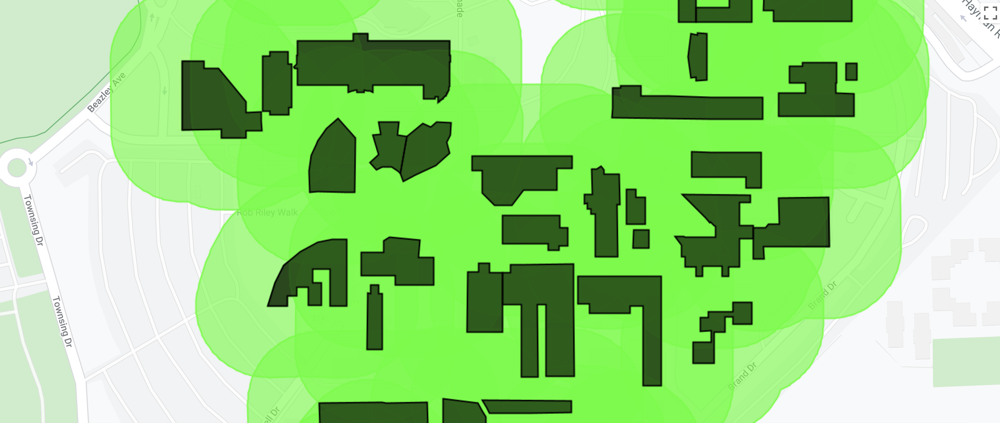
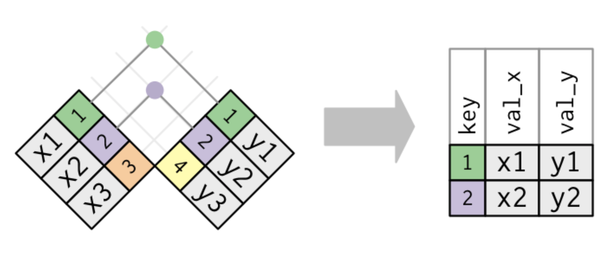

```{r setup, include=FALSE}
knitr::opts_chunk$set(echo = TRUE)
```

<br>

## Introduction

This lab will introduce data transformation and manipulation operations for vector data. 

<div class="well well-sm">

<b>Quick recap:</b> In Google Earth Engine, vector data is represented using `Feature` objects which include a `geometry` property storing a `Geometry` object that describes the location, extent, and shape of the `Feature` and a `properties` dictionary object of attribute information describing non-spatial characteristics of the data. A collection of `Feature`s in Google Earth Engine is a `FeatureCollection`; for example, if each weather station is represented as a `Feature` then a group of weather stations could be stored as a `FeatureCollection` object. 

</div>

Data transformation operations transform data into a format ready for subsequent analysis. For non-spatial data, common data transformation operations include filtering and subsetting observations, creating new variables through applying functions to existing variables, joining and combining data, and summarising or aggregating data. For example, consider the following data transformation operations that could be applied to climate data: 

<div class="well well-sm">

1. *<b>Filter and subset:</b>* filter the data for all observations that occurred within a time-period (e.g. since the year 2010) and select a variable of interest (e.g. temperature in Fahrenheit). 
2. *<b>Mutate - create a new variable:</b>* create a new variable (temperature in Celsius) by converting the observations of temperature in Fahrenheit using the equation: $T_{(C^{o})} = (T_{(F^{o})} - 32) * 5/9$. 
3. *<b>Join and combine:</b>*  join your temperature data to precipitation data (e.g. joining on weather station ID and date and time of weather observation). 
4. *<b>Summarise:</b>* summarise your data by computing the average daily temperature and precipitation for each weather station.

</div>

Data transformation operations can be applied to the non-spatial attribute information associated with spatial `Feature` objects. However, most data transformation operations have a spatial equivalent. For example,

<div class="well well-sm">

1. *<b>Filter and subset:</b>* filter a `FeatureCollection` based on geographic location and topological relations (e.g. selecting only weather stations that intersect with the Western Australia extent or only weather stations contained within a 10,000 km radius from Perth).
2. *<b>Mutate - create a new variable:</b>* the `Geometry` objects can be converted into spatial objects with new shapes or extents (e.g. through applying a 1 km buffer operation). 
3. *<b>Join and combine:</b>* spatial data can be combined through spatial join operations (e.g. join weather station data with Statistical Area Level 1 (SA1) polygon geometries based on the intersection between a weather station's location and the extent of the SA1)
3. *<b>Join and combine AND mutate - create a new variable:</b>* vector data can be combined with raster data via zonal statistics (e.g. computing the area of each land cover class within a polygon `Geometry`). 
4. *<b>Summarise:</b>* you could perform aggregations or summary operations for observations within a spatial extent (e.g compute the average temperature of all weather stations within each SA1 extent).  

</div>

Typically, the data transformation process will include both non-spatial operations applied to attribute data and spatial / geometric operations applied to the `Geometry` objects. This lab will demonstrate several spatial and non-spatial data transformation operations that can be applied to vector data in Google Earth Engine. These operations will form part of a workflow to address the question: *Which Perth university has the greenest and coolest campus?*

### Which Perth university has the greenest and coolest campus?

You will start with a `FeatureCollection` containing `Feature` objects which represent the footprint of a building (a polygon `Geometry` object) and attribute information indicating if the building is part of a university (the `building` property), the name of the university (the `uni_name` property), and a building ID (the `osm_id` property). The building footprint data are from <a href="https://wiki.openstreetmap.org/wiki/API_v0.6" target="_blank">Open Street Map</a>  and include buildings from the University of Western Australia (UWA) Crawley Campus, Curtin University Bentley Campus, Murdoch University Perth (Murdoch) Campus, Edith Cowan University (ECU) Mount Lawley Campus, and some non-university buildings near to each campus. 

You will use the area of tree canopy cover within a certain distance of a building as an indicator of *greenness*; the tree canopy data is in raster format and derived from the Urban Monitor data <a href="https://urbanmonitor-beta.landgate.wa.gov.au/content/app/urban-monitor-metadata-final-report.pdf" target="_blank">(Caccetta, 2012)</a>.  

The temperature data is also in raster format and is a measure of average summer (December, January, and February) land surface temperature (LST) derived from Landsat 8 <a href="https://ieeexplore.ieee.org/document/6784508" target="_blank">(Jiménez-Muñoz et al. 2014)</a>. 

You will need to produce summary statistics that describe the greenness and temperature of each university campus.  

Your analysis will comprise the following steps:

<div class="well well-sm">

1. *<b>Filter and subset:</b>* filter the building footprint `FeatureCollection` to include only university buildings.
2. *<b>Mutate - create a new variable:</b>* perform a buffer operation on each university building footprint `Geometry` object. 
3. *<b>Mutate - create a new variable:</b>* compute the area of tree canopy cover within the buffer of each building footprint. 
4. *<b>Mutate - create a new variable:</b>* compute the average LST for each building's buffer. 
5. *<b>Join and combine:</b>* join the area of tree canopy cover and average LST within each building's buffer to a `FeatureCollection` storing the building footprint `Geometry`. 
6. *<b>Summarise:</b>* compute the average tree canopy cover and LST for buildings on each campus. 

</div>

### Setup

Create a new script in your *labs-gee* repository called *lab5*. Enter the following comment header to the script. 

<br>

```{js, echo=TRUE, eval=FALSE}
/*
Lab 5
Author: Test
Date: XX-XX-XXXX

*/

```

<br>

### Data Import

Execute the following code to import the data. The OSM buildings near Perth university campuses are a `FeatureCollection` of building `Feature` objects. The Urban Monitor tree cover data are clips of the area surrounding each university campus from a larger raster layer. Import these four clipped rasters as `Image` objects and `mosaic()` them into one `Image`. Each 40 cm pixel in the `uniTree` `Image` has a value 1 if it covers a tree canopy and a masked no data value if not. The `multiply(ee.Image.pixelArea())` operation is converting the pixel value of one into the area of the pixel in square metres.   

<br>

```{js, echo=TRUE, eval=FALSE}
// Data import

// Perth OSM university buildings and buildings near universities
var perthBuildingOSM = ee.FeatureCollection('users/jmad1v07/gee-labs/perth-uni-osm');
print(perthBuildingOSM);
Map.centerObject(perthBuildingOSM, 13);
Map.addLayer(perthBuildingOSM, {color: 'FF0000'}, 'OSM buildings near Perth university campuses');

// import urban monitor tree cover data
var curtinTree = ee.Image('users/jmad1v07/gee-labs/curtin-tree-2016');
var ecuTree = ee.Image('users/jmad1v07/gee-labs/ecu-tree-2016');
var murdochTree = ee.Image('users/jmad1v07/gee-labs/murdoch-tree-2016');
var uwaTree = ee.Image('users/jmad1v07/gee-labs/uwa-tree-2016');

// mosaic urban monitor tree cover data covering Perth universities
var uniTree = ee.ImageCollection([curtinTree, ecuTree, murdochTree, uwaTree]).mosaic();
print(uniTree);

// convert each pixel value to represent area of tree cover (SqM)
var uniTreePixelArea = uniTree.multiply(ee.Image.pixelArea());
print(uniTreePixelArea);

// import Landsat 8 summer land surface temperature
var landsatLST = ee.Image('users/jmad1v07/gee-labs/landsat8-lst');

```

<br>

Explore the `perthBuildingOSM` data in the map display and in the *console*. 

```{r osm-building, fig.align = 'center', out.width = "85%", fig.cap = "OSM building footprints and properties near UWA.", echo = FALSE}
knitr::include_graphics('img/osm-building-footprint-uwa.png')

```

<br>
<details>
  <summary><b>*Can you visualise the `uniTree` `Image` on the map display? Look back to lab 4 for examples of how to visualise the Urban Monitor data and for appropriate colour schemes.*</b></summary>
  <p>
  <br>
  ```{js, echo=TRUE, eval=FALSE}
// UM uni tree
Map.addLayer(uniTree, {min: 0, max: 1, palette:['#009900']}, 'UM Tree');

``` 
  </p>
</details>
<br>

<hr>
<br>

## Filter

Filtering subsets observations from your data based on their values <a href="https://r4ds.had.co.nz" target="_blank">(Wickham and Grolemund, 2017)</a>. In Google Earth Engine, comparison operators (e.g equals to `eq`, not equals to `neq`, less than `lt`, greater than `gt`) are used to filter observations based on attribute values. 

There are a range of in-built convenience `filter()` functions in Google Earth Engine that you can use for common filtering operations; for example, the following code snippet from [Lab 4a](lab-4.html) demonstrates the use of the in-built `filterDate()` function to filter a Landsat 8 `ImageCollection` using `Image` capture dates recorded in the metadata `properties` object. 

<br>

```{js, echo=TRUE, eval=FALSE}
// Landsat 8 Image Collection
var l8ImColl = ee.ImageCollection('LANDSAT/LC08/C01/T1_SR');

// Filter Image Collection for 2018
var l8ImColl = l8ImColl
  .filterBounds(ee.Geometry.Point(115.81237940701908,-31.9783567043356))
  .filterDate('2018-01-01', '2018-12-31');
print(l8ImColl); 
```

<br>

<details>
  <summary><b>*Change the date range to see how many `Image`s are returned if you expand the date range to include 2017?*</b></summary>
  <p>
  <br>
  88 `Image`s
  
  ```{js, echo=TRUE, eval=FALSE}
// Filter Image Collection for 2018
var l8ImColl2017_2018 = l8ImColl
  .filterBounds(ee.Geometry.Point(115.81237940701908,-31.9783567043356))
  .filterDate('2017-01-01', '2018-12-31');
print(l8ImColl2017_2018); 
```
  </p>
</details>
<br>

<details>
  <summary><b>*What spatial filtering operation are you applying to the Landsat 8 `ImageCollection`?*</b></summary>
  <p>
  <br>
  This filter returns all `Image`s from the Landsat 8 image collection whose extent intersects with the point `Geometry` object passed into the `filterBounds()` function.
  
  `filterBounds(ee.Geometry.Point(115.81237940701908,-31.9783567043356))`
  </p>
</details>
<br>

You will often want filter data using attributes for which there are not in-built functions. Google Earth Engine allows you to specify custom `filter()` functions. The following code snippet demonstrates how to create your own filter to subset `Feature`s in the `perthBuildingOSM` `FeatureCollection` whose `building` property value is `'university'`. If you execute the following code snippet and inspect the filtered `FeatureCollection` in the *console* and the cyan building footprints on the map display you should see that `perthUniBuildingOSM` contains fewer `Feature`s than `perthBuildingOSM`. 

<br>

```{js, echo=TRUE, eval=FALSE}
// Filter OSM data to keep only university buildings
var perthUniBuildingOSM = perthBuildingOSM.filter(ee.Filter.eq('building', 'university'));
print('Uni Buildings:', perthUniBuildingOSM);
Map.addLayer(perthUniBuildingOSM, {color: '000000'}, 'OSM university buildings');

```

<br>

Let's quickly unpack the `filter()` function. The `filter()` function takes an `ee.Filter.eq(name, value)` object as an argument. The `ee.Filter.eq()` object is constructed by specifying a name and value which correspond to the name of the property and a value that property should take for a filter's comparison operation to evaluate to true. You will also note that the `ee.Filter.eq()` object is prefixed with `ee`. This indicates that you will be applying the filter's comparison operation to objects that are located on Google servers. 

<br>
<details>
  <summary><b>*Look at the filter documentation on the <a href="https://developers.google.com/earth-engine/apidocs/ee-filter" target="_blank">Google Earth Engine documentation website</a>. Which filter would you use to return non-university building `Feature`s from `perthBuildingOSM`*</b></summary>
  <p>
  <br>
  `ee.Filter.neq()` <a href="https://developers.google.com/earth-engine/apidocs/ee-filter-neq" target="_blank">ee.Filter.neq("building", "university")</a>.
  </p>
</details>
<br>

<hr>
<br>

## Buffer

To compute the area of tree cover or average LST near each university building you need to define the area which corresponds to a building's surrounding neighbourhood. You can compute this area by applying a geometric `buffer()` operation to each building `Feature`'s `Geometry` object. 

The buffer operation is a unary geometric operation; it is a unary geometric operation as it is applied to just one geometric object. Along with the buffer operation, examples of unary operations include computing the centroid of a polygon object, simplifying geometries, or shifting or rescaling a geometry <a href="https://geocompr.robinlovelace.net/geometric-operations.html" target="_blank">(Lovelace et al. 2020)</a>. In contrast, binary geometry operations modify a geometry based upon another; for example, clipping one geometry using the extent using the extent of another. 

Applying a buffer to a geometry returns a polygon encompassing the area within a specified distance of the input geometry; for example, applying a 1 km buffer to a point object would return a circular polygon with a 1 km radius surrounding the point. In Google Earth Engine the `buffer()` operation can be applied to `Geometry` objects and returns a buffer polygon `Geometry` object. The `buffer()` function in Google Earth Engine has a distance parameter which is a number specifying the size of the buffer to compute (in metres unless otherwise specified). 

Here, you will compute each building's surrounding neighbourhood using a 50 m buffer. The following code snippet creates a function that computes a 50 m buffer for a `Geometry` object. Let's quickly recap how user-defined functions are created in Google Earth Engine. 

1. *function name:* first, you have given the function an informative name that describes what it does; `bufferFunc` clearly indicates this function will compute a buffer. 
2. *parameters:* the function parameters are enclosed within parentheses `(feature)` following the function declaration. This function takes in a single parameter `feature` which is passed onto the operations enclosed in `{}`. 
3. *function operations:* the operation enclosed within this function computes the 50 m buffer for the `feature` passed into the function. 
4. *return:* this function `return`s a `Feature` object containing the 50 m buffered polygon surrounding the `Feature` passed into the function.

<br>

```{js, echo=TRUE, eval=FALSE}
// This function computes a 50 m buffer around each university building footprint
var bufferFunc = function(feature) {
  return feature.buffer(50);
};

```

<br>

You have created a function that will compute the 50 m buffer. Next, you need to apply this function to each university building. You do this by `map`ping the function over each `Feature` in the `perthUniBuildingOSM` `FeatureCollection`. You can think of this as a "for each" operation; for each `Feature` in the `FeatureCollection` compute this function and return the result. 

The concept of mapping a function over elements in a collection can be represented graphically:

<br>

```{r function-map, fig.align = 'center', out.width = "70%", fig.cap = "Graphical representation of mapping a function over a collection and returning a collection as an output (source: [Wickham (2020)](https://adv-r.hadley.nz/index.html)).", echo = FALSE}
knitr::include_graphics("img/function-map.png")

```

<br>

You can think of each of the orange boxes as being an element in a collection and `f` is a function that can be applied to each element. Here, `f` is `bufferFunc()`. Mapping the function `f` over each element in the collection returns a collection where each element is the return value from passing an input element into `f` as an argument. 

<br>

<div class="well well-sm">
<center>
`buildingFootprint` &rarr; <b>`bufferFunc(50)`</b> &rarr; `bufferedBuildingFootprint`<br>
&darr;<br>
`buildingFootprint` &rarr; <b>`bufferFunc(50)`</b> &rarr; `bufferedBuildingFootprint`<br>
&darr;<br>
`buildingFootprint` &rarr; <b>`bufferFunc(50)`</b> &rarr; `bufferedBuildingFootprint`<br>
&darr;<br>
`buildingFootprint` &rarr; <b>`bufferFunc(50)`</b> &rarr; `bufferedBuildingFootprint`<br>
</center>
</div>

<br>

*To avoid confusion, map here refers to the mathematical meaning of an "an operation that associates each element of a given set with one or more elements of a second set" and NOT representing objects in space <a href="https://adv-r.hadley.nz/index.html" target="_blank">(Wickham, 2020)</a>.*

If you execute the following code snippet you will map the buffer function `bufferFunc` over each `Feature` representing a university building in the `FeatureCollection` `perthUniBuildingOSM` and return a `FeatureCollection` stored in the variable `perthUniBuildingOSMBuffer`. Each `Feature` in `perthUniBuildingOSMBuffer` should contain a `Geometry` polygon object representing a 50 m buffer around a building. 

<br>

```{js, echo=TRUE, eval=FALSE}
// map buffer function over university buildings feature collection
var perthUniBuildingOSMBuffer = perthUniBuildingOSM.map(bufferFunc);
Map.addLayer(perthUniBuildingOSMBuffer, {color: '33FF00'}, 'Uni building 50 m buffer');

```

<br> 

```{r curtin-buffer, fig.align = 'center', out.width = "85%", fig.cap = "50 m buffer (green) computed for buildings at Curtin University.", echo = FALSE}


```

<hr>
<br>

## Zonal Statistics 

You need to compute the area of tree cover and average LST surrounding each university building. You can use your buffered polygon `Geometry` objects to represent the area surrounding a building. Tree cover and LST data are in raster format. Zonal operations can be used to summarise the raster tree cover or LST values that intersect with a building's buffer. 

Data aggregation and summaries are computed in Google Earth Engine using reducer objects of the `ee.Reducer` class; again, the `ee` prefix indicates that these reducer functions are executed on Google servers. You can find an overview of reducer functions in Google Earth Engine <a href="https://developers.google.com/earth-engine/guides/reducers_intro" target="_blank">here</a>. Reducers aggregate data over space, time, or another dimension in attribute data using an aggregation or summary function (e.g. mean, max, min, sum, standard deviation). 

You the pass values for the pixels that intersect with a building's buffer into a reducer function. There are `reduceRegion()` and `reduceRegions()` functions that can be used to summarise raster values that intersect with a specified region (i.e. a building's buffer); these functions return one summary value per region. A schematic illustrating a reducer function for a region is depicted below.

<br> 

```{r reducer, fig.align = 'center', out.width = "85%", fig.cap = "Reduce region (source: [Google Earth Engine developers guide](https://developers.google.com/earth-engine/guides/reducers_reduce_region)).", echo = FALSE}
knitr::include_graphics("img/Reduce_region_diagram.png")

```

<br>

The following code snippet applies the `reduceRegions()` function to the `umTreePixelArea` `Image` where each pixel value is the area of tree cover in square metres. If you look at the arguments to `reduceRegions()` you will see that the regions over which raster values are summarised are taken from the `perthUniBuildingOSMBuffer` `FeatureCollection`, a sum reducer function was use to summarise the raster values, and the summary operation was performed on raster data with a spatial resolution of 0.4 metres. 

The result of the `reduceRegions()` function is a `FeatureCollection` with the same number of `Features` as the input `FeatureCollection` but with a name:value pair in the `properties` object which contains the result of the summary of raster values within that region.

<br>

```{js, echo=TRUE, eval=FALSE}
// Zonal stats: reduceRegions to sum tree cover within a building's buffer
var perthUniBuildingTree = uniTreePixelArea.reduceRegions({
  collection: perthUniBuildingOSMBuffer,
  reducer: ee.Reducer.sum(),
  scale: 0.4,
});

// helper function to give result of reduceRegions an informative name
perthUniBuildingTree = perthUniBuildingTree.map(function(feature){
  return ee.Feature(feature.geometry(), { 
    building: feature.get('building'),
    osm_id: feature.get('osm_id'),
    uni_name: feature.get('uni_name'),
    treeAreaSqM: feature.get('sum')
  });
});

print('zonal stats - tree area:', perthUniBuildingTree);

```

<br> 

You can perform a similar `reduceRegions()` operation to compute average LST surrounding each university building. Inspect the results of the `reduceRegions()` in the *console*. 

<br>

```{js, echo=TRUE, eval=FALSE}
// Zonal stats: reduceRegions to average LST within a building's buffer
var perthUniBuildingLST = landsatLST.reduceRegions({
  collection: perthUniBuildingOSMBuffer,
  reducer: ee.Reducer.mean(),
  scale: 0.4,
});

// helper function to give result of reduceRegions an informative name
perthUniBuildingLST = perthUniBuildingLST.map(function(feature){
  return ee.Feature(feature.geometry(), { 
    building: feature.get('building'),
    osm_id: feature.get('osm_id'),
    uni_name: feature.get('uni_name'),
    lstK: feature.get('mean')
  });
});

print('zonal stats - ave. LST:', perthUniBuildingLST);

```

<br>

<br>
<details>
  <summary><b>*What is different about the reducer used to compute average LST for a building's buffer?*</b></summary>
  <p>
  <br>
  Instead of using a sum reducer which sums all the raster values that intersect with the region a mean reducer was used which computes the average of all raster values that intersect with a region - `ee.Reducer.mean()`.
  </p>
</details>
<br>

<hr>
<br>

## Join

You now have four `FeatureCollection`s that contain information about university buildings:

<div class="well well-sm">

* `perthUniBuildingOSM`: the `Geometry` objects for university building footprints.
* `perthUniBuildingOSMBuffer`: the `Geometry` objects for each university building's polygon buffer.
* `perthUniBuildingTree`: `Geometry` objects for each university building's polygon buffer and a `properties` dictionary with the area of tree cover within each buffer.
* `perthUniBuildingLST`: `Geometry` objects for each university building's polygon buffer and a `properties` dictionary with the average LST within each buffer.

</div>

You need to combine these `FeatureCollection`s into one data set without duplicating common `Geometry` objects or name:value pairs of attributes (e.g. the buffer `Geometry` objects will be common for `perthUniBuildingOSMBuffer`, `perthUniBuildingTree`, `perthUniBuildingLST`). 

You can use join operations to combine elements in a `FeatureCollection` through matching observations based on a common variable in both data sets (if you are familiar with relational database management systems this common variable(s) is often called a key - in Google Earth Engine these variables are called `leftField` and `rightField`). In Google Earth Engine what constitutes a match, between observations in two data sets, is determined by an `ee.Filter()` object; an `ee.Filter.eq()` object would join the attributes for two `Feature`s if their values for the specified `leftField` and `rightField` are equivalent. The graphic below illustrates the concept of joining two data sets based upon matching values in a common variable.

<br>

```{r join, fig.align = 'center', out.width = "70%", fig.cap = "Illustration of an inner join between two data sets based upon matching values in a common field (source: [Wickham and Grolemund (2017)](https://r4ds.had.co.nz)).", echo = FALSE}


```

<br>

The first step is to specify an `ee.Filter.equals()` object that will match values in a common field between two `Feature` objects. You can use the `osm_id` property which uniquely identifies a building object to match common buildings across `FeatureCollection`s. 

<br>

```{js, echo=TRUE, eval=FALSE}
// Use an equals filter to specify how the collections match.
var osmFilter = ee.Filter.equals({
  leftField: 'osm_id',
  rightField: 'osm_id'
});

```

<br>

Next, you need to specify the type of join to apply. Here, you will use an inner join which keeps all attributes from both `FeatureCollection`s being joined where there are matching observations for the joining field `osm_id`. 

<br>

```{js, echo=TRUE, eval=FALSE}
// Define the join.
var innerJoin = ee.Join.inner('primary', 'secondary');

// Apply the join.
var lstTreeJoin = innerJoin.apply(perthUniBuildingTree, perthUniBuildingLST, osmFilter);
print('joined:', lstTreeJoin);

```

<br>

The matching `Feature`s from `perthUniBuildingTree` and `perthUniBuildingLST` are stored in a `primary` and `secondary` dictionary object of the output from the join. Execute the following helper function to add the name:value pairs in `secondary` to the `properties` in the `primary` dictionary. This puts all your name:value pairs in one `properties` dictionary and makes it easy for you to query, summarise, and visualise this data. You can inspect the tidied `FeatureCollection` in the *console* to see the output from this function. 

*Not necessary, but it might be a good activity to consolidate understanding: work through the function in the below code snippet and describe what each line is doing. Things to focus on are what operations are being performed, on what, what is the output from an operation, and where is the output stored.* 

<br>

```{js, echo=TRUE, eval=FALSE}
// tidy up properties of output from join
lstTreeJoin = lstTreeJoin.map(function(feature) {
  var f1 = ee.Feature(feature.get('primary'));
  var f2 = ee.Feature(feature.get('secondary'));
  return f1.set(f2.toDictionary());
});

print('joined and tidied:', lstTreeJoin);

```

<br>

<hr>
<br>

## Descriptive Statistics

You have now transformed your raw data (open street map buildings near Perth university campuses, a raster layer of tree cover, and a raster layer of LST) into a format where you can answer the question at the beginning of the lab: *Which Perth university has the greenest and coolest campus?*

Your `FeatureCollection`, `lstTreeJoin`, should contain 215 `Feature`s with each `Feature` comprising a `Geometry` object and a dictionary of `properties`: `building`, `osm_id`, `uni_name`, `lstK`, and `treeAreaSqM`. One approach to addressing the question is to perform a *group by* and *summarise* operation. Group your data by the `uni_name` property and compute summary statistics for all observations within each group. Comparing the summary statistics between groups would indicate which university campus has buildings that are surrounded by more trees and cooler temperatures. 

You have already used <a href="https://developers.google.com/earth-engine/guides/reducers_intro" target="_blank">reducers</a> in Google Earth Engine to aggregate values across space, time, or other dimensions. There are other useful reducer functions: <a href="https://developers.google.com/earth-engine/guides/reducers_reduce_columns" target=_blank">`reduceColumns()`</a> aggregates values in `FeatureCollection` `properties` and a <a href="https://developers.google.com/earth-engine/guides/reducers_grouping" target="_blank">`reducer.group()`</a> applies summary operations to groups of observations. 

The following code snippet demonstrates how to apply `reduceColumns()` to the `FeatureCollection` `lstTreeJoin`. Let's go through this snippet line by line:

The `reduceColumns()` function has a:

* `selectors` parameter which is a list of `properties` that the reducer will group by and summarise values for.
* a `reducer` parameter which specifies the type of reducer function that will be applied to the `properties` specified in the `selectors` argument. 
* pass a mean reducer `ee.Reducer.mean()` as the reducer argument into `reduceColumns()` indicating you want to aggregate values using the mean function. 
* specify `repeat(2)` to apply this reducer twice (one reducer for `'treeAreaSqM'` and one reducer for `'lstK'`). 
* use `.group({.......})` to define how to group `Feature`s in your `FeatureCollection` before reducing their values. `groupField` specifies the grouping property in `selectors` (index location 2 corresponds to the third element in the list - `uni_name`). `groupName` is the name of the property for the grouping variable in the output.

<br>

```{js, echo=TRUE, eval=FALSE}
// group by and summarise tree area and LST within each university campus
var campusSummaryStats = lstTreeJoin.reduceColumns({
    selectors: ['treeAreaSqM', 'lstK', 'uni_name'],
    reducer: ee.Reducer.mean().repeat(2).group({
      groupField: 2,
      groupName: 'uni_name'
    })
});

print(campusSummaryStats);

```

<br>

If you inspect the `print()` of `campusSummaryStats` in the *console* you will see that it returned a dictionary object which contains a list of dictionary objects. This is an unfriendly data structure for storing and querying the data it contains. 

<br>

```{r unfriendly-data-structure, fig.align = 'center', out.width = "85%", fig.cap = "Structure of data returned by grouped `reduceColumns()`.", echo = FALSE}
knitr::include_graphics("img/unfriendly-data-structure.png")

```

<br>

The following code snippet tidies up this data returning a `FeatureCollection` where each `Feature` has a null `geometry` property and a dictionary of `properties`: `uni_name`, `lstK`, and `treeAreaSqM`. 

<br>

*Again, it is not necessary to understand what is going on here but working through it line by line would be a good extra exercise to consolidate understanding of programmatically transforming data into more friendly formats.*

```{js, echo=TRUE, eval=FALSE}
// tidy up campus summary stats
var campusSummaryStats = ee.Dictionary(campusSummaryStats).values();
var campusSummaryStatsFlat = ee.List(campusSummaryStats).flatten();

var tidySummaryStats = function(listElement) {
  var groups = ee.Dictionary();
  var stats = ee.Dictionary(listElement).get('mean');
  var treeArea = ee.List(stats).get(0);
  var temp = ee.List(stats).get(1);
  var uni = ee.Dictionary(listElement).get('uni_name');
  groups = groups.set('uni_name', uni)
    .set('treeAreaSqM', treeArea)
    .set('lstK', temp);
  var groupsFeat = ee.Feature(null, groups); 
  return groupsFeat;
  
};

var tidyCampusStats = campusSummaryStatsFlat.map(tidySummaryStats);
tidyCampusStats = ee.FeatureCollection(tidyCampusStats);
print('tidy campus stats:', tidyCampusStats);

```

<br>

```{r tidy-data-structure, fig.align = 'center', out.width = "85%", fig.cap = "Tidier data structure for storing the results of grouped `reduceColumns()`.", echo = FALSE}
knitr::include_graphics("img/tidy-data-structure.png")

```

<br>

Let's look at the results. You should have `print()`ed `tidyCampusStats` onto the *console*. The `properties` object for each `Feature` stores the average area of tree canopy cover and LST within a 50 m buffer of buildings on each university campus. The figure above shows that, on average, buildings on Curtin University's Bentley Campus have an LST of 307.47 K. Look at the values reported for the other university campuses.

<hr>
<br>

## Visualisation

To make comparisons between campuses in terms of their greenness and coolness, you can look up the values in the *console* for the `properties` object storing the results of the group by and summarise operations. However, this is not a visually friendly way to inspect your data, identify patterns, or detect relationships between variables. Google Earth Engine provides a range of tools to generate <a href="https://developers.google.com/earth-engine/guides/charts" target="_blank">interactive charts</a> from spatial data. 

Chart objects can be rendered in the *console* to visualise your data. The `ui.Chart.feature.byFeature()` function creates a chart from a set of `Feature`s in a `FeatureCollection` plotting each `Feature` on the X-axis and the value for a `Feature`'s property on the Y-axis. 

The first argument to the `ui.Chart.feature.byFeature()` function is the `FeatureCollection` - `tidyCampusStats` here. The second argument to `ui.Chart.feature.byFeature()` is the label property for `Feature`s plotted on the X-axis - `'uni_name'` here. The final argument is a list object of properties whose values are plotted on the Y-axis - `['treeAreaSqM']` here. 

Use the `.setChartType()` method to specify the type of chart to create. View possible charts in this <a href="https://developers.google.com/chart/interactive/docs/gallery" target="_blank">gallery</a>. A dictionary of name:value pairs is passed into the `setOptions()` method to control various stylistic elements of the chart (e.g. chart title, axis title). 

To render your chart in the *console* use the `print()` function.

<br>

```{js, echo=TRUE, eval=FALSE}
// Make a chart by feature
var treeColumnChart =
  ui.Chart.feature.byFeature(tidyCampusStats, 'uni_name', ['treeAreaSqM'])
    .setChartType('ColumnChart')
    .setSeriesNames([''])
    .setOptions({
      title: 'Average tree cover near university buildings (SqM)',
      hAxis: {title: 'Uni. Campus'},
      vAxis: {title: 'Tree Cover (SqM)'}
    });
    
print(treeColumnChart);
    
    
// Make a chart by feature.
var lstColumnChart =
  ui.Chart.feature.byFeature(tidyCampusStats, 'uni_name', ['lstK'])
    .setChartType('ColumnChart')
    .setSeriesNames([''])
    .setOptions({
      title: 'Average LST near university buildings (K)',
      hAxis: {title: 'Uni. Campus'},
      vAxis: {title: 'LST (K)'}
    });
    
print(lstColumnChart);  

```

<br>

```{r tree-chart, fig.align = 'center', out.width = "85%", fig.cap = "Average area of tree cover within a 50 m buffer of buildings on university campuses.", echo = FALSE}
knitr::include_graphics("img/tree-chart.png")

```

<br>

```{r lst-chart, fig.align = 'center', out.width = "85%", fig.cap = "Average LST (K) within a 50 m buffer of buildings on university campuses.", echo = FALSE}
knitr::include_graphics("img/lst-chart.png")

```

<br>

The `ui.Chart.feature.groups()` function creates a chart from a set of `Feature`s in a `FeatureCollection` plotting values for `Feature` properties on the X-axis and Y-axis. This chart can be used to visualise the relationships between variables stored in `FeatureCollection` data. 

The first argument to the `ui.Chart.feature.groups()` function is the `FeatureCollection` - `lstTreeJoin` here as we want to visualise data for individual univeristy buildings. The second argument to `ui.Chart.feature.groups()` is the property to be plotted on the X-axis - `'treeAreaSqM'` here. The third argument to `ui.Chart.feature.groups()` is the property to be plotted on the Y-axis - `'lstK'` here. The final argument is the series property used to determine groups within the data - `'uni_name'` here (setting this argument will mean each University's data points will be rendered in different colours). 

<br>

```{js, echo=TRUE, eval=FALSE}
// Make a scatter chart
var tempVsTree =
  ui.Chart.feature.groups(lstTreeJoin, 'treeAreaSqM', 'lstK', 'uni_name')
    .setChartType('ScatterChart')
    .setOptions({
      title: '',
      hAxis: {title: 'Building neighbourhood tree cover (SqM)'},
      vAxis: {title: 'Temperature (K)'}
    });

print(tempVsTree);

```

<br> 

```{r lst-tree-scatter, fig.align = 'center', out.width = "85%", fig.cap = "Scatter chart showing the relationship between average LST (K) and tree cover (SqM) within a 50 m buffer of buildings on university campuses.", echo = FALSE}
knitr::include_graphics("img/lst-tree-scatter.png")

```

<hr>
<br>

<div class="tocify-extend-page" data-unique="tocify-extend-page" style="height: 0;"></div>
<footer>
<p>Advanced GIS and Remote Sensing</p>
</footer>
