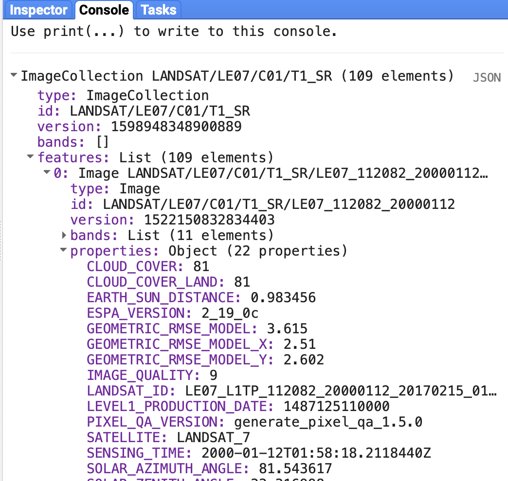
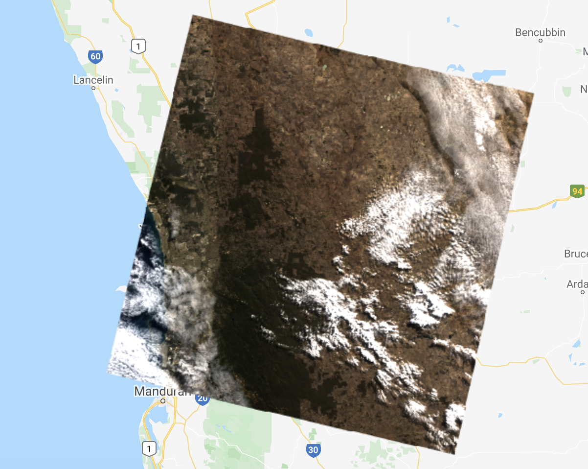
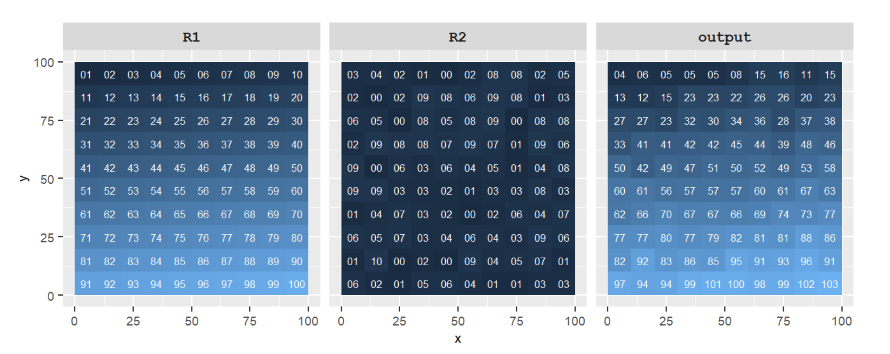
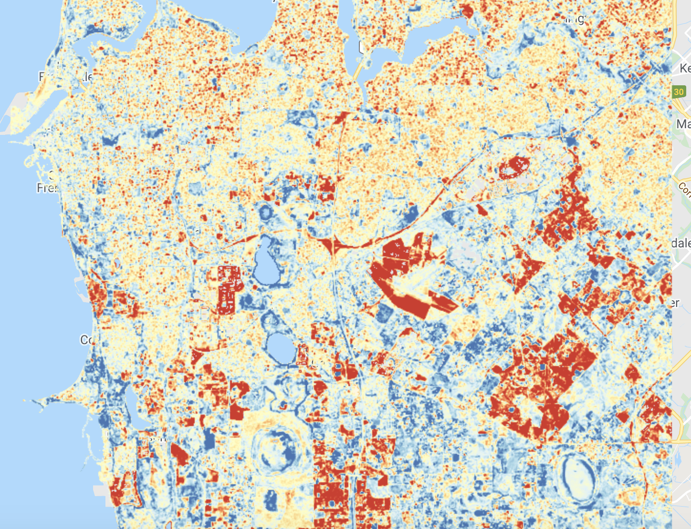

```{r setup, include=FALSE}
knitr::opts_chunk$set(echo = TRUE)
```

<br>

## Introduction

This lab will introduce data transformation and manipulation operations for raster data.

<div class="well well-sm">

<b>Quick recap:</b> In Google Earth Engine, raster data is represented using `Image` objects which include one or more bands and each band is a georeferenced raster. Each band can have its own set of `properties` such as data type (e.g. integer), scale (spatial resolution), band name, and projection. The `Image` object itself can contain metadata relevant to all bands inside a `properties` dictionary object (e.g. date of `Image` capture). A collection of `Image`s are stored in an `ImageCollection`. For example, all Landsat 8 `Image`s are stored in an `ImageCollection` object.

</div>

[Lab 5](lab-5.html) introduced data transformation operations that can be applied to vector data. These operations can be categorised into:

1. filtering or subsetting data
2. creating new variables from existing / raw data 
3. joining or combining data sets 
4. summarising or aggregating data

These categories of data transformation operations also apply raster data. Vector data transformation operations can be spatial or non-spatial. Similarly, raster data transformation operations can be spatial (e.g. changing the spatial resolution of raster pixels, clipping a raster extent), non-spatial and applied to metadata (e.g. filtering raster `Image`s by date), or applied to values stored in raster pixels (e.g. applying a function to convert raster `Image` pixel values that represent temperature in Fahrenheit to Celsius).

Data transformation operations applied to raster data can also be categorised as:

1. <b>local operations:</b> a pixel value is computed using per-pixel arithmetic, comparison, or logical operations.
2. <b>focal operations:</b> a pixel value is computed using aggregation or summary operations applied to neighbouring pixel values defined by a moving window or kernel. 
3. <b>zonal operations:</b> a pixel value is computed using aggregation or summary operations applied to pixels within an irregular region.
4. <b>global operations:</b> an output is the result of aggregation or summary operations applied to all pixels in a raster data set. 

### Where has vegetation cover changed between 2000-2002 and 2017-2019?

This lab demonstrates a range of raster data transformations as part of a work flow to address the question: *Where has vegetation cover changed between 2000-2002 and 2017-2019?* The study area is the urban Perth and Peel region.

To address this question you will be using surface reflectance data from the Landsat 7 and Landsat 8 satellites. 

The Landsat 7 surface reflectance data is derived from measurements recorded by the Enhanced Thematic Mapper (ETM+) sensor which has a revisit period of 16 days and a 30 m spatial resolution. Data from Landsat 7 is available from 1999 in Google Earth Engine. 

The Landsat 8 surface reflectance data is derived from measurements recorded by the Operational Land Imager (OLI) sensor. Again, Landsat 8 data has a revisit period of 16 days and a spatial resolution of 30 m. Landsat 8 observations are available from 2013. 

The following are good resources for information about Landsat data:

* <a href="https://esajournals.onlinelibrary.wiley.com/doi/full/10.1002/ecy.1730" target="_blank">A survival guide to Landsat preprocessing</a>
* <a href="https://www.sciencedirect.com/science/article/pii/S003442571400042X" target="_blank">Landsat-8: Science and product vision for terrestrial global change research</a>
* <a href="" target="_blank">Benefits of the free and open Landsat data policy</a>
* <a href="https://www.sciencedirect.com/science/article/pii/S0034425719300707" target="_blank">Current status of Landsat program, science, and applications</a>

This lab will also introduce you to Google Earth Engine's capacity to process big geospatial data sets. Here, you will use all Landsat 7 and 8 scenes that intersect with the Perth and Peel region between 2000 and 2002 and 2017 and 2019. 

Your workflow will encompass the following steps:

1. Subset all Landsat 7 and 8 `Image`s that intersect with study region. 
2. Mask cloudy pixels out of all Landsat 7 and 8 `Image`s returned from step 1. 
3. Merge Landsat 7 and Landsat 8 `Image`s into one `ImageCollection`.
4. Compute the NDVI for all cloud free Landsat pixels between 2000-2002 and 2017-2019.
5. Compute a median NDVI composite `Image` for 2000-2002 and 2017-2019.
6. Compute a difference `Image` showing change in NDVI between 2000-2002 and 2017-2019.

### Setup

Create a new script in your *labs-gee* repository called *lab6*. Enter the following comment header to the script. 
<br>

```{js, echo=TRUE, eval=FALSE}
/*
Lab 6
Author: Test
Date: XX-XX-XXXX

*/

// import data

// import Landsat 7 and 8 ImageCollections
var l7 = ee.ImageCollection('LANDSAT/LE07/C01/T1_SR');
var l8 = ee.ImageCollection('LANDSAT/LC08/C01/T1_SR');

var bBox = ee.Geometry.Polygon(
        [[[115.73339493500093, -32.00885297734888],
          [115.73339493500093, -32.17638807304199],
          [115.97097428070406, -32.17638807304199],
          [115.97097428070406, -32.00885297734888]]], null, false);

```

<br> 

<hr>
<br>

## Filter

`ImageCollection`s can be filtered using spatial and non-spatial filters. The `filterBounds()` function filters  `Image`s in an `ImageCollection` that intersect with the extent of a `Geometry` object (passed as an argument to the `filterBounds()` function). This is a spatial filtering operation. 

`ImageCollection`s can also be filtered using non-spatial operations using the values of properties in an `Image`s metadata. Each Landsat `Image` has a `properties` dictionary object that stores various metadata attributes including the date and time of image capture (the `system:time_start` property). This property can be used with the `filterDate()` function to subset all Landsat `Image`s captured within a specified date range. String data for the start and end date of the period to filter the `ImageCollection` for are passed as arguments into the `filterDate()` function and an `ImageCollection` containing only `Image`s captured during that period is returned. 
Executing the code below will filter the Landsat 8 and Landsat 7 `ImageCollection`s using the `Geometry` object in `bBox` and subset `Image`s captured between the dates specified as string objects passed into the `filterBounds()` function.

<br>

```{js, echo=TRUE, eval=FALSE}
/* filter Landsat 7 and 8 ImageCollections to return only Images 
that intersect the bBox and were captured within specified date range */
var l72000 = l7
  .filterBounds(bBox)
  .filterDate('2000-01-01', '2002-12-31');
  
var l72017 = l7
  .filterBounds(bBox)
  .filterDate('2017-01-01', '2019-12-31');
  
var l82017 = l8
  .filterBounds(bBox)
  .filterDate('2017-01-01', '2019-12-31');

print('Landsat 7 Im Coll 2000-2002:', l72000);

```

<br>

Print the Landsat 7 `ImageCollection` that is returned from filtering the `ImageCollection` storing the Landsat 7 archive for the `Images` that intersect with the `Geometry` object `bBox` and were captured between 1 January 2000 and 31 December 2002. The filtered `ImageCollection` is stored in the variable `l72000` and should contain 109 Landsat 7 `Images`. If you inspect the `SENSING_TIME:` property for each of the `Image`s in the `l72000` you should see dates between 1 January 2000 and 31 December 2002.

<br>

```{r l7-im-coll, fig.align = 'center', out.width = "70%", fig.cap = "`Print()` of filtered Landsat 7 `ImageCollection`.", echo = FALSE}


```

<br>

<br>

<details>
  <summary><b>*What would happen if you passed the dates `'2010-01-01', '2010-12-31'` into the `filterBounds()` for a Landsat 8 `ImageCollection`?*</b></summary>
  <p><br>
  Error message - there should be no Landsat 8 `Image`s captured in 2010. Landsat 8 started collecting data in 2013. 
  </p>
</details>
<br>

### Cloud Masks

You have just applied spatial and non-spatial filtering operations to an `ImageCollection`. You can also apply filtering operations to an individual `Image`. A common application of spatial filtering operations applied to an `Image` in remote sensing is masking out a pixel value based upon the pixel value in the corresponding location in another raster. 

Remote sensing data products often have a pixel quality band which indicates if the observation for a pixel is high quality or not. Cloud cover and atmospheric contamination are common sources of low quality observations. 

The following code block displays an `Image` from the filtered Landsat 8 `ImageCollection` `l82017` as an RGB composite. Cloud cover contamination is clearly visible. 

<br>

```{js, echo=TRUE, eval=FALSE}
// cloud mask function

// visualise a cloudy Landsat Image
var cloudyL8 = ee.Image('LANDSAT/LC08/C01/T1_SR/LC08_112082_20170510');

/* Define the visualization parameters. The bands option allows us to specify which bands to map. 
Here, we choose B4 (Red), B3 (Green), B2 (Blue) to make a RGB composite image.*/ 
var vizParams = {
  bands: ['B4', 'B3', 'B2'],
  min: 0,
  max: 3500,
};
Map.centerObject(cloudyL8, 8);
Map.addLayer(cloudyL8, vizParams, 'Cloudy L8 Image');

```

<br>

```{r cloudy-l8, fig.align = 'center', out.width = "70%", fig.cap = "Cloud contamination of Landsat 8 `Image`.", echo = FALSE}


```

<br>

Landsat surface reflectance pixel quality attributes are stored as a bitmask within the `pixel_qa` band generated by the <a href="https://www.usgs.gov/land-resources/nli/landsat/cfmask-algorithm" target="_blank">CFMASK algorithm</a>. Other remote sensing products (e.g. MODIS and Planet) also provide pixel quality information as a bitmask; therefore, bitmasks are an important concept to understand when working with remote sensing data.

Each pixel in a quality band stores a number which can be represented as a decimal number (e.g. 32) or as a binary number (e.g. 00100000 - this is an 8 bit integer or one byte). 

<div class="well well-sm">

<b>Binary numbers</b>

* each bit in the binary number can take a value of 0 or 1 
* bits are ordered from right to left (i.e. 00001001 - bit 0 and bit 3 are represented by the binary digit 1)
* bit order starts at 0 (i.e. bit 5 is set to 1 here - 00100000) 
* binary numbers have base 2 
* convert binary 00001001 to decimal &rarr; 00001001 = $(0*2^7) + (0*2^6) + (0*2^5) + (0*2^4) + (1*2^3) + (0*2^2) + (0*2^1) + (1*2^0)$ = 9

</div>

In a bitmask `Image`, each bit corresponds to an indicator of quality information for that pixel. Keeping with the binary number 00100000, the bitmask represented by bit 5 evaluates to true and all other bitmasks are false. The bitmasks represented by values in the `pixel_qa` band of Landsat `Image`s are shown below. The `pixel_qa` band stores pixel values as unsigned 16 bit integers with bits 0 to 10 representing different bitmasks representing different aspects of pixel quality. 

A high quality pixel observation has the digit 1 in bit 1 (i.e. 0000000000000010). A cloudy pixel would have the digit 1 in bits 3 and 5 (i.e. 0000000000101000). While using bitmasks to store pixel quality information is more complicated than using separate binary `Image` bands for each indicator of pixel quality, it is a more efficient way of storing and transporting this information.  

<br>

```{r cf-mask-pixel-qa, fig.align = 'center', out.width = "50%", fig.cap = "`pixel_qa` bitmask derived from CFMASK for Landsat surface reflectance.", echo = FALSE}
knitr::include_graphics("img/cf_mask_pixel_qa.png")

```

<br>

<details>
  <summary><b>*If a pixel was clear and snow what would its `pixel_qa` value be in binary?*</b></summary>
  <p><br>
  0000000000010010 (bit 1 for clear and bit 4 for snow)
  </p>
</details>
<br>

You can use the bitmask contained in the `qa_band` to mask out cloudy pixels. To do this you need identify which pixels have the digit 1 in bit 3 or bit 5 (i.e. they are cloudy) and then mask those pixels in the Landsat 8 `Image`. The following steps demonstrate how to do this: 

1. Create a binary number representing cloud shadow (digit 1 in bit 3): `var cloudShadowBitMask = (1 << 3);`. The `<<` shifts bits left by filling in zeros from the right. Here, 1 is shifted three bits left and the resulting value is stored in `cloudShadowBitMask`. `cloudShadowBitMask` now represents the value of the bitmask when cloud shadow is present.

<br>

2. Create a binary number representing cloud shadow (digit 1 in bit 3): `var cloudsBitMask = (1 << 5);`. The `<<` shifts bits left by filling in zeros from the right. Here, 1 is shifted five bits left and the resulting value is stored in `cloudsBitMask`. `cloudsBitMask` now represents the value of the bitmask when cloud is present.

<br>

<center>
<table style="width:75%; border-collapse: collapse; border-bottom: 1px solid #ddd; padding: 15px;">
  <caption>Left shift operator to create bitmask values for cloud and cloud shadow.</caption>
  <tr>
    <th>Variable</th>
    <th>Operation</th>
    <th>Operand</th>
    <th>Output</th>
  </tr>
  <tr>
    <td>`cloudShadowBitMask`</td>
    <td>`(1 << 3)`</td>
    <td>0000000000000001</td>
    <td>0000000000001000</td>
  </tr>
  <tr>
    <td>`cloudsBitMask`</td>
    <td>`(1 << 5)`</td>
    <td>0000000000000001</td>
    <td>0000000000100000</td>
  </tr>
</table>
</center>

<br>

3. Extract the `pixel_qa` band into its own `Image` object `pixelQA`: `var pixelQA = cloudyL8.select('pixel_qa');`

<br>

4. Use `bitwiseAnd` and comparison operators, that evaluate to boolean true or false values, to identify if pixel values in `pixelQA` have the digit 1 in bit 3 or bit 5 when the pixel value is represented as a binary number. The `bitwiseAnd` operator compares to binary numbers and returns a number with same number of bits and the digit 1 in bit locations where both input binary numbers have the digit 1. 

<br>

<center>
<table style="width:75%; border-collapse: collapse; border-bottom: 1px solid #ddd; padding: 15px;">
  <caption>`bitwiseAnd` operation.</caption>
  <tr>
    <th>Situation</th>
    <th>Operation</th>
    <th>Operand</th>
    <th>Output</th>
  </tr>
  <tr>
    <td>cloud shadow present in `pixelQA`</td>
    <td>`pixelQA.bitwiseAnd(cloudShadowBitMask)`</td>
    <td>0000000001001000 & 0000000000001000</td>
    <td>0000000000001000</td>
  </tr>
  <tr>
    <td>cloud shadow NOT present in `pixelQA`</td>
    <td>`pixelQA.bitwiseAnd(cloudShadowBitMask)`</td>
    <td>0000000001000000 & 0000000000001000</td>
    <td>0000000000000000</td>
  </tr>
   <tr>
    <td>cloud present in `pixelQA`</td>
    <td>`pixelQA.bitwiseAnd(cloudsBitMask)`</td>
    <td>0000000001111000 & 0000000000100000</td>
    <td>0000000000100000</td>
  </tr>
  <tr>
    <td>cloud shadow NOT present in `pixelQA`</td>
    <td>`pixelQA.bitwiseAnd(cloudsBitMask)`</td>
    <td>0000000001011000 & 0000000000100000</td>
    <td>0000000000000000</td>
  </tr>
</table>
</center>

<br>

5. If the result of applying a `bitwiseAnd` operation to a pixel value in `pixelQA` and either `cloudShadowBitMask` or `cloudsBitMask` is not equal to zero then the bitmask indicates either cloud or cloud shadow is present at that pixel location and it should be masked from subsequent processing. The `.eq(0)` comparison can be used to test if the result of a `bitwiseAnd()` operation is equal to zero and the `.and()` logical operator can be used to test if the `pixelQA` pixel value has the digit 0 for the bitmask for cloud and cloud shadow. If this logical operator evaluates to true then it indicates the pixel is cloud free. 

<br>

The following code puts all these commands together. `cloudMask` stores a raster `Image` with a pixel value of 1 indicating no cloud and a pixel value 0 indicating cloud. When visualised on the map, cloud pixels should render in black.

<br>

```{js, echo=TRUE, eval=FALSE}
// make a cloud mask
var cloudShadowBitMask = (1 << 3);
var cloudsBitMask = (1 << 5);

var pixelQA = cloudyL8.select('pixel_qa');
var cloudMask = pixelQA.bitwiseAnd(cloudShadowBitMask).eq(0)
  .and(pixelQA.bitwiseAnd(cloudsBitMask).eq(0));
Map.addLayer(cloudMask, {}, 'cloud mask');

```

<br>

```{r cloud-mask, fig.align = 'center', out.width = "50%", fig.cap = "`cloudMask` `Image` derived from the `pixelQA` bitmask.", echo = FALSE}
knitr::include_graphics("img/cloud-mask.png")

```

<br>

You can use the `Image` stored in the variable `cloudMask` to mask pixel values in the Landsat 8 `Image` `cloudyL8` where a pixel is cloudy. <a href="https://developers.google.com/earth-engine/tutorials/tutorial_api_05#masking" target="_blank">Masking</a> pixels in Google Earth Engine makes pixels transparent and removes them from subsequent processing, analysis, or visualisation. To mask `Image` pixel values in Google Earth Engine pass a raster `Image`, where pixel values of zero indicate locations to mask, into the `updateMask()` function. 

<br>

```{js, echo=TRUE, eval=FALSE}
// mask out clouds in the cloudyL8 image
var cloudyL8Mask = cloudyL8.updateMask(cloudMask);
Map.addLayer(cloudyL8Mask, vizParams, 'Cloud Masked L8 Image');

```

<br>

```{r cloud-mask-l8, fig.align = 'center', out.width = "50%", fig.cap = "`cloudMask` applied to Landsat 8 `Image`.", echo = FALSE}
knitr::include_graphics("img/cloud-masked-l8.png")

```

<br>

Use the <b>Layers</b> widget to toggle the unmasked and masked Landsat 8 `Image` on and off to see the effect of cloud masking using the bitmask in the `pixel_qa` band. 

You have gone through the process of masking out cloudy pixels from a single Landsat 8 `Image`. However, repeating this process manually for all Landsat 8 `Image`s would be time consuming. This is where you can take advantage of a programmatic approach to GIS. You can wrap up the steps to create a cloud mask from an `Image`s `pixel_qa` band and use that cloud mask to mask an `Image`s spectral reflectance values in a function. You can then `map` that function over an `ImageCollection` of Landsat `Image`s masking out cloudy pixels in each `Image`. 

<br>

```{js, echo=TRUE, eval=FALSE}
// Function to mask clouds based on the pixel_qa band of Landsat data.
function cloudMaskFunc(image) {
  // Bits 3 and 5 are cloud shadow and cloud, respectively.
  var cloudShadowBitMask = (1 << 3);
  var cloudsBitMask = (1 << 5);
  // Get the pixel QA band.
  var qa = image.select('pixel_qa');
  // Both flags should be set to zero, indicating clear conditions.
  var mask = qa.bitwiseAnd(cloudShadowBitMask).eq(0)
                 .and(qa.bitwiseAnd(cloudsBitMask).eq(0));
  return image.updateMask(mask);
}
```

<br>

Next, you need to `map` this function over each of your filtered `ImageCollection`s of Landsat 7 and 8 data.

<br>

```{js, echo=TRUE, eval=FALSE}
// map cloudMask function over Landsat ImageCollections.
l72000 = l72000.map(cloudMaskFunc);

l72017 = l72017.map(cloudMaskFunc);

l82017 = l82017.map(cloudMaskFunc);

```

<br>

In Lab 5 the concept of `map`ping a function over a `FeatureCollection`, applying the function to each `Feature` in the `FeatureCollection`, and returning a `FeatureCollection` of `Features` storing the results returned from the function was introduced. The same concept of `map`ping a function over an `ImageCollection` applies here. The function `cloudMaskFunc` is mapped over the `ImageCollection`s `l72000`, `l72017`, and `l82017`, each `Image` in these `ImageCollection`s is cloud masked, and an `ImageCollection` of cloud masked `Image`s is returned. 

<br>

```{r function-map, fig.align = 'center', out.width = "70%", fig.cap = "Graphical representation of mapping a function over a collection and returning a collection as an output (source: [Wickham (2020)](https://adv-r.hadley.nz/index.html)).", echo = FALSE}
knitr::include_graphics("img/function-map.png")

```

<br>

The concept of masking pixel values based on a cloud mask can be considered spatial subsetting; you are subsetting pixels for subsequent analysis based on the pixel values and their location in another raster `Image` <a href="https://geocompr.robinlovelace.net/spatial-operations.html#spatial-raster-subsetting" target="_blank">(Lovelace et al. 2020)</a>. This is also an example of a local raster operation where operations are applied on a per-pixel basis.

<hr>
<br>

## Create new variables

### `Image` math and local map algebra operations

`Image` math operations are applied to `Image`s on a per-pixel basis. The output from an `Image` math operation is a raster where each pixel's value is the result of the `Image` math operation. The input to the `Image` math operation is either:

1. two or more `Image`s where the operation is applied on a per-pixel basis.
2. two or more `Image`s and a constant number where the constant number is combined with each pixel value using the specified math operator. 

<br>

```{r map-algebra-image-image, fig.align = 'center', out.width = "85%", fig.cap = "Illustration of `Image` math with two or more `Image`s where the operation is applied on a per-pixel basis - `output = R1 + R2` (source: [Gimond (2019)](https://mgimond.github.io/Spatial/index.html)).", echo = FALSE}


```

<br>

```{r map-algebra-image-constant, fig.align = 'center', out.width = "85%", fig.cap = "Illustration of `Image` math with two or more `Image`s and a constant number where the constant number is combined with each pixel value using the specified math operator - `output = 2 * + raster + 1` (source: [Gimond (2019)](https://mgimond.github.io/Spatial/index.html)).", echo = FALSE}
knitr::include_graphics("img/map-algebra-image-constant.png")

```

Pixel values across `Image`s or pixel values and constant numbers can be combined using math operators in Google Earth Engine:

* `add()`
* `subtract()`
* `multiply()`
* `divide()`

`Image` math operations can also be combined with per-pixel comparison and logical operators that evaluate to true or false.

* `lt()` - less than
* `gt()` - greater than
* `lte()` - less than or equal to
* `gte()` - greater than or equal to
* `eq()` - equal to
* `neq()` - not equal to
* `and()` - AND

In Google Earth Engine only the intersection of unmasked pixels between input `Image`s are returned from `Image` math operations. 

### Spectral indices

`Image` math is used to combine bands in remote sensing `Image`s that correspond to measures of spectral reflectance (ie. reflectance in different wavelengths). Mathematical per-pixel combinations of spectral reflectance measures are called spectral indices. Different land surface features have different spectral signatures (they reflect differently across wavelengths of the electromagnetic spectrum). Spectral indices use `Image` math to combine information about levels of reflectance in different wavelengths into a single value. Thus, computing spectral indices can provide more information about the condition or characteristics of a pixel (location on the Earth's lands surface) than could be obtained from spectral reflectance measures in a single band. 

Spectral indices are commonly used to monitor vegetation (vegetation indices). The normalised difference vegetation index (NDVI) is computed using spectral reflectance in red and near infrared wavelengths. 

The NDVI equation is:
$$NDVI=\frac{NIR-red}{NIR+red}$$

NDVI values have a range of -1 to 1; a higher NDVI value indicates greater vegetation cover, greenness, or biomass within a pixel.

The NDVI is based on the reflectance characteristics of green vegetation which absorbs red light and reflects near infrared electromagnetic radiation. Red light is absorbed by chlorophyll in leaves (which also explains why we see vegetation in green). Near infrared electromagnetic radiation is reflected by green vegetation as it passes through the upper layers of leaves and is scattered by mesophyll tissue and openings between cells. Some of this scattered near infrared radiation is reflected upwards and detected by the remote sensors. For vegetated land covers there will be a larger difference between red and near infrared reflectance than is observed for other non-vegetated land covers. 

The following two functions compute the NDVI for Landsat 7 and Landsat 8. They return an `Image` with a band named `'nd'` as set by the `rename()` function and a `system:time_start` property which is set in the returned `Image`s metadata. This is important as it records what date and time the NDVI data corresponds to.

Note the different band designations for Landsat 7 and Landsat 8. The near infrared band in Landsat 7 is band 4 (`'B4'`) and the red band is band 3 (`'B3'`). For Landsat 8 the near infrared band is band 5 (`'B5'`) and the red band in band 4 (`'B4'`).

<br>

```{js, echo=TRUE, eval=FALSE}
// Image math - NDVI
var ndviL7 = function(image) {
  
  var ndvi = image.select('B4').subtract(image.select('B3'))
    .divide(image.select('B4').add(image.select('B3')));
  ndvi = ndvi.rename('nd');
  var startDate = image.get('system:time_start'); 
  return ndvi.set({'system:time_start': startDate});
};

var ndviL8 = function(image) {
  
  var ndvi = image.select('B5').subtract(image.select('B4'))
    .divide(image.select('B5').add(image.select('B4')));
  ndvi = ndvi.rename('nd');
  var startDate = image.get('system:time_start'); 
  return ndvi.set({'system:time_start': startDate});
};

```

<br>

Finally, map these functions over the Landsat 7 and Landsat 8 `ImageCollection`s to return an `ImageCollection` of NDVI `Image`s. Display the first NDVI `Image` returned in the `l82017NDVI` on the map to visualise the output of computing the NDVI using Landsat data.

<br>

```{js, echo=TRUE, eval=FALSE}
//Map NDVI functions of Landsat ImageCollections
var l2000 = l72000.map(ndviL7);

var l72017NDVI = l72017.map(ndviL7);

var l82017NDVI = l82017.map(ndviL8);
print(l82017NDVI);

// display first Landsat 8 NDVI Image on the map
Map.addLayer(l82017NDVI.first(), {min: 0.2, max: 0.8, palette:['#f7fcfd','#e5f5f9','#ccece6','#99d8c9','#66c2a4','#41ae76','#238b45','#006d2c','#00441b']}, 'first L8 NDVI Image');

```

<br>

`Image` math or local mag algebra operations are raster data transformation operations where you apply a function to raw or input data to compute a derived variable for subsequent analysis. If your study required monitoring vegetation condition, you can apply a function to spectral reflectance data to compute per-pixel vegetation index values. 

There are many other spectral and vegetation indices that are used for different land surface monitoring. For example, the soil adjusted vegetation index (SAVI) is used to account for soil brightness effects when vegetation cover is low. The SAVI equation is:
$$SAVI=\left( \frac{NIR-red}{NIR+red+L} \right) \left( 1+L \right)$$
$L$ is 0 for high vegetation cover and 1 for low vegetation covers. The following table shows the band designations for Landsat data.

<br>

```{r landsat-bands, fig.align = 'center', out.width = "85%", fig.cap = "Landsat bands and wavelength coverage (source: [Young et al (2017)](https://esajournals.onlinelibrary.wiley.com/doi/full/10.1002/ecy.1730)).", echo = FALSE}
knitr::include_graphics("img/landsat-bands-young.png")

```

<br>

<details>
  <summary><b>*Can you create functions that compute the SAVI from Landsat 7 and Landsat 8 data? Remember that band designations differ between Landsat 7 and 8.*</b></summary>
  <p><br>
  
  ```{js, echo=TRUE, eval=FALSE}
// Image math - SAVI
var saviL7 = function(image) {
  
  var savi = ((image.select('B4').subtract(image.select('B3')))
    .divide(image.select('B4').add(image.select('B3')).add(1)))
    .multiply(2);
  savi = savi.rename('nd');
  var startDate = image.get('system:time_start'); 
  return savi.set({'system:time_start': startDate});
};

var saviL8 = function(image) {
  
  var savi = ((image.select('B5').subtract(image.select('B4')))
    .divide(image.select('B5').add(image.select('B4')).add(1)))
    .multiply(2);
  savi = savi.rename('nd');
  var startDate = image.get('system:time_start'); 
  return savi.set({'system:time_start': startDate});
};

//Map SAVI functions of Landsat ImageCollections
var saviL72000 = l72000.map(saviL7);

var saviL82017 = l82017.map(saviL8);
print(saviL82017);

// display first Landsat 8 SAVI Image on the map
Map.addLayer(saviL82017.first(), {min: 0.2, max: 0.8, palette:['#a6611a','#dfc27d','#f5f5f5','#80cdc1','#018571']}, 'first L8 SAVI Image');

```
  </p>
</details>
<br>

<hr>
<br>

## Join / Combine

The time period for Landsat 7 observations spans 1999 to 2020. Therefore, you have Landsat 7 observations for the period 2000-2002 and 2017-2019. Landsat 8 observations start from 2013. You need to combine the Landsat 7 and Landsat 8 observations for period 2017 to 2019. To do this use the `merge()` function which merges two `ImageCollection`s into one. You can then sort by the date of `Image` capture so the `Image`s in the returned collection are in a temporal order.

<br>

```{js, echo=TRUE, eval=FALSE}
// merge Landsat 7 NDVI and Landsat 8 NDVI ImageCollections and sort by time
var l2017 = ee.ImageCollection(l82017NDVI.merge(l72017NDVI)).sort('system:time_start');
print(l2017);

```

<br>

Inspect the `ImageCollection` `l2017` in the *console* to see that it includes Landsat 8 and Landsat 7 `Image`s. 

<hr>
<br>

## Summarise 

You now have two `ImageCollection`s `l2000` and `l2017` that contain NDVI `Image`s from 2000 to 2002 and 2017 to 2019 respectively. You need to summarise the NDVI data in these two `ImageCollection`s to create a per-pixel measure of vegetation condition in each time-period. 

The process of combining multiple, spatially overlapping pixel measures is called <a href="https://developers.google.com/earth-engine/guides/ic_composite_mosaic" target="_blank">compositing</a>. Composite vegetation index `Image`s are often computed because spectral reflectance values for a signal time point are often noisy (e.g. due to cloud cover or atmospheric contamination). However, the summary of multiple measures at the same location is likely to reduce noise and provide a more accurate indication of the characteristics of that pixel. 

Creating composite `Image`s from `ImageCollection`s in Google Earth Engine is straightforward. You can apply the `median()`, `mean()`, `max()` functions to an `ImageCollection` to compute the per-pixel median, mean, or max value for all `Image`s in the collection. Here, use the `median()` function to create a median NDVI composite for the period 2000 to 2002 and 2017 to 2019. 

<br>

```{js, echo=TRUE, eval=FALSE}
// 3 year median NDVI composite
var l2000Composite = l2000
  .median()
  .clip(bBox);
  
// mask water
l2000Composite = l2000Composite.updateMask(l2000Composite.gt(0));

```

<br>

You will spot that you also `clip`ped your median NDVI composite `Image` using the extent of the `Geometry` object `bBox`. You also masked out any pixels in your median NDVI composite with NDVI value less than or equal to zero. This is a quick way to remove water from your `Image` as water's NDVI values are typically below 0. Both of these steps are to enhance visualisation of your NDVI composite `Image`s on the map (computationally it is quicker to visualise a smaller extent and measuring vegetation on water bodies is not useful). 

The `clip()` operation is another example of spatial subsetting. 

Creating the mask of pixel locations with a median NDVI composite value greater than 0 `l2000Composite.gt(0)` is an example of a local raster operation using a comparison operator as opposed to an arithmetic operator (each pixel value will evaluate to true or false).

Turn off the other layers on your map display using the *Layers* menu. Visualise your median NDVI composite `Image` on the map. Use the inspector to query NDVI values at different locations.

<br>

```{js, echo=TRUE, eval=FALSE}
// 3 year median NDVI composite - 2000 - 2002
print(l2000Composite);
Map.centerObject(l2000Composite, 12);
Map.addLayer(l2000Composite, {min: 0.1, max: 0.8, palette:['#ffffcc','#d9f0a3','#addd8e','#78c679','#41ab5d','#238443','#005a32']}, 'median NDVI 2000 - 2002');

```

<br>

Repeat the steps for the time period 2017 to 2019. 

<br>

```{js, echo=TRUE, eval=FALSE}
// 3 year median NDVI composite - 2017 - 2019
var l2017Composite = l2017
  .median()
  .clip(bBox);
  
// mask water
l2017Composite = l2017Composite.updateMask(l2017Composite.gt(0));  

print(l2017Composite);
Map.addLayer(l2017Composite, {min: 0.1, max: 0.8, palette:['#ffffcc','#d9f0a3','#addd8e','#78c679','#41ab5d','#238443','#005a32']}, 'median NDVI 2017 - 2019');

```

<br>

Let the median NDVI composites for the period 2000-2002 and 2017-2019 (`l2000Composite` and `l2017Composite`) load on your map display. Toggle them on and off using the *Layers* menu to visualise change in vegetation over that time period. You should see something similar to the video below. Where you see change in NDVI can you explain why? Look at the satellite base map in areas where you note change in NDVI to see if that can provide any clues as to what caused the change in NDVI. 

<br>
<center>
<iframe src="https://player.vimeo.com/video/454224096" width="640" height="423" frameborder="0" allow="autoplay; fullscreen" allowfullscreen></iframe>
<p>Change in NDVI between 2000-2002 and 2017-2019</p>
</center>
<br>

<hr>
<br>

## Change Detection

You can use the median NDVI composite `Image`s for the two time periods to answer the question at the beginning of the lab: <b>*Where has vegetation cover changed between 2000-2002 and 2017-2019?*</b>. 

Using the `Image` math operations introduced earlier, you can compute a <a href="https://www.crcsi.com.au/assets/Earth-Observation/EO-Publication-Vol2D-April-2020/EO-Publication-Vol2D-144dpi.pdf" target="_blank">change detection</a> `Image` which shows the location, direction (positve NDVI change, negative NDVI change, no change), and magnitude of NDVI change between these two time periods. Bi-temporal change detection is the operation of detecting change between two `Image`s captured on different dates. 

You can perform an `Image` differencing operation to compute a change `Image`.

<br>

```{js, echo=TRUE, eval=FALSE}
// change detection
var ndviChange = l2017Composite.subtract(l2000Composite);
print(ndviChange);
Map.addLayer(ndviChange, {min: -0.2, max: 0.2, palette:['#d73027','#f46d43','#fdae61','#fee090','#ffffbf','#e0f3f8','#abd9e9','#74add1','#4575b4']}, 'change in NDVI');

```

<br>

You should see an `Image` similar to the figure below on your map visualising change in NDVI between 2000-2002 and 2017-2019. The areas in red indicate a decrease in NDVI, yellow little / no change in NDVI, and blue indicates an increase in NDVI. 

Change the min and max values in the visualisation parameters to highlight different features of vegetation change (i.e. just areas of vegetation loss).

```{r image-diff-change-detection, fig.align = 'center', out.width = "85%", fig.cap = "`Image` difference between NDVI in 2000-2002 and 2017-2019. Red indicates decrease in NDVI and blue indicates increase in NDVI.", echo = FALSE}


```

<hr>
<br>

<div class="tocify-extend-page" data-unique="tocify-extend-page" style="height: 0;"></div>
<footer>
<p>Advanced GIS and Remote Sensing</p>
</footer>