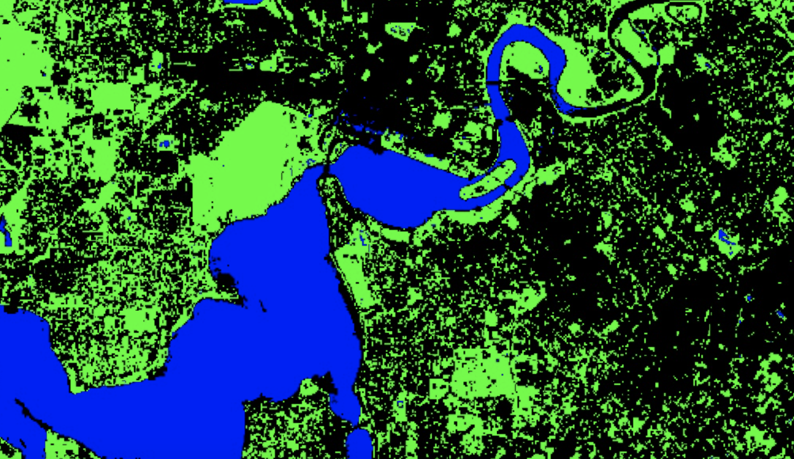
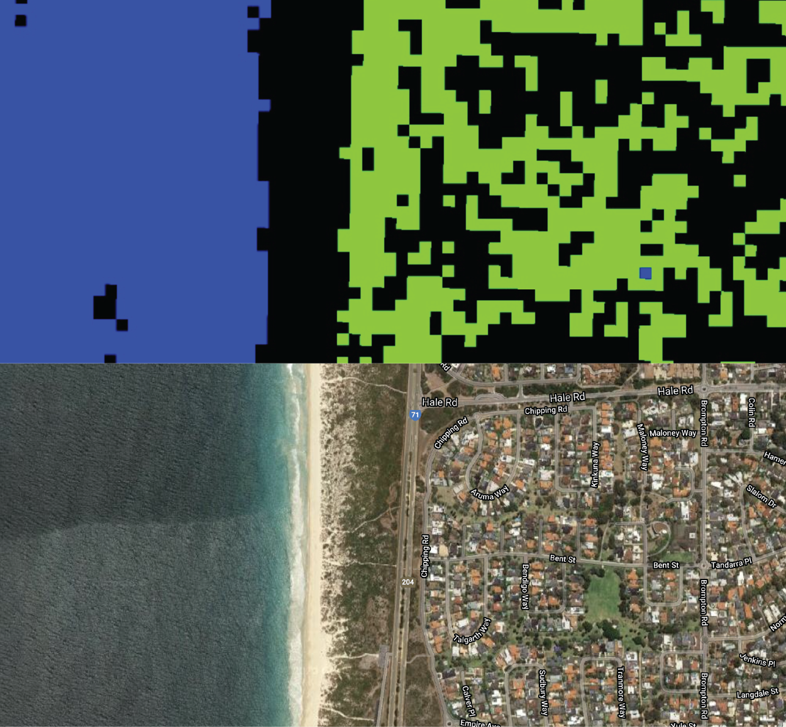

```{r setup, include=FALSE}
knitr::opts_chunk$set(echo = TRUE)
```

<br>

## Introduction

This lab will introduce a workflow to classify `Image`s in Google Earth Engine using supervised classification algorithms.

Image classification is the process of classifying pixels in an `Image` into similar classes (groups or clusters of similar pixels) or categories (a label that relates to physical or land surface characteristics).

You will use a supervised classification algorithm to assign each pixel a category label based upon pixel values for one or more predictor variables. Land cover mapping is a common image classification task. Different land cover types have different spectral signatures (i.e. they have different levels of reflectance in different portions of the electromagnetic spectrum); an algorithm can be trained to predict each pixel's land cover type based upon values of predictor variables (i.e. spectral reflectance data). 

An algorithm is a set of rules or instructions that a computer follows to solve a problem or perform a task. Algorithms can take many forms and different algorithms are suited to different classification tasks. 

You have a predictor dataset $X$ which contains $p$ predictor variables $X_{1}, X_{2},..., X_{p}$; in the case of land cover classification using remotely sensed data $p$ often corresponds to wavelengths of the electromagnetic spectrum. Your goal is to train a classifier (algorithm) $f$ which relates predictor variables $X$ to an outcome $Y$. 

$$Y = f(X)$$

The video below presents a good overview of tools for `Image` classification in Google Earth Engine. It is quite long, so best watched after the lab to consolidate what you have learnt. 

<br>
<center>
<iframe width="412" height="232" src="https://www.youtube.com/embed/NPplRtH2N94" frameborder="0" allow="accelerometer; autoplay; encrypted-media; gyroscope; picture-in-picture" allowfullscreen></iframe>
<p>An overview of `Image` classification in Google Earth Engine.</p>
</center>
<br>

### Supervised Classification

In supervised classification, the values of $Y$ are known and typically correspond to geographic phenomena or entities of interest (e.g. the range of land cover types in an `Image`). In the case of land cover classification, the classifier $f$ will predict a pixel $i$'s land cover type $y_{i}$ based on the values of $x_{i}$.  

A classification tree is one of the simplest supervised classifiers to see inside and visualise the algorithm's rules and the process it follows to make predictions. A classification tree consists of a series of yes / no splits for values of $X$, the predictor variables (e.g. spectral reflectance measured in $p$ wavelengths). The leaves of a classification tree correspond to an outcome category or label (e.g. a land cover type). For a pixel with measures of spectral reflectance but an unknown land cover type, you move down the tree following the yes / no splits to arrive at a leaf node. The leaf node you end up in is the predicted land cover for that pixel.

<br>

```{r dec-tree, fig.align = 'center', out.width = "80%", fig.cap = "Example classification tree showing how land cover can be predicted from spectral reflectance values (adpated from Tso and Mather (2009)).", echo = FALSE}
knitr::include_graphics("img/decision-tree-tso-mather.png")

```

<br>

Your goal is to train a classifier $\hat{f}$ that predicts a pixel's land cover type, $\hat{y}_i$, using pixel spectral reflectance data. Training a classifier involves identifying the rules that best relate values of predictor variables to an outcome category. To train the classifier you give it some labelled training data; labelled training data are observations where there are values for the predictor variables, $X_{1}, X_{2},..., X_{p}$, and a label of the outcome category $Y$. That is, for each training observation $x_{i}$ there is a known $y_{i}$. You train a classifier by finding rules that minimise a metric of classification error when predicting the known$y_{i}$ in the training data. The process of preparing the training data is called training or feature engineering.

Your final step is to assess the accuracy of your model. You see how well your model performs in predicting $Y$ for data that was not used in training the model (test or validation data). 

### Unsupervised Classification

In unsupervised classification, for each observation $x_{i}$ in the training data there is no observed outcome $y_{i}$. An unsupervised classification algorithm $f$ assigns observations to clusters based upon them having similar values in the predictor variables $X$. In the context of remote sensing `Image` classification, an unsupervised classification algorithm would assign a pixel $i$ to a class $j$ based upon a its $x_{i}$ spectral reflectance values. Your goal, given some training data, is to train an unsupervised classification algorithm $\hat{f}$ that assigns pixels to classes so that the within-class (within-cluster) variability in pixel values is minimised. Unsupervised classifiers in Google Earth Engine are called `clusterers`; this name refers to goal of unsupervised classifiers to create clusters of similar observations. Classes (clusters) do not directly relate to ground objects, real world phenonomenon or entities, or land cover types; instead, they define clusters of similar pixels in terms of their spectral reflectance values. Often, `Image` classes relate to interesting land surface characteristics but it is a post-processing step to formalise these relationships and assign meaningful labels to `Image` classes. You will not be using unsupervised classification algorithms in this lab. However, you can follow this <a href="https://developers.google.com/earth-engine/guides/clustering" target="_blank">guide</a> to see how to use them in Google Earth Engine. 

### Task

You will perform a supervised classification of a Landsat 8 `Image` to predict a pixel's land cover type.

<b>Supervised classification</b>

1. Prepare labelled training data comprising observations of Landsat 8 spectral reflectance values and a land cover type property.
2. Train a supervised classifier to predict a pixel's land cover type (water, built up, or vegetation).
3. Predict each pixel's land cover type in the Landsat 8 `Image`.
4. Assess the accuracy of the your land cover prediction using independent test data. 

### Setup

<br>

```{js, echo=TRUE, eval=FALSE}
/*
Lab 7
Author: Test
Date: XX-XX-XXXX

*/

```

<br>

### Data Import

```{js, echo=TRUE, eval=FALSE}
// Data import

// study area
var bBox = 
    /* color: #d63000 */
    /* displayProperties: [
      {
        "type": "rectangle"
      }
    ] */
    ee.Geometry.Polygon(
        [[[115.23492202085255, -31.663337604046916],
          [115.23492202085255, -32.220373273114554],
          [116.13442763608693, -32.220373273114554],
          [116.13442763608693, -31.663337604046916]]], null, false);

//Get Landsat 8 SR Image
var l8SR = ee.Image('LANDSAT/LC08/C01/T1_SR/LC08_113082_20160802').clip(bBox);
print(l8SR);

// Use these Landsat 8 bands and rescale spectral reflectance values
var bands = ['B2', 'B3', 'B4', 'B5', 'B6', 'B7'];
l8SR = l8SR.select(bands).divide(10000);

/* Define the visualization parameters. The bands option allows us to specify which bands to map. Here, we choose B4 (Red), B3 (Green), B2 (Blue) to make a RGB composite image.*/ 
var vizParams = {
  bands: ['B4', 'B3', 'B2'],
  min: 0,
  max: 0.4,
};

// Centre the display and then map the Landsat 8 image
Map.centerObject(l8SR, 10);
Map.addLayer(l8SR, vizParams, 'RGB composite');
print(l8SR);

```

<br>

Use the *Inspector* tab to visualise the difference in Landsat 8 spectral reflectance across different wavelengths for different land cover types.

<br>
<center>
<iframe src="https://player.vimeo.com/video/457400549" width="640" height="368" frameborder="0" allow="autoplay; fullscreen" allowfullscreen></iframe>
<p>Visualise spectral reflectance using the *Inspector* tab</p>
</center>
<br>

<hr>
<br>

## Supervised Classification

### Training (Feature) Engineering

The first task in a supervised classification workflow is to prepare the training data. This is termed training or feature engineering (in machine learning predictor variables are often called features). 

Classifiers in Google Earth Engine require a `FeatureCollection` for training where one property in the `properties` object is the outcome variable and the other properties are the predictors. 

The `FeatureCollection` `trainingPoints` contains three `Feature` objects. Each `Feature` object has a multipoint `Geometry` object and a `properties` object containing the property `lc`. `lc` refers to the land cover type at each point's location. 

An `lc` value of 0 corresponds to vegetated land cover, an `lc` value of 1 corresponds to built up land cover, and an `lc` value of 2 corresponds to water.

These labelled training points were created through manual digitisation guided by visual inspection of the Google satellite basemap.  

<br>

```{js, echo=TRUE, eval=FALSE}
// Training engineering
// Import points labelled with land cover type property
var trainingPoints = ee.FeatureCollection("users/jmad1v07/gee-labs/training_points");
print(trainingPoints);
Map.addLayer(trainingPoints, {color:'red'}, 'training data');

```

<br>

<details>
  <summary><b>*The date of the Google satellite basemap used to guide the creation of the training data was not known. What problem could this introduce when using this training data to train a classifier to predict the land cover type of Landsat 8 pixels?*</b></summary>
  <p>
    <br>
    Land cover might have changed between the date of capture of the Google satellite basemap and the date of the Landsat 8 `Image` you wish to classify. This means that the labelled training data may not accurately reflect the land cover type at the time the Landsat 8 `Image` was captured.
  </p>
</details>
<br>

<br>

<details>
  <summary><b>*Explore the red points on the map that represent the location of the labelled training points. You should see clusters of points in Perth CBD and Kings Park. What problem could this clustering of training data present?*</b></summary>
  <p>
    <br>
    Training data observations which are close to each other in space might have spatial correlation among their data values. This spatial correlation reduces the effective number of independent training data observations. This can be problematic as non-parametric classifiers, such as CART, require large numbers of training data observations to characterise the relationships between predictor variables and outcome categories. 
  </p>
</details>
<br>

You now need to find the Landsat 8 spectral reflectance values that intersect with each of the point locations.

There is a convenient `sampleRegions()` function in Google Earth Engine that helps with training engineering. The `sampleRegions()` function samples the pixels of an input `Image` (`l8SR` here) using the `Geometry` objects specified as the `collection` argument (`trainingPoints` here). This function extracts the values in each band of `l8SR` that intersect with each point's location.  

<br>

```{js, echo=TRUE, eval=FALSE}
// Sample spectral reflectance at training points
var trainingData = l8SR.sampleRegions({
  collection: trainingPoints,
  properties: ['lc'],
  scale: 30
});
print(trainingData);

```

<br>

Inspect the `FeatureCollection` `trainingData` in the *console*. You should see it contains 129 `Feature` objects and each `Feature` has a `properties` object containing an `lc` property which corresponds to a land cover type and properties `B2` through to `B7` which correspond to spectral reflectance measurements. 

<br>

```{r training-data, fig.align = 'center', out.width = "50%", fig.cap = "`FeatureCollection` storing training data to train a supervised classifier to predict land cover type.", echo = FALSE}
knitr::include_graphics("img/training-data.png")

```

<br>

You can now use `trainingData` to train a classifier to predict land cover type based on Landsat 8 spectral reflectance data values.

### Train classifier

You are going to use `trainingData` to train a classification and regression tree (CART) model to predict a pixel's land cover type based on its spectral reflectance values. 

The first step is to create a CART object using the `ee.Classifier.smileCart()` constructor function. You then use the `train()` function to train the CART classifier. You pass your labelled training data `trainingData` into the `train()` function and it will learn the rules that best relate spectral reflectance values in your training data to the observed land cover type specified by the `lc` property.

<br>

```{js, echo=TRUE, eval=FALSE}
// Train a CART classifier with default parameters.
var trainedCART = ee.Classifier.smileCart()
  .train(trainingData, 'lc', bands);
print(trainedCART);

```

<br>

The video below presents a short demonstration of how CART classifiers work. You can also read Chapter 8 of <a href="http://faculty.marshall.usc.edu/gareth-james/ISL/" target="_blank">James et al. (2013)</a> to understand the process of how CART classifier rules are trained via minimising an error function.

<br>

<center>
<iframe width="560" height="315" src="https://www.youtube.com/embed/p17C9q2M00Q" frameborder="0" allow="accelerometer; autoplay; encrypted-media; gyroscope; picture-in-picture" allowfullscreen></iframe>
<p>Overview of CART classifiers</p>

</center>

<br>

### Predict land cover type

Now you can use your trained CART classifier object to predict each Landsat 8 pixel's land cover. To classify an `Image` in Google Earth Engine using a trained classifier use the `classify()` function. You pass your trained classifier into the `classify()` function as an argument; this function will apply the algorithm defined in your trained classifier (`trainedCART` here) to each pixel's spectral reflectance values to predict land cover type. 

Display your predicted land cover `Image` on the map. Visually inspect your map of predicted land cover. How good a job has your trained classifier `trainedCART` done at predicting the land cover type of the Landsat 8 pixels?

<br>

```{js, echo=TRUE, eval=FALSE}
// Classify (predict land cover type) l8SR using trained CART classifier
var lcImage = l8SR
  .select(bands)
  .classify(trainedCART);
print(lcImage);

//Make a palette for mapping
var lulcColor = [
  '00FF00', // vegetation
  '000000', // built up
  '0000FF', // water
];

Map.addLayer(lcImage, {palette: lulcColor, min: 0, max: 2}, 'supervised classification');

```

<br>

```{r predicted-land-cover, fig.align = 'center', out.width = "80%", fig.cap = "Predicted land cover type using the trained CART classifier", echo = FALSE}


```

<br>

Use the <b>Layers</b> tab to toggle on and off the Landsat 8 RGB composite, the predicted land cover map, and the Google satellite basemaps. Zoom in on a few locations and explore the difference between the land covers captured by the Google satellite basemaps and the Landsat 8 data. 

You should see that in many cases a single Landsat 8 pixel is comprised of multiple land cover types (e.g. a pixel could include trees, a grass garden, paved surface, and roofs). This is a mixed pixel problem; it is one example of how spatial data often simplifies reality. Here, a mix of land cover types with different spectral signatures will be represented by a single spectral reflectance value per-band and per-pixel or by a single land cover type label. 

<br>
<center>

<iframe src="https://player.vimeo.com/video/457375669" width="640" height="354" frameborder="0" allow="autoplay; fullscreen" allowfullscreen></iframe>
<p>Visualise mixed pixels</p>

</center>
<br>

```{r mixed-pixels, fig.align = 'center', out.width = "80%", fig.cap = "Mixed pixels - a pixel is assigned a single land cover type category yet it contains a mix of land cover types", echo = FALSE}
knitr::include_graphics("img/mixed-pixels.png")

```

<br>

<details>
  <summary><b>*How could you reduce the mixed pixel problem that is visible when predicting land cover over urban Perth using Landsat 8 data?*</b></summary>
  <p>
    <ul>
    <li> You could use finer spatial resolution data that would be able to resolve the different land cover objects present within a single Landsat pixel.</li> 
    <li> You could use a fuzzy classification system where a pixel can be a member of more than one land cover type. </li>
    </ul>
    
  </p>
</details>
<br>

The classifier you have just trained predicts whether a pixel is one of three land cover types (vegetation, built up, or water). In reality, there are far more than three land cover types present within the area covered by the Landsat 8 `Image`. An example of this is shown in the below figure where beach between City Beach and Scarborough in Perth is classified as built up land cover. Therefore, through limiting the possible land cover types a pixel could be classified as we are introducing error into predicted land cover maps (i.e. there is a discrepancy between predicted land cover and reality).

<br>

```{r beach-built-up, fig.align = 'center', out.width = "80%", fig.cap = "Beach (sandy land cover) classified as built up.", echo = FALSE}


```

<br>

<details>
  <summary><b>*How could you train a classifier that predicts whether a pixel belongs to more land cover types than vegetation, built up, or water?*</b></summary>
  <p>
  <br>
  Ensure that your labelled training data covers the range of land cover types within the area of interest and that you have a sufficient number of training data observations per-land cover type in order to characterise each land cover type accurately. 
    
  </p>
</details>
<br>

### Accuracy Assessment

Before using your trained classifier to predict the land cover type of new pixels (i.e. pixels that you don't already know the land cover type) you need to know how accuracte the classifier's predictions are. You do this by assessing the classifier's accuracy; typically this is done by comparing predictions to observations on unseen data - data that has not been used to train the model. This will give you an indication of how well your classifier will generalise and work on new data. 

First, you need some test data that contains labels of observed land cover types. Then you can use your trained classifier to predict the land cover type at each of these locations. Finally, you compare the predicted versus the observed land cover types to assess the accuracy of your trained classifier. 

Import the the `FeatureCollection` `test_points` into the variable `testPoints`. This contains labelled points with an observed land cover type property. The process of predicting the land cover type at each of these test points is similar to the feature engineering process described above. Use the `sampleRegions()` function to extract the spectral reflectance measures for each of these points. Then use the trained classifier `trainedCART` to predict the land cover type at each test point based on its spectral reflectance values.

<br>

```{js, echo=TRUE, eval=FALSE}
// Accuracy Assessment
var testPoints = ee.FeatureCollection('users/jmad1v07/gee-labs/test_points');
Map.addLayer(testPoints, {color:'yellow'}, 'test points');

// Sample spectral reflectance at test points
var testData = l8SR.sampleRegions({
  collection: testPoints,
  properties: ['lc'],
  scale: 30
});
print(testData);

// Classify the test data.
var testClassified = testData.classify(trainedCART);
print(testClassified);

```

<br>

Using the predicted versus observed land cover types for the test data points you can generate an error matrix. This an $n$ x $n$ matrix where $n$ is the number of land cover types. In Google Earth Engine error matrices, the columns (1-axis) represent the predicted data and the rows (0-axis) represent the observed test data. The diagonal of the matrix represents pixels that were correctly classified (i.e. the classifier correctly predicted the observed land cover type in the test data). This code flips (transposes) the matrix for display purposes here so observed data are in the columns and predicted data are in the rows. 

You can use the `errorMatrix()` function in Google Earth Engine to generate an error matrix from a `FeatureCollection`. The first argument to the `errorMatrix()` function is the observed land cover type (`lc` here) and the second argument is the predicted land cover type (`classification` here).

<br>

```{js, echo=TRUE, eval=FALSE}
// Get an error matrix
var errorMat = testClassified.errorMatrix('lc', 'classification');
print('error matrix: ', errorMat.array().matrixTranspose(0, 1));


```

<br>

```{r error-matrix, fig.align = 'center', out.width = "70%", fig.cap = "Error matrix and accuracy assessment indicators.", echo = FALSE}
knitr::include_graphics("img/error-matrix.png")

```

<br>

The sum of the diagonal elements is the number of correctly classified pixels. The overall accuracy of the classifier can be computed as:

$$accuracy=\frac{Correctly Classified Points}{Total Number of Points}$$
This indicator of classification accuracy can be interpreted as $x$% of an image is correctly classified. It does not give any indication of the spatial variability in classification accuracy or if certain land cover types are classified more accurately than others. 

There are helpful functions in Google Earth Engine that you can apply to error matrices to compute accuracy assessment statistics. You can apply the `accuracy()` function to your error matrix to compute the overall accuracy and you can apply the `kappa()` function to compute the kappa statistic. 

<br>

```{js, echo=TRUE, eval=FALSE}
print('overall accuracy: ', errorMat.accuracy());
print('kappa: ', errorMat.kappa());
print('producers accuracy: ', errorMat.producersAccuracy());
print('users accuracy:', errorMat.consumersAccuracy());

```

<br>

Using the error matrix you can compute producer's and user's accuracy that give an indication of the accuracy of classification for individual land cover types.

The producer's accuracy is computed by dividing the entry in cell ($i$, $i$) of the error matrix by the sum of column $i$. The producer's accuracy is a measure of omission error and informs on the number of test pixels in a given land cover type that were correctly classified. Here, all of the vegetation (class 0) pixels in the test dataset were correctly classified as vegetation by `trainedCART`. Eight of the test data points labelled as built up were classified as vegetation; therefore, built up land cover has a producer's accuracy of 78%.

The user's accuracy is computed by dividing the entry in cell ($i$, $i$) of the error matrix by the sum of row $i$. The user's accuracy is a measure of commission error (i.e. erroneously labelling a pixel a given land cover type). Of the 34 test data points that were predicted as being of vegetation land cover type, eight were observed as being built up. Thus, vegetation land cover has a user's accuracy of 76%. 


<hr>
<br>

<div class="tocify-extend-page" data-unique="tocify-extend-page" style="height: 0;"></div>
<footer>
<p>Advanced GIS and Remote Sensing</p>
</footer>
