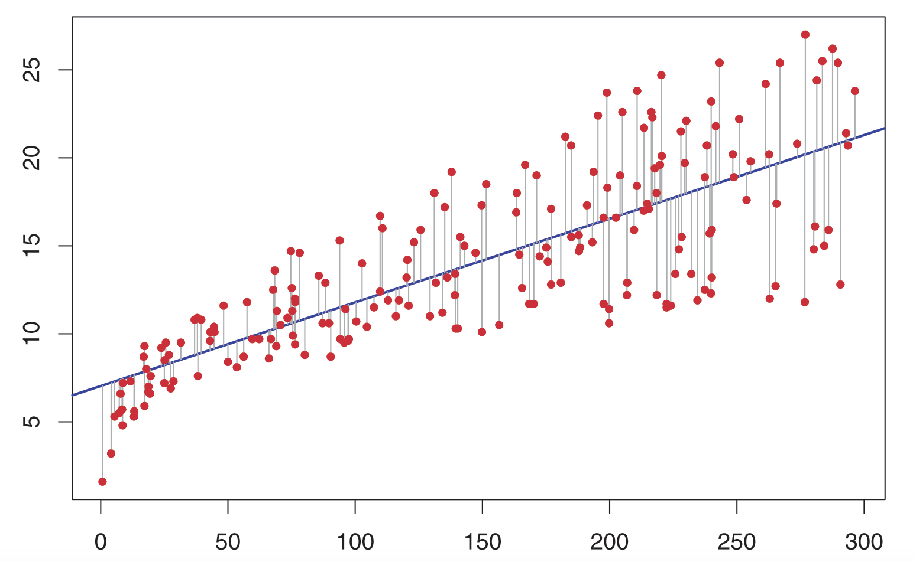
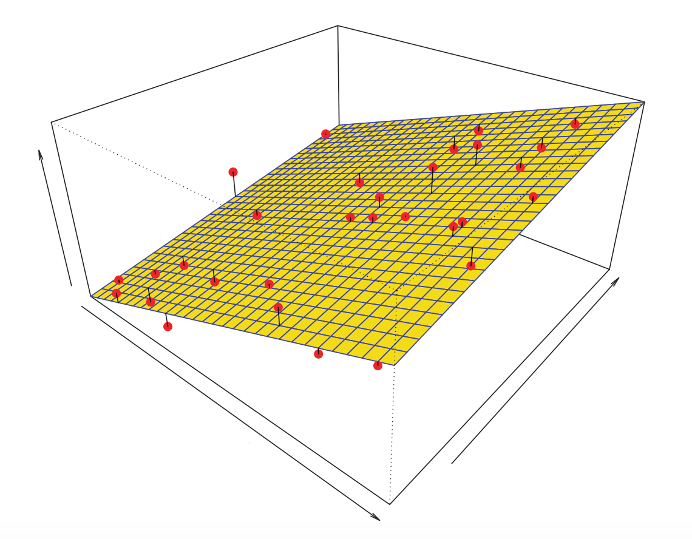
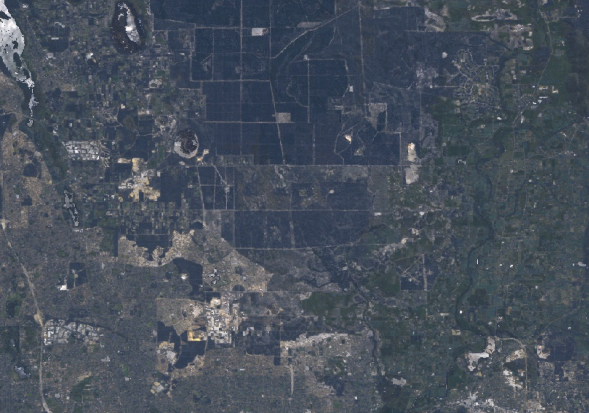
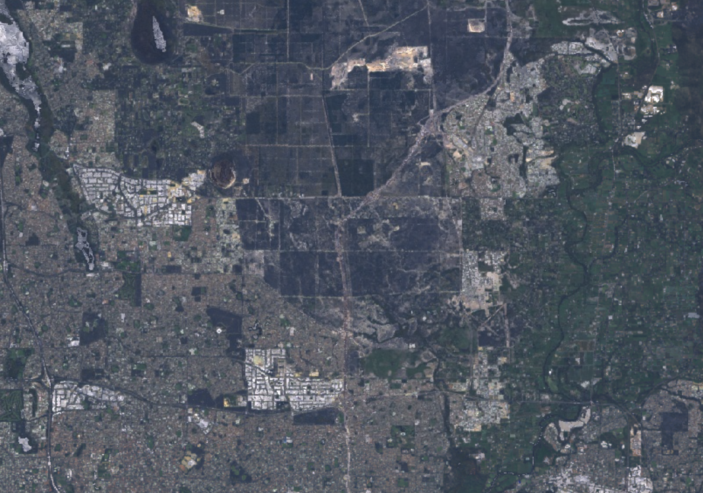
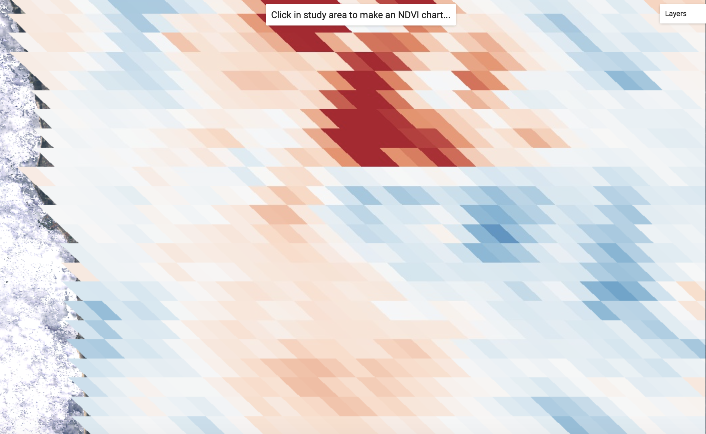
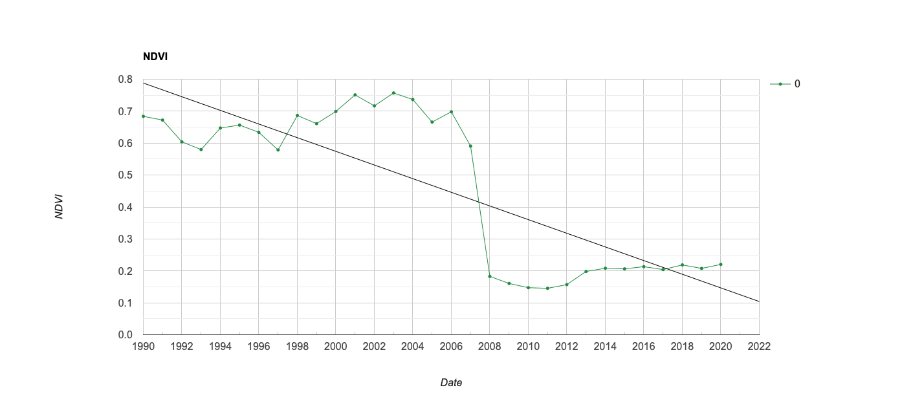

```{r setup, include=FALSE}
knitr::opts_chunk$set(echo = TRUE)
```

<br>

## Introduction

In the previous two labs you used non-parametric models $f$ that relate predictor variables $X$ to a response variable $Y$. There was in the context of prediction tasks where given $x$ inputs a trained model $\hat{f}$ will predict a response $\hat{y}$. 

$$\hat{y}=\hat{f}(x)$$
Non-parametric models do not make any prior assumptions about the functional form of the relationship between $X$ and $Y$ (i.e. there is no requirement that $f$ is linear, quadratic, or another form of model). For example, when you trained a classification tree model in lab 7 you did not make prior assumptions about the functional form of the relationship between $X$ (spectral reflectance values) and $Y$ (land cover categories). During the process of training a non-parametric model the data informs the estimation of $f$ and its model of the relationship between $X$ and $Y$.

Parametric models are another group of statistical models that relate values of $X$ predictors to an outcome $Y$; if you have estimated a linear regression model before you have used a parametric model. Parametric models consist of a finite number of parameters to estimate. To use the example of a linear regression model; $f$ consists of $p + 1$ parameters - *slope* coefficients $\beta_{1}, \beta_{2},...,\beta_{p}$ for each of the $X_{1}, X_{2},...,X_{p}$ predictors and an *intercept* parameter $\beta_{0}$. 

The process of training a parametric model involves estimating parameter values that minimise a loss function. The loss function is a measure of the difference between the observed response variable $y$ and the predicted response $\hat{y}$. In linear regression, the estimated parameter values minimise the least squares criterion. This involves estimating values for $\beta_{0}, \beta_{1},...,\beta_{p}$ that minimise the residual sum of squares (RSS). Mathematically, this involves finding the values of $\beta_{0}, \beta_{1},...,\beta_{p}$ that result in lowest sum of squared differences between observed $y$ and $\hat{y}$ for all $i$ data training data points. For a simple linear regression with one predictor $X_{1}$:

$$  RSS\left(\hat\beta_0, \hat\beta_1\right) = \sum_{i=1}^n\left[y_i - \left(\hat\beta_0 + \hat\beta_1 x_i\right)\right]^2 $$

Graphically, this can be conceptualised as identifying parameters that define a line fitted through the data points that minimises the vertical distance between the line and all training data points. For a linear regression model with one predictor this can be visualised as:

<br>

```{r lin-reg, fig.align = 'center', out.width = "80%", fig.cap = "Least squares fit for a linear regression model with one predictor variable (source: James et al. (2013)).", echo = FALSE}


```

<br>

If you have more than one predictor variable, the fitted model with parameters that minimise the difference between observed $y$ and predicted $\hat{y}$ is illustrated below. 

<br>

```{r multi-lin-reg, fig.align = 'center', out.width = "80%", fig.cap = "Least squares fit for a multiple linear regression model with more than one predictor variable (source: James et al. (2013)).", echo = FALSE}


```

<br>

If there is a relationship between $Y$ and $X$ which is captured by $f$ such that:

$$Y = f(X) + \epsilon$$

and you assume $f$ is a linear regression model with a slope and intercept parameter and one predictor variable $X_{1}$ you can rewrite the above equation as:

$$Y = \beta_0 + \beta_1 X_{1} + \epsilon$$

You don't know the true values of $\beta_0$ and $\beta_1$ but you can estimate them from your training data:

$$\hat{y} = \hat\beta_0 + \hat\beta_1 x + \hat\epsilon$$
where:

* $\hat\beta_0$ is the estimated intercept parameter (the value at which the line of best fit intersects with the Y-axis). $\hat\beta_0$ represents the mean value of $Y$ when $X = 0$.
* $\hat\beta_1$ is the estimated slope coefficient; the slope coefficient $\hat\beta_1$ represents the change in $Y$ for a one unit change in $X$.
* $\hat\epsilon$ is the residual which is an estimate of the model's mean zero random error term $\epsilon$; $\hat\epsilon$ is computed as the difference between observed $y$ and predicted $\hat{y}$. 

If your predictor variable $X$ is temporal (i.e. years, months) then the line of best fit and the slope coefficient $\beta$ represent trends in $Y$ over time. The sign on the slope coefficient indicates the direction of the trend (positive - increasing over time - or negative - decreasing over time). The value of the slope coefficient indicates the rate of change in $Y$ over time. 

This lab will introduce tools for training parametric models in Google Earth Engine. You will use these models to detect trends in urban vegetation and land surface temperature (LST) across a study area in urban Perth. You will also learn techniques for inference (i.e. identifying if trends you observe are statistically significant), assessing model fit, and evaluating the strengths and weaknesses of a given parametric model for a particular application. 

### Data

You will use 30 years of annual greenest pixel Landsat data to estimate temporal trends in urban vegetation. This data is derived from Landsat 5, Landsat 7, and Landsat 8 top of atmosphere (TOA) reflectance data. The records for the data in Google Earth Engine data catalog are <a href="https://developers.google.com/earth-engine/datasets/catalog/LANDSAT_LC08_C01_T1_ANNUAL_GREENEST_TOA" target="_blank">here</a>; also see <a href="https://www.sciencedirect.com/science/article/abs/pii/S0034425709000169" target="_blank">Chander et al. (2009)</a>. 

For the LST data you will use the MODIS MYD11A2 product (<a href="https://www.sciencedirect.com/science/article/pii/S003442571300285X?casa_token=iYMc72sMa4sAAAAA:z41SIlkBRjhKbvyygsUML9LHM_omiYLlna6yJT_DAF1NTfg8YlmWwefAyQjYe13dGdOEf2qHjg" target="_blank">Wan (2014)</a>). This data has a 1 km spatial resolution with an 8 day temporal resolution with observations from the year 2000. The reference for this data on the Google Earth Engine data catalog is <a href="https://developers.google.com/earth-engine/datasets/catalog/MODIS_006_MYD11A2#bands" target="_blank">here</a>.

### Setup

<br>

```{js, echo=TRUE, eval=FALSE}
/*
Lab 9
Author: Test
Date: XX-XX-XXXX

*/


```

<br>

### Data Import - Landsat NDVI

First, to visualise change in urban land cover between 1990 and 2019 import the following two Landsat TOA `Image`s. `l1990` is a Landsat 5 multispectral composite `Image` from 1990 and `l2019` is a Landsat 8 multispectral `Image` from 2019. 

Visualise the two `Image`s as RGB composites on the map display; switch between the two `Image`s and you should be able to see the effects of urban development since 1990.

<br>

```{js, echo=TRUE, eval=FALSE}
// Study area
var bBox = 
    /* color: #0b4a8b */
    /* shown: false */
    /* displayProperties: [
      {
        "type": "rectangle"
      }
    ] */
    ee.Geometry.Polygon(
        [[[115.71190972343935, -31.726395823091245],
          [115.71190972343935, -31.935245757597972],
          [116.07308526054872, -31.935245757597972],
          [116.07308526054872, -31.726395823091245]]], null, false);
Map.centerObject(bBox, 11);     
Map.addLayer(bBox, {}, 'study area');

// 1990 Landsat TOA Greenest
var l1990 = ee.Image('users/jmad1v07/gee-labs/landsat5-1990-toa');

// 2019 Landsat TOA Greenest
var l2019 = ee.Image('users/jmad1v07/gee-labs/landsat8-2019-toa');

// Visualise 1990 and 2019 Landsat RGB Images
// RGB visualisation parameters
var trueColorVis = {
  min: 0,
  max: 0.4,
  gamma: 1.2,
};

// 1990
Map.addLayer(l1990, trueColorVis, 'L5 1990');

// 2019
Map.addLayer(l2019, trueColorVis, 'L8 2019');

```

<br>

<br>

```{r l1990, fig.align = 'center', out.width = "80%", fig.cap = "Landsat 5 TOA RGB composite `Image` - 1990.", echo = FALSE}


```

<br>

```{r l2019, fig.align = 'center', out.width = "80%", fig.cap = "Landsat 8 TOA RGB composite `Image` - 2019.", echo = FALSE}


```

<br>

Next, import an `ImageCollection` storing `Images` that contain the greenest NDVI value for each pixel-year combination from 1990 to 2020 derived from Landsat 5, Landsat 7, and Landsat 8 data. Inspect this data's properties in the *console*; there should be 31 `Image`s.

<br>

```{js, echo=TRUE, eval=FALSE}
//1990 - 2020 Landsat TOA Greenest Image Collection
var landsatNDVI = ee.ImageCollection('users/jmad1v07/gee-labs/landsat-toa-perth');
print(landsatNDVI);


```

<br>

Before estimating linear regression models to identify temporal trends in the data you can visually inspect trends in NDVI at each pixel. The following code allows you to click on any pixel in the map display and a chart displaying NDVI values for each year and a line of best fit will be rendered on the *console*. 

<br>

```{js, echo=TRUE, eval=FALSE}
// Visually explore trends in NDVI
function curve(coords){
  var geometry = ee.Geometry.Point(coords.lon, coords.lat);
  var chart = ui.Chart.image.seriesByRegion(landsatNDVI, geometry, ee.Reducer.mean(), 'ndvi', 30, 'system:time_start')
    .setChartType('ScatterChart')
    .setOptions({
      title: 'NDVI',
      lineWidth: 1,
      pointSize: 3,
      trendlines: {0: {
        color: '#000000'
      }},
      hAxis: {
        title: 'Date'
      },
      vAxis: {
        title: 'NDVI'
      },
      series: {
      0: {
        color: '#238b45'},
        }
    });

  print(chart);
}
Map.add(ui.Label('Click in study area to make an NDVI chart...'));
Map.onClick(curve);

```

<br>

<center>

<iframe src="https://player.vimeo.com/video/462315277" width="640" height="319" frameborder="0" allow="autoplay; fullscreen" allowfullscreen></iframe>
<p>Generate charts visualising NDVI trends over time.</p>

</center>
<br>

### Data Import - MODIS LST

First, you need to import the MODIS MYD11A2 product `ImageCollection` which stores 8 day temporal resolution LST data. You will need to filter this data for Perth's summer months (January and February) and for pixels that intersect with the study region `bBox`. You do this using the `ee.Filter.calendarRange()` and `filterBounds()` functions. 

Next, you need to reduce this `ImageCollection` so that it stores an `Image` for each year where each pixel's value is the median LST for all observations within a year. You also give each `Image` a band named `year` which is an `Image` where each pixel's value is the year. This `year` band will become the predictor variable when training regression models to identify trends in LST over time. You will notice that you multiply LST values by 0.02 - LST values in the MYD11A2 product need to be rescaled by 0.02 to recover values in Kelvin. 

<br>

```{js, echo=TRUE, eval=FALSE}
// MODIS LST
var modisSummerLST = ee.ImageCollection("MODIS/006/MYD11A2")
  .filter(ee.Filter.calendarRange(1, 2, 'month')) 
  .filterBounds(bBox);
print(modisSummerLST);

// Compute annual average MODIS LST
// year list
var years = ee.List.sequence(2003, 2020, 1);
print(years);

// Jan and Feb median Image composite
modisSummerLST = ee.ImageCollection.fromImages(
  years.map(function(year) {
  var modisSummerMedian = modisSummerLST.filter(ee.Filter.calendarRange(year, year, 'year'))
      .select('LST_Day_1km')
      .median()
      .multiply(0.02);
  return ee.Image.constant(year).float()
          .addBands(modisSummerMedian).rename(['year', 'modis_lst'])
          .clip(bBox);
  }));
print('MODIS Summer LST:', modisSummerLST);

```

<br>
<hr>
<br>

## Training Linear Regression Models

There are numerous functions that can be called in Google Earth Engine to estimate linear regression models. Here, you will use the reducer `linearFit()` method. This method can be called on an `ImageCollection` where each `Image` has two bands; the first band is the predictor variable and the second band is the response variable. If you inspect either `landsatNDVI` or `modisSummerLST` you should see that the first band is named `year`. This is the predictor variable as you are seeking to identify temporal trends in either NDVI or LST over time.

A call to `linearFit()` returns an `Image` with two bands named `scale` and `offset`. The `scale` band is an `Image` of slope coefficients for each pixel indicating the sign (positive / negative) and rate of change in NDVI or LST. The `offset` band is an `Image` of intercept values for each pixel. 

You can map the `scale` band to visualise temporal trends in NDVI or LST on the map display. There is a guide to linear regression models in Google Earth Engine <a href="https://developers.google.com/earth-engine/guides/reducers_regression" target="_blank">here</a>.

<br>

```{js, echo=TRUE, eval=FALSE}
// Linear regression - trend analysis
// NDVI trends
var lRegNDVI = landsatNDVI.reduce(ee.Reducer.linearFit());
print('NDVI regression', lRegNDVI);
Map.addLayer(lRegNDVI.select('scale'), {min: -0.025, max: 0.025, palette:['#d73027','#fc8d59','#fee08b','#ffffbf','#d9ef8b','#91cf60','#1a9850']}, 'NDVI Trend');

// LST trends
var lRegLST = modisSummerLST.reduce(ee.Reducer.linearFit());
print('LST regression', lRegLST);
Map.addLayer(lRegLST.select('scale'), {min: -0.2, max: 0.2, palette:['#2166ac', '#67a9cf', '#d1e5f0', '#f7f7f7', '#fddbc7', '#ef8a62', '#b2182b']}, 'LST Trend');

```

<br>

Look at areas on the map where there have been increasing or decreasing trends in NDVI. Do they correspond to observable changes in land cover that you could see in the two RGB composite `Image`s for 1990 and 2019? 

<br>

```{r ndvi-trends, fig.align = 'center', out.width = "80%", fig.cap = "NDVI trends.", echo = FALSE}
knitr::include_graphics("img/ndvi-trends.png")

```

<br>

<details>
  <summary><b>*There are only 18 years of MODIS LST data. What is a risk of using a relatively short time-series for trend detection?*</b></summary>
  <p><br>
  The trend you estimate is sensitive to outliers or noise; for example, an anomalously high LST value late in the time-series could pull your trend upwards. Also, there might long-run cycles in your time-series that could be conflated with a trend when a short time-series is used.
  </p>
</details>
<br>

```{r lst-trends, fig.align = 'center', out.width = "80%", fig.cap = "LST trends.", echo = FALSE}


```

<br>

<hr>
<br>

## Model Fit

Generate charts of NDVI values over time for areas where your linear regression model has estimated increasing or decreasing trends (use the click function to print charts in the *console*). 

<details>
  <summary><b>*How good a job do you think a linear regression model is doing at identifying and representing temporal trends in NDVI?*</b></summary>
  <p><br>
  There are some locations where the trend in NDVI is clearly not linear. In such locations a linear model might not be appropriate for trend detection. You could identify trends using more flexible models that can account for non-linear relationships between $X$ and $Y$ (e.g. using a quadratic model with $X^{2}$ as a predictor) or use algorithms that can detect abrupt changes in time-series (e.g. <a href="https://emapr.github.io/LT-GEE/" target="_blank">LandTrendr</a>).
 
   ```{r abrupt-ndvi-change, fig.align = 'center', out.width = "70%", fig.cap = "Abrupt - non-linear change in NDVI", echo = FALSE}


```
  </p>
</details>
<br>


Beyond visually inspecting how well the model (a linear model here) fits the data, you can compute statistics that quantify model fit. 

### Residual Standard Error

The residual standard error (RSE; sometimes called standard error of the regression) is an estimate the standard deviation of the error term $\epsilon$. It is computed as:

$$ RSE = \sqrt{\frac{1}{n-p-1} \sum^n_{i=1}(y_i - \hat y_i)^2} $$
The RSE is a measure of, on average, how much a prediction $\hat{y}_i$ deviates from the true value $y_{i}$ for a model $\hat{f}(X)$. If the RSE is small then it indicates the model fits the data well; conversely, if the RSE is large then it indicates the model does not fit the data well. 

You can compute the RSE for each location where you estimated a trend in NDVI. Areas with higher RSE values are mapped in deeper red shades; compare these locations on the map to charts visualising trends in NDVI at that location in the *console*. At locations with higher RSE values you should observe greater spread in observed NDVI values around the estimated trend line.

<br>

```{js, echo=TRUE, eval=FALSE}
// RSE
var n = lNDVI.size();
print('number of observations:', n);

var rse = lNDVI.map(function(image) {
  var yHat = image.select('year').multiply(lRegNDVI.select('scale')).add(lRegNDVI.select('offset'));
  var residualSquared = image.select('ndvi').subtract(yHat).pow(2);
  return residualSquared;
}).sum()
  .multiply(ee.Number(1).divide(n.subtract(2)))
  .sqrt();
  
Map.addLayer(rse, {min: 0, max: 0.2, palette:['#fee5d9','#fcae91','#fb6a4a','#de2d26','#a50f15']}, 'RSE');

```

<br>

### $R^{2}$ statistic

The RSE statistic provides a measure of the absolute fit of the model. However, as it is in units of $Y$ it is not always clear what constitutes a good fit. The $R^{2}$ is another statistic used to measure the fit of the model; it represents a value between 0 and 1 which indicates the proportion of the variance in $Y$ explained by $f(X)$. It can be interpreted independent of the units of $Y$. 

The $R^{2}$ is computed as: 

$$ R^{2} = 1-\frac{RSS}{TSS} $$

where RSS is the residual sum of squares:

$$ RSS = \sum^n_{i=1}(y_i - \hat y_i)^2 $$
and TSS is the total sum of squares:

$$ TSS = \sum^n_{i=1}(y_i - \bar y)^2 $$
The TSS is a measure of the variance in $Y$; it is the sum of the squared deviations of observations $y_{i}$ from the sample mean $\bar y$. The RSS is the amount of variation in $Y$ not explained by the trained model $\hat{f}(X)$. Thus, the formula for the $R^{2}$ indicates the amount of variance in $Y$ (TSS) that is explained by the trained model $\hat{f}(X)$. The higher the value of the $R^{2}$ the more variation in $Y$ is explained by the model and the better it fits the data. 

You can estimate the $R^{2}$ for each trend in NDVI that you estimated as:

<br>

```{js, echo=TRUE, eval=FALSE}
// R Squared
var rss = lNDVI.map(function(image) {
  var yHat = image.select('year').multiply(lRegNDVI.select('scale')).add(lRegNDVI.select('offset'));
  var residualSquared = image.select('ndvi').subtract(yHat).pow(2);
  return residualSquared;
}).sum();

var meanY = lNDVI.select('ndvi').mean();

var tss = lNDVI.map(function(image) {
  var devSquared = image.select('ndvi').subtract(meanY).pow(2);
  return devSquared;
}).sum();

var rSquared = ee.Image.constant(1).subtract(rss.divide(tss));
Map.addLayer(rSquared, {min: 0, max: 1, palette:['#f2f0f7','#cbc9e2','#9e9ac8','#756bb1','#54278f']}, 'R Squared');

```

<br>

Areas in darker purple shades have a higher $R^{2}$ value. Compare these locations to charts visualising the trend in NDVI for those pixels in the *console*. There should be less scatter in observed NDVI values around the trend line.

<hr> 
<br>

## Confidence Intervals

The values that you estimated for the parameters indicate the size and sign of the effect of the predictor on the response; here, the sign and rate of change in trends of $Y$ over time. The RSE and $R^{2}$ measure how well the model you trained fits the data. However, these statistics do not indicate whether the trends you have observed are statistically significant. A trend is statistically significant if the probability of observing that trend is very small when the null hypothesis of no trend is true. A hypothesis test can be performed to determine if an estimated parameter value (i.e. the trend over time) is statistically significant. 

In the context of testing for statistically significant trends, you pose two hypotheses: 

$$H_{0}: \beta_{1} = 0$$

$H_{0}$ is the null hypothesis where the trend is equal to zero. The alternative hypothesis $H_{1}$ is that the trend is not equal to zero.

$$H_{1}: \beta_{1} \neq 0$$

You perform a hypothesis test to test for statistical significance; based upon your data is there evidence "beyond reasonable doubt" that the null hypothesis of no trend is false? When performing a hypothesis test you need to decide a *significance level* $\alpha$; this is the <b>Type I error</b> which is the probability of falsely rejecting the null hypothesis when it is true that you are willing to accept. Commonly a 5% significance level is used ($\alpha = 0.05$).    

You can test for statistical significance by computing confidence intervals for a parameter estimate. A confidence interval is a range which has a $1 - \alpha$ probability of containing the true value of the parameter you are estimating. If the confidence interval surrounding $\hat\beta_1$ (your trend estimate) contains 0 then you cannot reject the null hypothesis $H_{0}: \beta_{1} = 0$ at a significance level $\alpha$.

You can compute the sampling standard deviation (standard error) of your estimated parameter value. This gives an indication of the variability (or uncertainty) in your estimate of the trend. You can compute the standard error of your trend estimate as:

$$\hat\sigma_{\beta_1}=\sqrt\frac{\hat\sigma_{\epsilon}^{2}}{\sum^n_{i=1}(x_i - \bar x)^2}$$ 
where the the denominator is the variance of $X_{1}$ and the numerator $\hat\sigma_{\epsilon}^{2}$ is the variance of the residuals:

$$ \hat\sigma_{\epsilon}^{2}=\frac{1}{n-p-1} \sum^n_{i=1}(y_i - \hat y_i)^2$$
The smaller the value of $\hat\sigma_{\epsilon}^{2}$ the smaller the standard error $\hat\sigma_{\beta_1}$ of your trend estimate. This makes sense, if the the variance in the residuals is small it indicates your model is fitting the data well. If the variance of $X_{1}$ is large, the standard error $\hat\sigma_{\beta_1}$ of your trend estimate $\beta_1$ will be smaller; if values of your predictor $x$ are more spread out you have more leverage to estimate a slope. 

You can compute the standard error $\hat\sigma_{\epsilon}^{2}$ for each of your estimates pixel-wise NDVI trends as:

<br>

```{js, echo=TRUE, eval=FALSE}
// Confidence Intervals
// variance of residuals
var varE = lNDVI.map(function(image) {
  var yHat = image.select('year').multiply(lRegNDVI.select('scale')).add(lRegNDVI.select('offset'));
  var residualSquared = image.select('ndvi').subtract(yHat).pow(2);
  return residualSquared;
}).sum()
  .multiply(ee.Number(1).divide(n.subtract(2)));

//variance of X
var meanX = lNDVI.select('year').mean();

var varX = lNDVI.map(function(image) {
  var devSquared = image.select('year').subtract(meanX).pow(2);
  return devSquared;
}).sum();

// standard error of trend estimate
var seB = varE.divide(varX).sqrt();

```

<br>

The standard error of your estimated trend $\hat\sigma_{\beta_1}$ is a measure of the uncertainty in your estimate (if you took repeat samples how much your estimate would change from sample to sample). Confidence intervals indicate how close the true trend is likely to be to your estimated trend. You can compute confidence intervals using the standard error of your estimated trend $\hat\sigma_{\beta_1}$. You can approximate the 95 % confidence interval as:

$$[\hat\beta_{k} \pm 2 \cdot \hat\sigma_{\beta_1}]$$
Execute the following code to compute the 95 % confidence intervals for each of your trends. 

<br>

```{js, echo=TRUE, eval=FALSE}
// compute confidence intervals
var ciLow = lRegNDVI.select('scale').subtract(seB.multiply(2));
var ciHigh = lRegNDVI.select('scale').add(seB.multiply(2));

```

As stated above, the confidence intervals are the range that will contain the unknown true value of the trend with a 95 % probability. If your confidence intervals contain 0 then you cannot reject the null hypothesis that the trend you estimated is equal to 0. 

To identify statistically significant trends (i.e. locations where you can reject the null hypothesis of the trend being equal to 0) find all locations where the upper and lower confidence intervals were greater than or less than 0. 

<br>

```{js, echo=TRUE, eval=FALSE}
// locations where confidence intervals do not include 0
var statSigPositive = ciLow.gt(0).and(ciHigh.gt(0));
var statSigNegative = ciLow.lt(0).and(ciHigh.lt(0));

// locations with statistically significant trends
var statSig = statSigPositive.add(statSigNegative).gt(0);

```

<br>

Finally, you want to mask out all trends in NDVI that are not statistically significant. This will allow you to map only statistically significant trends in NDVI at the $\alpha = 0.05$ significance level.

```{js, echo=TRUE, eval=FALSE}
// mask not significant trends
var sigTrends = lRegNDVI.select('scale').updateMask(statSig);
Map.addLayer(sigTrends, {min: -0.025, max: 0.025, palette:['#d73027','#fc8d59','#fee08b','#ffffbf','#d9ef8b','#91cf60','#1a9850']}, 'Stat. Significant NDVI Trend');

```

<br>

Turn off all other layers and set the basemap to satellite. You should see a map like the below figure showing only the locations of statistically significant trends in NDVI.

<br>

```{r sig-trends-ndvi, fig.align = 'center', out.width = "80%", fig.cap = "Statistically significant trends in NDVI 1990-2020.", echo = FALSE}
knitr::include_graphics("img/sig-trends-ndvi.png")

```

<br>

<details>
  <summary><b>*You have just performed a large number of significance tests (one in each pixel). What problem occurs due to this approach of multiple hypothesis testing?*</b></summary>
  <p><br>
  You are performing multiple hypothesis tests where each test has a 0.05 (5 %) probability of a false positive (rejecting the null hypothesis when it is true). By chance you will expect some significant results when performing multiple hypothesis tests; this number of false positives could be large when performing a large number of hypothesis tests such as in each pixel of a satellite `Image`. One approach to addressing this issue is to use the <a href="https://en.wikipedia.org/wiki/Bonferroni_correction" target="_blank">Bonferroni correction</a> where your significance level becomes $0.05 / m$ if your original significance level was $\alpha = 0.05$ and you perfom $m$ hypothesis tests.
  </p>
</details>
<br>

<br>

<hr>
<br>

<div class="tocify-extend-page" data-unique="tocify-extend-page" style="height: 0;"></div>
<footer>
<p>Advanced GIS and Remote Sensing</p>
</footer>


