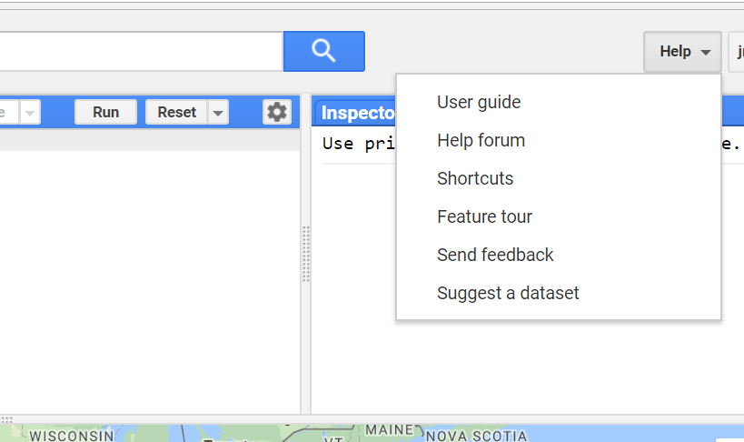

```{r setup, include=FALSE}
knitr::opts_chunk$set(echo = TRUE)
```

<br>

## Google Earth Engine Labs 

These labs introduce Google Earth Engine as a tool for performing geospatial data analysis. Geospatial data analysis can be considered as a workflow comprising four stages (that are often iterative):

* Data (variables to represent spatial concepts, phenomena, or entities - data collection, data entry, data download, and data import)
* Transform (transforming data so it can can be used for geospatial data analysis - summarising, combining, filtering)
* Visualisation (look for patterns, features, and relationships in your data - maps, charts, tables)
* Model (use mathematical and statistical tools to answer questions using your data)

These stages are based on the more generic data science workflow presented by <a href="https://r4ds.had.co.nz" target="_blank">Wickham and Grolemund (2017)</a>. As the figure below indicates, all the stages of the data analysis workflow are wrapped in a *program* box. You will use a programming language to specify the tasks to be performed at each of the stage of the data analysis workflow. In these labs you will be introduced to JavaScript, a programming language for writing commands in Google Earth Engine programs. While learning to code is not the primary aim of these labs, an awareness of programming concepts and the ability to perform tasks using code is a useful skill for geospatial data analysis and often makes your life easier through the ability to automate tasks. The labs are designed to provide support in using a programming language to perform geospatial data analysis using Google Earth Engine and hopefully this is another skill you'll pick up.   

<br>

```{r data-science, fig.align = 'center', out.width = "70%", fig.cap = "Data science workflow (source: [Wickham and Grolemund (2017)](https://r4ds.had.co.nz))", echo = FALSE}
knitr::include_graphics("img/data-science.png")

```

<br>

Each of the labs relate to a stage in the geospatial data analysis workflow outlined above. Thematically, the labs will focus on geospatial data analysis issues in urban areas primarily using data from the Perth region.  

* **Preliminary Resource:** Introduction to JavaScript and programming concepts
* **Lab 4a:** Data: Spatial data models and data structures
* **Lab 4b:** Visualisation: Spatial data visualisation
* **Lab 5:** Transform: Vector data operations
* **Lab 6:** Transform: Raster and remote sensing data processing
* **Lab 7:** Model: Land cover classification
* **Lab 8:** Model: Predicting urban land surface temperatures
* **Lab 9:** Model: Trends in urban vegetation and temperature

A series of questions are posed throughout the lab as demonstrated below; these are to help you engage with the content, have a go at answering them and click on the question to reveal the answer. 

<br>
<details>
  <summary><b>*Example Question?*</b></summary>
  <p><br>Answer.</p>
</details>
<br>

### Sign Up

Sign up for Google Earth Engine <a href="https://signup.earthengine.google.com/#!/" target="_blank">here</a>. Identify that you are using Google Earth Engine for educational purposes as part of the Advanced GIS and Remote Sensing undergraduate course at the University of Western Australia.

<br>

## Google Earth Engine

Google Earth Engine is a platform for geospatial data analysis. It combines <a href="https://developers.google.com/earth-engine/datasets/" target="_blank">databases of big geospatial data</a> that are updated daily, a range of geospatial data analysis and processing functions poften found in GIS and remote sensing software, and access to cloud computing resources to apply these functions to geospatial datasets. You can access Google Earth Engine through the <a href="https://code.earthengine.google.com" target="_blank"><em>Code Editor</em></a> - a web-based interactive development environment (IDE) for creating Google Earth Engine programs for geospatial data analysis and visualising the results in web maps, interactive charts, or text summaries.

<br>
<center>

<iframe width="720" height="405" src="https://www.youtube.com/embed/gKGOeTFHnKY" frameborder="0" allow="autoplay; encrypted-media" allowfullscreen></iframe>

</center>
<br>

<a href="https://www.sciencedirect.com/science/article/pii/S0034425717302900" target="_blank">Gorelick et al. (2017)</a> provide a detailed description of the Google Earth Engine platform.

### Applications

Applications of Google Earth Engine span a variety of disciplines which utilise geospatial data:

* <a href="https://earthenginepartners.appspot.com/science-2013-global-forest" target="_blank">Monitoring global forest change</a>
* <a href="http://species.mol.org/species/map/Perdix_dauurica" target="_blank">Mapping habitat ranges</a>
* <a href="https://blog.google/around-the-globe/google-europe/nature-water-unveiling-most-detailed-view-water-earth/" target="_blank">Global water security</a>
* <a href="http://www.g-feed.com/2015/05/introducing-scym.html" target="_blank">Monitoring global croplands</a>
* <a href="https://medium.com/google-earth/mapping-global-travel-time-to-urban-resources-448c1d7919d2" target="_blank">Mapping travel time to urban centres</a>

More examples of how Google Earth Engine is used can be found on the <a href="https://medium.com/google-earth/tagged/earth-engine" target="_blank">Google Earth Engine blog</a>.

## Useful Resources

There are a range user resources for Google Earth Engine. You should use these resources to supplement the work done in the labs. Becoming familiar with these resources will help you troubleshoot problems. Using these resources will develop your independent problem solving skills when undertaking geospatial data analysis. 

1. <a href="https://developers.google.com/earth-engine/" target="_blank">Google Earth Engine introduction</a> - comprehensive overview of Google Earth Engine's capabilities. 
2. <a href="https://developers.google.com/earth-engine/tutorials" target="_blank">Google Earth Engine tutorials</a> - range of introductory and advanced tutorials on using Google Earth Engine for geospatial data analysis.
3. <a href="https://developers.google.com/earth-engine/edu" target="_blank">Google Earth Engine for education</a> - range of training resources. 
4. User Forum and help tab in the code editor (see below).

<br>

```{r gee-help, fig.align = 'center', out.width = "50%", fig.cap = "Google Earth Engine user forum and help tab", echo = FALSE}


```

<br>
<hr>

<footer>
<p>Advanced GIS and Remote Sensing</p>
</footer>